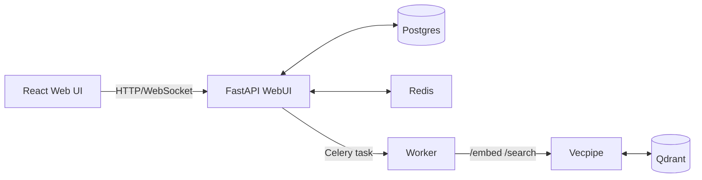

# Semantik

Private, self‑hosted semantic search for your documents.

[](https://www.python.org/downloads/)
[](https://www.gnu.org/licenses/agpl-3.0)
[](https://www.docker.com)
[](https://github.com/psf/black)

Semantik is a self‑hosted semantic search stack for local documents. I built it to make searching my own unstructured corpus less painful and to keep a clean playground for experimenting with various retrieval, chunking, and reranking strategies. It runs fully on your hardware: FastAPI control plane + Celery workers + a dedicated embedding/search service over Postgres, Redis, and Qdrant. GPU is recommended for indexing speed, but CPU works for modest collections.

By default, models run locally and no document content leaves your machine.

This is a personal project and still pre‑release — expect rough edges and API churn.

<p align="center">
  <a href="docs/images/dashboard.png"></a>
  <a href="docs/images/search.png"></a>
  <a href="docs/images/models.png"></a>
</p>

<details>
<summary>More screenshots</summary>
<p align="center">
  <a href="docs/images/benchmarks.png"></a>
  <a href="docs/images/mcp-profiles.png"></a>
</p>
</details>

## Table of Contents

- [What It Does](#what-it-does)
- [Architecture](#architecture)
- [Getting Started](#getting-started)
- [Configuration](#configuration)
- [Development](#development)
- [Roadmap](#roadmap)
- [License](#license)

## What It Does

Everything is organized around **collections** — each with its own embedding model, chunking strategy, and sources. All models run locally by default; no document content leaves your machine.

### Hybrid Search Stack
- Dense (semantic) + sparse (BM25/SPLADE) with RRF fusion
- Cross-encoder reranking for precision
- HyDE query expansion via pluggable LLMs (Anthropic, OpenAI, or local GPU)
- All parameters tunable per collection

### Retrieval Lab
- 6 chunking strategies (character, recursive, markdown, semantic, hierarchical, hybrid)
- Embedding model and quantization swapping
- IR benchmarking with Precision@K, Recall@K, MRR, nDCG
- Embedding space visualization via embedding-atlas

### Data Pipeline
- DAG-based processing with conditional routing (route files by type, size, content characteristics)
- AI-assisted pipeline configuration via conversational wizard (EXPERIMENTAL)
- Pluggable connectors: directories, Git repos, IMAP mailboxes (credentials encrypted at rest)
- 15+ document formats via unstructured (PDF, DOCX, Markdown, HTML, and more)
- Continuous sync with configurable intervals
- Fully async ingestion with live progress streaming

### Integrations
- MCP server for AI assistants (Claude, etc.) — see `docs/MCP.md`
- Scoped, revocable API keys for programmatic access
- Plugin system with 6 extension points (embedding, chunking, connectors, rerankers, sparse indexers, extractors)

### Operations
- Zero-downtime reindexing (blue/green staging)
- Model manager with download tracking and cache visibility
- Live progress via Redis + WebSockets

## Architecture

Three Python packages, one frontend:
- `packages/webui/` – FastAPI app serving REST + WebSocket APIs and the React UI; owns Postgres state.
- `packages/vecpipe/` – embedding + search HTTP service that talks to Qdrant.
- `packages/shared/` – shared configs, DB models/repos, chunking + embedding utilities.
- `apps/webui-react/` – React/Vite UI, built into `packages/webui/static/`.

Data flow:
1. Client creates/updates a collection.
2. WebUI writes an **operation** row to Postgres and dispatches a Celery task.
3. Worker extracts text, chunks, requests embeddings from vecpipe, and upserts to Qdrant.
4. Progress goes to Redis → WebSockets → UI; final status is persisted in Postgres.



## Getting Started

### Prerequisites

- Docker + Docker Compose
- NVIDIA runtime (optional, for GPU acceleration)

### Installation

```bash
git clone https://github.com/jbmiller10/semantik.git
cd semantik

# Guided setup: generates .env, checks GPU/paths, starts stack
make wizard

# Manual setup:
cp .env.docker.example .env
# IMPORTANT: Replace ALL placeholder credentials in .env before starting:
#   JWT_SECRET_KEY, POSTGRES_PASSWORD, REDIS_PASSWORD, QDRANT_API_KEY,
#   FLOWER_USERNAME, FLOWER_PASSWORD
# Generate secrets with: openssl rand -hex 32
# If you are not using connectors with credentials, set CONNECTOR_SECRETS_KEY="" to disable secrets encryption.
make docker-up
```

### Endpoints

| Service | URL |
|---------|-----|
| Web UI + API | `http://localhost:8080` |
| Qdrant | `http://localhost:6333` |
| Vecpipe (internal) | `http://vecpipe:8000` |

### First Steps

1. Open the UI at `http://localhost:8080` and create an account. The first user is automatically an admin.
2. Create a collection and add sources (directories, Git repos, or IMAP mailboxes).
3. Semantik indexes in the background — search when ready.

For programmatic access, see the v2 API at `/api/v2/*` — documented in `docs/API_REFERENCE.md`.

### Stopping

```bash
make docker-down        # Stop (keep volumes)
make docker-down-clean  # Stop and remove volumes
```

## Configuration

The setup wizard (`make wizard`) or `.env.docker.example` covers common settings. For detailed configuration options, see `docs/CONFIGURATION.md`.

## Development

### Backend

```bash
make dev-install        # Install dependencies
make run                # FastAPI hot reload on :8080
make dev                # Full stack: API + worker + vecpipe
```

### Frontend

```bash
make frontend-install   # npm install
make frontend-dev       # Vite on :5173, proxies to backend
```

### Testing

```bash
make test               # Run all tests (Pytest)
make test-coverage      # Tests with coverage report
make test-e2e           # E2E tests (requires running stack)
```

Frontend tests: `npm test --prefix apps/webui-react`

Test database: `docker compose --profile testing up -d postgres_test` (port 55432)

## Roadmap

**Near-term:**
- Built-in agentic search
- Memory governor improvements
- Bug fixes

**Planned:**
- Knowledge graph builder for GraphRAG
- Expanded benchmarking tools
- Text+image embedding models
- Custom/sentence-transformers model support
- Additional visualization options
- More connectors, parsers, and chunkers

## License

AGPL‑3.0 — see `LICENSE`.

_Active development; breaking changes are possible._
