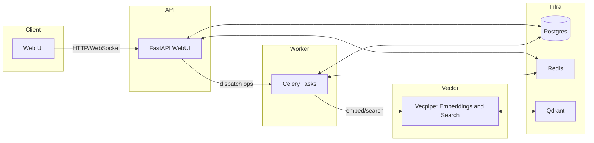

🚨🚨🚨

Semantik is currently in a **pre-release state**, please be aware that you will likely encounter rough-edges and bugs, and we do not yet recommend its usage in a production environment. 

🚨🚨🚨

---


# Semantik - Easy, Private, and Powerful Document Search

[](https://www.python.org/downloads/)
[](https://www.gnu.org/licenses/agpl-3.0)
[](https://www.docker.com)
[](https://github.com/psf/black)

Semantik is a self‑hosted semantic search system for local and team documents. It runs a FastAPI backend, a dedicated embedding/search service, and a Celery worker pipeline over Postgres, Redis, and Qdrant. A GPU is recommended; CPU works for small datasets.

### Why Semantik
Private, self‑hosted semantic search that fits on your own hardware. Designed for clear ops and predictable performance.

## Features
- Semantic, keyword, and hybrid search with optional reranking
- Collection management and document preview in the Web UI
- Real‑time operation updates over WebSocket
- Blue/green reindexing with staging/swap and cleanup
- Health/metrics endpoints and rate limiting

## Tech Stack
- Backend: Python 3.11, FastAPI, SQLAlchemy, Alembic, Celery (Redis broker), Pydantic, SlowAPI
- Vector/ML: PyTorch, Transformers/Sentence‑Transformers, Qdrant
- Frontend: React (Vite), React Query, React Router, Zustand, Tailwind
- Infra: Docker Compose, Postgres, Redis, Qdrant; optional Flower
- Tooling: uv (deps), Ruff, Black, Mypy, Pytest, Vitest, Playwright

## Architecture
- WebUI API (`packages/webui`): REST + WebSocket, collection/operation APIs, Alembic migrations on start
- Vecpipe (`packages/vecpipe`): embedding + search HTTP API, talks to Qdrant
- Worker (`packages/webui` Celery): ingestion/chunking/reindex orchestration
- Infra: Postgres (state), Redis (broker/results + progress streams), Qdrant (vectors)

Data flow :
1) API request → 2) DB operation row → 3) Celery task → 4) extract + chunk → 5) embed via vecpipe → 6) upsert to Qdrant → 7) progress via Redis/WebSocket → 8) status persisted.




### Design Notes
- Commit‑before‑dispatch task pattern eliminates operation/task race conditions
- Partition‑aware Postgres schema with helper‑computed partition keys
- Scalable WebSocket manager suited for horizontal scaling
- Chunking tasks include circuit breaker, DLQ, and resource limits
- Metrics and health checks across services

### Security Snapshot
- JWT auth with rate limiting (SlowAPI) and validated CORS
- CSP headers enabled at the API layer
- Internal API key for service‑to‑service calls
- Data stays local by default (no external model calls)

## Quickstart (Docker)
Prereqs: Docker + Compose; NVIDIA runtime for GPU.

```bash
git clone https://github.com/jbmiller10/semantik.git
cd semantik

# Guided setup (generates env, checks GPU/paths, starts services)
make wizard

# Or manual
cp .env.docker.example .env
make docker-up
```

Default endpoints:
- Web UI: http://localhost:8080
- Vecpipe API: http://localhost:8000
- Qdrant: http://localhost:6333

Stop services: `make docker-down` (keeps volumes) or `make docker-down-clean` (removes volumes).

## Dev Setup
- Backend deps: `make dev-install`
- Run API (hot reload): `make run`
- Frontend: `make frontend-install && make frontend-dev`
- Integrated dev stack: `make dev`
- Backend‑only infra (for local API): `make docker-dev-up`

## Configuration (env)
Common variables (see `.env.docker.example` and docs for full list):
- Auth: `JWT_SECRET_KEY` (generate once with `uv run python scripts/generate_jwt_secret.py --write` or via the setup wizard)
- Database: `DATABASE_URL` or `POSTGRES_HOST|PORT|DB|USER|PASSWORD`
- Redis: `REDIS_URL` (Celery + progress streams)
- Qdrant: `QDRANT_HOST`, `QDRANT_PORT`
- Models: `DEFAULT_EMBEDDING_MODEL` (e.g. `Qwen/Qwen3-Embedding-0.6B`), `DEFAULT_QUANTIZATION` (`float16`), `USE_MOCK_EMBEDDINGS`
- Paths: `DOCUMENT_PATH` (mounted docs), `HF_CACHE_DIR` (models cache)
- Ports: `WEBUI_PORT` (8080), `SEARCH_API_PORT` (8000)
- Worker: `CELERY_CONCURRENCY` (optional; defaults to `max(1, cores-1)` based on container CPU quota; set explicitly to pin), `CELERY_MAX_CONCURRENCY` (optional cap applied to the auto value; defaults to 4 in docker-compose)
- Embedding throttle: `EMBEDDING_CONCURRENCY_PER_WORKER` (optional; default 1, docker-compose default set) limits concurrent `/embed` calls per worker to protect VRAM

## Services
- WebUI (FastAPI): container `webui` (port 8080); serves API/UI, runs migrations at start
- Vecpipe (embeddings/search): container `vecpipe` (port 8000); embeds and queries Qdrant
- Worker (Celery): container `worker`; consumes tasks for ingestion, chunking, reindex
- Infra: Postgres 16, Redis 7, Qdrant latest; optional Flower at `:5555`

## Ingestion / Chunking Flow
- Create or update a collection via API → operation row is written and committed
- API dispatches `webui.tasks.process_collection_operation(operation_id)` to Celery
- Worker extracts text, applies the configured chunking strategy, requests embeddings from vecpipe, and upserts vectors to Qdrant
- Progress updates stream to Redis; WebUI broadcasts over WebSocket
- Reindex uses a staging collection (blue/green) and schedules old‑collection cleanup on success

## Running Scheduled Tasks (beat)
A Celery beat schedule is defined for cleanup and monitoring, but beat is not started by default. Add a minimal beat service:

```yaml
# docker-compose.override.yml (example)
services:
  beat:
    build:
      context: .
      dockerfile: Dockerfile
      target: runtime
    container_name: semantik-beat
    # Override the image entrypoint to run beat directly
    entrypoint: ["celery", "-A", "webui.celery_app", "beat", "-l", "info"]
    environment:
      - REDIS_URL=redis://redis:6379/0
      - CELERY_BROKER_URL=redis://redis:6379/0
      - CELERY_RESULT_BACKEND=redis://redis:6379/0
    depends_on:
      - redis
```

Ensure the worker consumes the default queue (current configuration uses defaults).

## Quick API Examples

Create a collection
```bash
curl -X POST http://localhost:8080/api/v2/collections \
  -H "Content-Type: application/json" \
  -H "Authorization: Bearer <token>" \
  -d '{
        "name": "work_docs",
        "description": "Team documents",
        "embedding_model": "Qwen/Qwen3-Embedding-0.6B",
        "quantization": "float16",
        "chunk_size": 1000,
        "chunk_overlap": 200
      }'
```

Add a source (file or directory)
```bash
curl -X POST http://localhost:8080/api/v2/collections/<collection_uuid>/sources \
  -H "Content-Type: application/json" \
  -H "Authorization: Bearer <token>" \
  -d '{
        "source_path": "/mnt/docs/handbook",
        "config": {}
      }'
```

Search across collections
```bash
curl -X POST http://localhost:8080/api/v2/search \
  -H "Content-Type: application/json" \
  -H "Authorization: Bearer <token>" \
  -d '{
        "collection_uuids": ["<uuid1>", "<uuid2>"],
        "query": "onboarding policy",
        "k": 10,
        "use_reranker": true
      }'
```

## Testing
- Backend: `make test` (Pytest); coverage: `make test-coverage`
- E2E (requires stack): `make test-e2e`
- Frontend: `npm test --prefix apps/webui-react`
- Dedicated test DB: `docker compose --profile testing up -d postgres_test` (default port 55432)

## Roadmap / Limitations
- Scheduled tasks: run Celery beat in Docker for periodic maintenance
- CPU‑only mode is suitable for small corpora; GPU recommended for indexing speed and reranking
- Worker concurrency now auto-scales by default (cores-1, minimum 1); set `CELERY_CONCURRENCY` to pin it or `CELERY_MAX_CONCURRENCY` to cap the auto value (compose default 4). Embed calls are throttled per worker via `EMBEDDING_CONCURRENCY_PER_WORKER` (default 1).
- Planned: hybrid search improvements, broader formats/OCR, additional embedding/reranker options, MCP integration

### Performance
Performance varies by hardware, collection size, and model choice. See tuning guidance in [docs/CONFIGURATION.md#performance-tuning](docs/CONFIGURATION.md#performance-tuning).

## License
Semantik is licensed under the [GNU Affero General Public License v3.0](LICENSE).

_This project is in active development; APIs and defaults may evolve._
