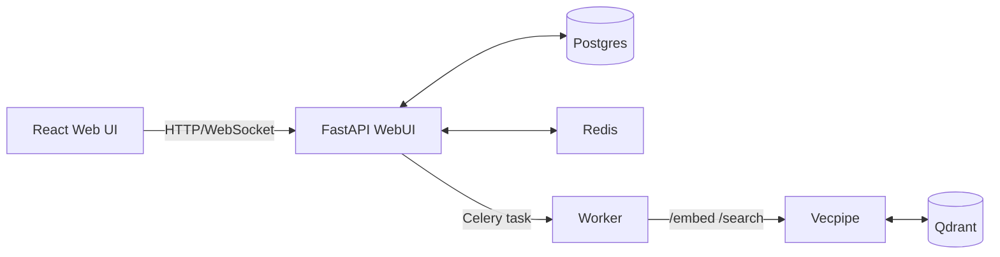

# Semantik

Private, self‑hosted semantic search for your documents.

[](https://www.python.org/downloads/)
[](https://www.gnu.org/licenses/agpl-3.0)
[](https://www.docker.com)
[](https://github.com/psf/black)

Semantik is a self‑hosted semantic search stack for local documents. I built it to make searching my own unstructured corpus less painful and to keep a clean playground for experimenting with various retrieval, chunking, and reranking strategies. It runs fully on your hardware: FastAPI control plane + Celery workers + a dedicated embedding/search service over Postgres, Redis, and Qdrant. GPU is recommended for indexing speed, but CPU works for modest collections.

By default, models run locally and no document content leaves your machine.

This is a personal project and still pre‑release — expect rough edges and API churn.

## What It Does
- **Collections**: group documents with their own embedding + chunking config.
- **Ingestion pipeline**: scan → extract → chunk → embed → upsert, all async.
- **Connectors**: pluggable ingestion sources — built-ins so far are directories, Git repos, and IMAP mailboxes (credentials encrypted at rest; see `docs/CONNECTORS.md`).
- **Formats** include PDF, DOCX, Markdown, HTML, plain text, and more (via `unstructured`).
- **Search**: semantic, keyword, and hybrid modes, with optional cross‑encoder reranking.
- **MCP Integration**: connect AI assistants (Claude Desktop, Cursor) to search your collections via the Model Context Protocol. See `docs/MCP.md`.
- **Live progress** is streamed to the UI over Redis + WebSockets.
- **Zero‑downtime reindexing**: blue/green staging + swap + cleanup.
- **Chunking lab**: 6 built‑in strategies (character, recursive, markdown, semantic, hierarchical, hybrid) plus a plugin system for adding additional strategies.
- **Embeddings lab**: swap models/quantization per collection; mock mode for testing.
- **Visualize:** project embeddings into 2D space & visualize relationships
- **Continuous sync**: keep collections up-to-date automatically with configurable sync intervals for your data sources.

## Sources & Continuous Sync

Collections support multiple data sources with optional continuous sync:

- **Sync Modes**: `one_time` (manual) or `continuous` (automatic at intervals)
- **Interval**: Minimum 15 minutes for continuous sync
- **Encrypted Credentials**: Git tokens, SSH keys, and IMAP passwords stored encrypted at rest

## Architecture
Three Python packages, one frontend:
- `packages/webui/` – FastAPI app serving REST + WebSocket APIs and the React UI; owns Postgres state.
- `packages/vecpipe/` – embedding + search HTTP service that talks to Qdrant.
- `packages/shared/` – shared configs, DB models/repos, chunking + embedding utilities.
- `apps/webui-react/` – React/Vite UI, built into `packages/webui/static/`.

Data flow:
1. Client creates/updates a collection.
2. WebUI writes an **operation** row to Postgres and dispatches a Celery task.
3. Worker extracts text, chunks, requests embeddings from vecpipe, and upserts to Qdrant.
4. Progress goes to Redis → WebSockets → UI; final status is persisted in Postgres.



## Quickstart (Docker)
Prereqs: Docker + Compose. NVIDIA runtime if you want GPU acceleration.

```bash
git clone https://github.com/jbmiller10/semantik.git
cd semantik

# Guided setup: generates .env, checks GPU/paths, starts stack
make wizard

# Manual setup:
cp .env.docker.example .env
# IMPORTANT: Replace ALL placeholder credentials in .env before starting:
#   JWT_SECRET_KEY, POSTGRES_PASSWORD, REDIS_PASSWORD, QDRANT_API_KEY,
#   FLOWER_USERNAME, FLOWER_PASSWORD
# Generate secrets with: openssl rand -hex 32
# If you are not using connectors with credentials, set CONNECTOR_SECRETS_KEY="" to disable secrets encryption.
make docker-up
```

Endpoints after boot:
- Web UI + API: `http://localhost:8080`
- Vecpipe API (internal-only by default): `http://vecpipe:8000` (expose port 8000 if you need host access)
- Qdrant: `http://localhost:6333`

First run note: open the UI and create an account. The very first user is made admin/superuser automatically.

Stop: `make docker-down` (keep volumes) or `make docker-down-clean` (wipe volumes).

## Usage
1. Open the UI at `http://localhost:8080` and create a collection.
2. Add one or more sources (directories; optionally Git repos / IMAP mailboxes). Semantik will index in the background.
3. Search across one or more collections.

If you prefer the API, the v2 endpoints are under `/api/v2/*` — see `docs/API_REFERENCE.md`.

## Configuration
`make wizard` or `.env.docker.example` covers the common knobs. A few highlights:
- `JWT_SECRET_KEY` – auth secret (wizard generates one).
- `POSTGRES_PASSWORD` – database password.
- `REDIS_PASSWORD` – Redis authentication (v7.1+).
- `QDRANT_API_KEY` – vector database authentication (v7.1+).
- `DATABASE_URL`, `REDIS_URL`, `QDRANT_HOST|PORT` – infra wiring.
- `DEFAULT_EMBEDDING_MODEL`, `DEFAULT_QUANTIZATION`, `USE_MOCK_EMBEDDINGS` – model defaults.
- `DOCUMENT_PATH` – host folder to index (mounted read‑only into containers; default `./documents`).
- `HF_CACHE_DIR` – persistent HuggingFace model cache (avoids re‑downloads).
- `CONNECTOR_SECRETS_KEY` – Fernet key for encrypting connector credentials in the DB (set to empty to disable).
- `CELERY_CONCURRENCY`, `CELERY_MAX_CONCURRENCY` – worker parallelism.
- `EMBEDDING_CONCURRENCY_PER_WORKER` – throttle embed calls per worker (VRAM‑friendly).

Full list + tuning notes: `docs/CONFIGURATION.md`.

## Extensibility
Semantik is meant to be a sandbox for trying retrieval ideas:
- **Plugins** (embedding providers, chunking strategies, connectors) load from Python entry points
  `semantik.plugins`.
- **Toggles**: `SEMANTIK_ENABLE_PLUGINS` (global), plus per-type flags
  `SEMANTIK_ENABLE_EMBEDDING_PLUGINS`, `SEMANTIK_ENABLE_CHUNKING_PLUGINS`,
  `SEMANTIK_ENABLE_CONNECTOR_PLUGINS`.

Plugin loading is idempotent and safe to run without plugins installed.

## Dev Notes
Backend:
```bash
make dev-install
make run        # FastAPI hot reload on :8080
```

Frontend:
```bash
make frontend-install
make frontend-dev   # Vite on :5173, proxies /api and /ws to backend
```

Integrated dev stack (API + worker + vecpipe):
```bash
make dev
```

## Testing
- Backend: `make test` (Pytest) or `make test-coverage`.
- E2E (requires running stack): `make test-e2e`.
- Frontend: `npm test --prefix apps/webui-react`.
- Test Postgres profile: `docker compose --profile testing up -d postgres_test` (port 55432).

## Docs
There's a lot of detail in `docs/`:
- `docs/DOCUMENTATION_INDEX.md` – map of all docs.
- `docs/ARCH.md` – full system architecture.
- `docs/SEARCH_SYSTEM.md`, `docs/RERANKING.md`, `docs/CHUNKING_FEATURE_OVERVIEW.md` – retrieval/chunking deep dives.
- `docs/WEBSOCKET_API.md`, `docs/API_REFERENCE.md` – API contracts.
- `docs/MCP.md` – MCP integration for AI assistants.

## Roadmap / Ideas
- Integrated benchmarking tools
- More connectors (web/Slack/etc.) and richer OCR pipelines.
- Additional embedding/reranker options and hybrid tuning.

## License
AGPL‑3.0. See `LICENSE`.

_Active development; breaking changes are possible._
