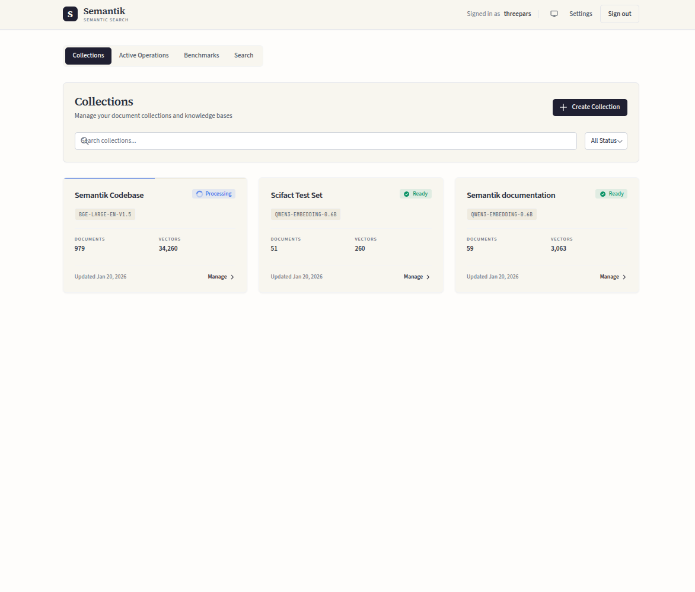
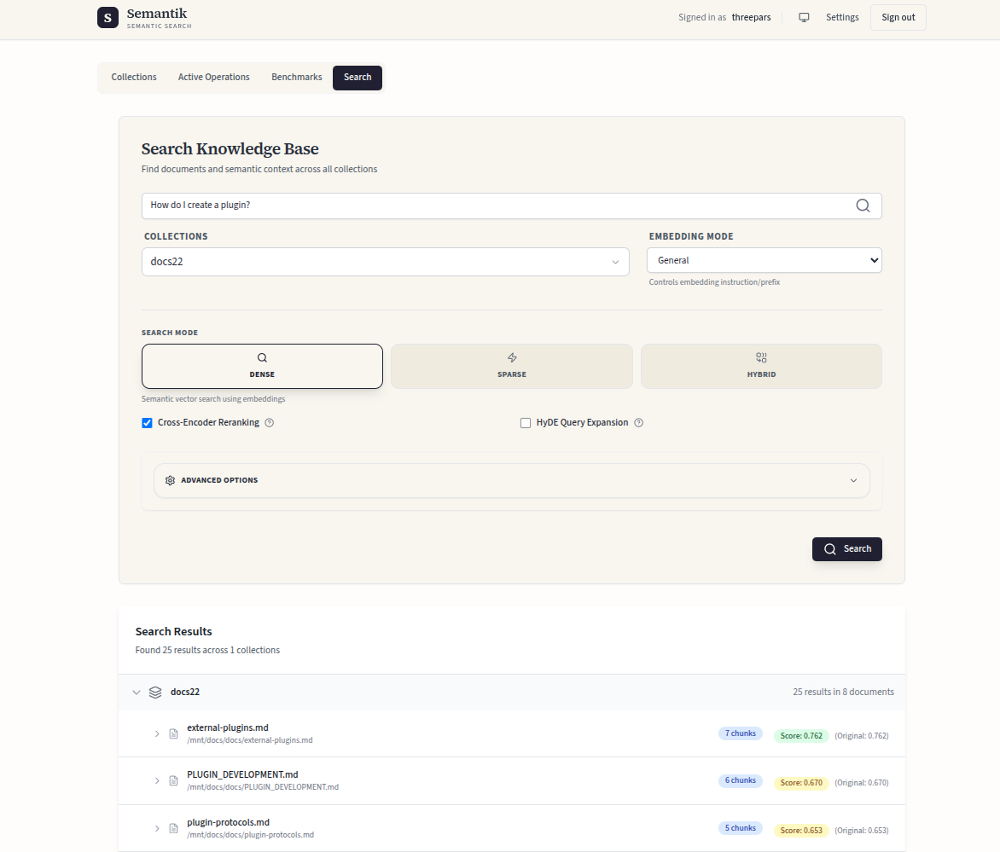
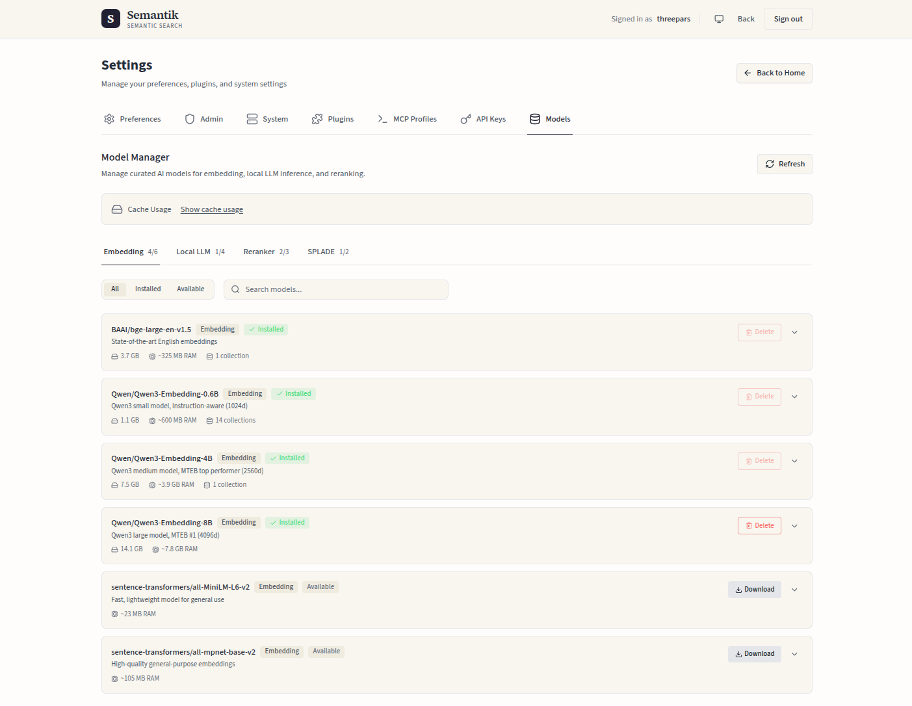
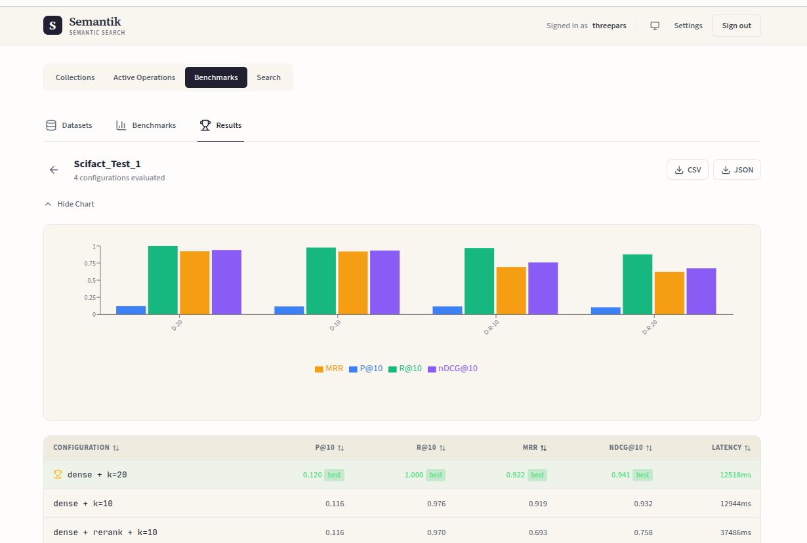
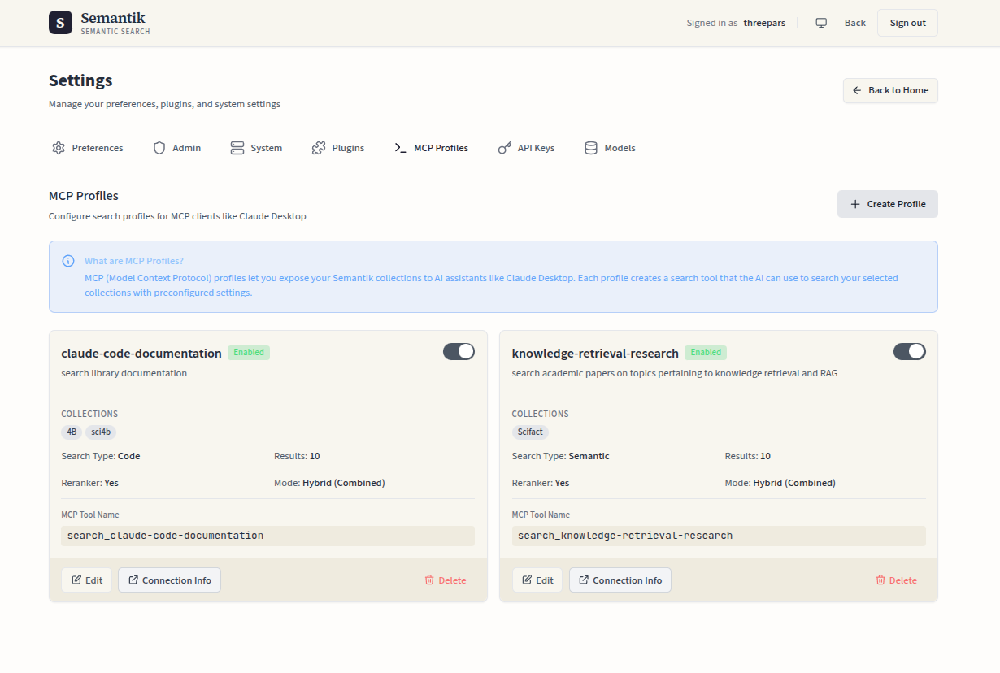
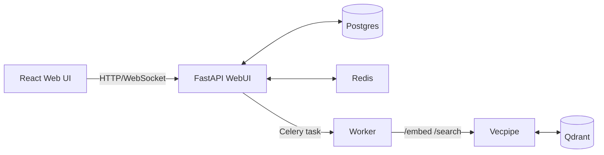

# Semantik

Private, self‑hosted semantic search for your documents.

[](https://www.python.org/downloads/)
[](https://www.gnu.org/licenses/agpl-3.0)
[](https://www.docker.com)
[](https://github.com/psf/black)

Semantik is a self‑hosted semantic search stack for local documents. I built it to make searching my own unstructured corpus less painful and to keep a clean playground for experimenting with various retrieval, chunking, and reranking strategies. It runs fully on your hardware: FastAPI control plane + Celery workers + a dedicated embedding/search service over Postgres, Redis, and Qdrant. GPU is recommended for indexing speed, but CPU works for modest collections.

By default, models run locally and no document content leaves your machine.

This is a personal project and still pre‑release — expect rough edges and API churn.

<p align="center">
  <a href="docs/images/dashboard.png"></a>
  <a href="docs/images/search.png"></a>
  <a href="docs/images/models.png"></a>
</p>

<details>
<summary>More screenshots</summary>
<p align="center">
  <a href="docs/images/benchmarks.png"></a>
  <a href="docs/images/mcp-profiles.png"></a>
</p>
</details>

## What It Does

Everything is organized around **collections** — each with its own embedding model, chunking strategy, and sources. All models run locally by default; no document content leaves your machine.

### Hybrid Search Stack
- Dense (semantic) + sparse (BM25/SPLADE) with RRF fusion
- Cross-encoder reranking for precision
- HyDE query expansion via pluggable LLMs (Anthropic, OpenAI, or local GPU)
- All parameters tunable per collection

### Retrieval Lab
- 6 chunking strategies (character, recursive, markdown, semantic, hierarchical, hybrid)
- Embedding model and quantization swapping
- IR benchmarking with Precision@K, Recall@K, MRR, nDCG
- Embedding space visualization via embedding-atlas

### Data Pipeline
- Pluggable connectors: directories, Git repos, IMAP mailboxes (credentials encrypted at rest)
- 15+ document formats via unstructured (PDF, DOCX, Markdown, HTML, and more)
- Continuous sync with configurable intervals
- Fully async ingestion with live progress streaming

### Integrations
- MCP server for AI assistants (Claude, etc.) — see `docs/MCP.md`
- Scoped, revocable API keys for programmatic access
- Plugin system with 6 extension points (embedding, chunking, connectors, rerankers, sparse indexers, extractors)

### Operations
- Zero-downtime reindexing (blue/green staging)
- Model manager with download tracking and cache visibility
- Live progress via Redis + WebSockets

## Architecture
Three Python packages, one frontend:
- `packages/webui/` – FastAPI app serving REST + WebSocket APIs and the React UI; owns Postgres state.
- `packages/vecpipe/` – embedding + search HTTP service that talks to Qdrant.
- `packages/shared/` – shared configs, DB models/repos, chunking + embedding utilities.
- `apps/webui-react/` – React/Vite UI, built into `packages/webui/static/`.

Data flow:
1. Client creates/updates a collection.
2. WebUI writes an **operation** row to Postgres and dispatches a Celery task.
3. Worker extracts text, chunks, requests embeddings from vecpipe, and upserts to Qdrant.
4. Progress goes to Redis → WebSockets → UI; final status is persisted in Postgres.



## Quickstart (Docker)
Prereqs: Docker + Compose. NVIDIA runtime if you want GPU acceleration.

```bash
git clone https://github.com/jbmiller10/semantik.git
cd semantik

# Guided setup: generates .env, checks GPU/paths, starts stack
make wizard

# Manual setup:
cp .env.docker.example .env
# IMPORTANT: Replace ALL placeholder credentials in .env before starting:
#   JWT_SECRET_KEY, POSTGRES_PASSWORD, REDIS_PASSWORD, QDRANT_API_KEY,
#   FLOWER_USERNAME, FLOWER_PASSWORD
# Generate secrets with: openssl rand -hex 32
# If you are not using connectors with credentials, set CONNECTOR_SECRETS_KEY="" to disable secrets encryption.
make docker-up
```

Endpoints after boot:
- Web UI + API: `http://localhost:8080`
- Vecpipe API (internal-only by default): `http://vecpipe:8000` (expose port 8000 if you need host access)
- Qdrant: `http://localhost:6333`

First run note: open the UI and create an account. The very first user is made admin/superuser automatically.

Stop: `make docker-down` (keep volumes) or `make docker-down-clean` (wipe volumes).

## Usage
1. Open the UI at `http://localhost:8080` and create a collection.
2. Add one or more sources (directories; optionally Git repos / IMAP mailboxes). Semantik will index in the background.
3. Search across one or more collections.

If you prefer the API, the v2 endpoints are under `/api/v2/*` — see `docs/API_REFERENCE.md`.

## Configuration
`make wizard` or `.env.docker.example` covers the common knobs. 

See:`docs/CONFIGURATION.md`.

## Extensibility
Semantik is meant to be a sandbox for trying retrieval ideas:
- **Plugins** for 6 extension points: embedding providers, chunking strategies, connectors, rerankers, sparse indexers, and extractors. Load via Python entry points (`semantik.plugins`).
- **Runtime-checkable protocols** let you build external plugins without importing Semantik internals. See `docs/external-plugins.md` and `docs/plugin-protocols.md`.

Plugin loading is idempotent and safe to run without plugins installed.

## Dev Notes
Backend:
```bash
make dev-install
make run        # FastAPI hot reload on :8080
```

Frontend:
```bash
make frontend-install
make frontend-dev   # Vite on :5173, proxies /api and /ws to backend
```

Integrated dev stack (API + worker + vecpipe):
```bash
make dev
```

## Testing
- Backend: `make test` (Pytest) or `make test-coverage`.
- E2E (requires running stack): `make test-e2e`.
- Frontend: `npm test --prefix apps/webui-react`.
- Test Postgres profile: `docker compose --profile testing up -d postgres_test` (port 55432).


## Roadmap 
Next up:
- Built-in agentic search
- Improvements to the memory governor system
- bugfixes

In no particular order:
- Knowledge graph builder for GraphRAG
- Expanded benchmarking tools
- Support for Text+Image embedding models
- Support for custom embedding models/any sentence-transformers compatible model
- Expanded visualization options for exploring the embedding space
- Additional connectors, parsers, chunkers

## License
AGPL‑3.0. See `LICENSE`.

_Active development; breaking changes are possible._
