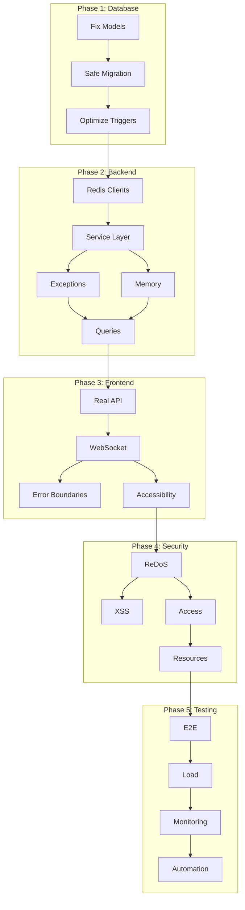

# MASTER ORCHESTRATOR: Chunking Feature Fix Campaign

## Campaign Overview
**Total Duration**: 63.5 hours (~8 days)  
**Total Tickets**: 20 tickets across 5 phases  
**Risk Level**: CRITICAL - Multiple production-blocking issues  
**Success Criteria**: Feature fully functional, secure, and monitored

## Executive Summary

The chunking feature has critical architectural flaws that render it non-functional. Database models don't match schema, backend has memory leaks and wrong Redis clients, frontend is entirely mocked, security vulnerabilities exist, and there's no monitoring. This orchestration plan coordinates the complete remediation.

## Master Execution Timeline

```
Week 1: Critical Infrastructure
Day 1: Phase 1 - Database (6.5h)
Day 2-3: Phase 2 - Backend (14h)  
Day 4-5: Phase 3 - Frontend (13h)

Week 2: Hardening & Operations
Day 6: Phase 4 - Security (10h)
Day 7-8: Phase 5 - Testing & Monitoring (17h)
Day 9: Final Validation & Deployment
```

## Phase Dependencies & Orchestration



## Critical Path Analysis

### Blocking Dependencies (Sequential)
1. **DB-001** → Everything depends on correct models
2. **BE-001** → Services need proper Redis clients
3. **FE-001** → Frontend needs real backend
4. **TEST-001** → Final validation requires all fixes

### Parallel Opportunities
- **BE-003** + **BE-004** (After BE-002)
- **FE-003** + **FE-004** (After FE-002)
- **SEC-002** + **SEC-003** (After SEC-001)
- **Phase 4** can start once Phase 3 is stable

## Risk Management Matrix

| Risk | Probability | Impact | Mitigation | Owner |
|------|------------|--------|------------|-------|
| Data loss during migration | Medium | Critical | Timestamped backups, validation | DB-002 |
| API contract breaks | Low | High | Contract tests, versioning | BE-002 |
| WebSocket instability | High | Medium | Fallback to polling | FE-002 |
| Performance regression | Medium | Medium | Baseline metrics, monitoring | TEST-002 |
| Security vulnerability | Low | Critical | Multiple scans, pen testing | SEC-* |

## Go/No-Go Decision Gates

### Gate 1: After Phase 1 (Database)
**Criteria**:
- [ ] All ORM operations working
- [ ] Zero data loss confirmed
- [ ] Performance baseline established

**If Failed**: STOP - Cannot proceed without database

### Gate 2: After Phase 2 (Backend)
**Criteria**:
- [ ] All endpoints responding correctly
- [ ] No memory leaks under load
- [ ] API contracts unchanged

**If Failed**: Frontend work blocked

### Gate 3: After Phase 3 (Frontend)
**Criteria**:
- [ ] Real-time updates working
- [ ] No mock data remaining
- [ ] Accessibility standards met

**If Failed**: User experience compromised

### Gate 4: After Phase 4 (Security)
**Criteria**:
- [ ] Zero high/critical vulnerabilities
- [ ] Resource limits enforced
- [ ] Access controls verified

**If Failed**: Cannot go to production

### Gate 5: Production Readiness
**Criteria**:
- [ ] E2E tests passing > 95%
- [ ] Load test < 5% errors
- [ ] Monitoring operational
- [ ] Team trained

**If Failed**: Delay production deployment

## Resource Allocation

### Team Assignments
```yaml
Phase 1 (Database):
  Lead: Senior Backend Engineer
  Support: DBA
  Duration: 6.5 hours

Phase 2 (Backend):
  Lead: Backend Team Lead
  Support: 2 Backend Engineers
  Duration: 14 hours

Phase 3 (Frontend):
  Lead: Frontend Team Lead
  Support: 2 Frontend Engineers
  Duration: 13 hours

Phase 4 (Security):
  Lead: Security Engineer
  Support: Backend Engineer
  Duration: 10 hours

Phase 5 (Testing):
  Lead: QA Lead
  Support: DevOps Engineer
  Duration: 17 hours
```

## Communication Protocol

### Daily Standup Template
```
Phase: [Current Phase]
Progress: [Tickets Completed] / [Total Tickets]
Blockers: [List any blockers]
Next 24h: [Planned tickets]
Risk Level: [Green/Yellow/Red]
```

### Escalation Triggers
- **Immediate Escalation**:
  - Data loss detected
  - Security breach identified
  - Production system down
  - > 4 hour delay on critical path

- **Standard Escalation**:
  - Performance regression > 20%
  - Test failures > 10%
  - Resource exhaustion
  - Dependency conflicts

## Validation Checkpoints

### Phase Validation Scripts
```bash
#!/bin/bash
# Master validation script

validate_phase() {
    phase=$1
    case $phase in
        1) ./validate_database.sh ;;
        2) ./validate_backend.sh ;;
        3) ./validate_frontend.sh ;;
        4) ./validate_security.sh ;;
        5) ./validate_testing.sh ;;
    esac
    
    if [ $? -ne 0 ]; then
        echo "❌ Phase $phase validation failed"
        exit 1
    fi
    
    echo "✅ Phase $phase validated"
}

# Run all validations
for i in {1..5}; do
    validate_phase $i
done

echo "🎉 All phases validated successfully"
```

### Key Metrics to Track

```python
# Real-time metrics dashboard
metrics = {
    'tickets_completed': 0,
    'tickets_total': 20,
    'hours_spent': 0,
    'hours_estimated': 63.5,
    'bugs_found': 0,
    'bugs_fixed': 0,
    'test_coverage': 0,
    'api_compatibility': 100,
    'performance_baseline': {},
    'security_score': 0
}

def update_dashboard():
    print(f"""
    ╔════════════════════════════════════════╗
    ║     CHUNKING FIX CAMPAIGN DASHBOARD    ║
    ╠════════════════════════════════════════╣
    ║ Progress: {metrics['tickets_completed']}/{metrics['tickets_total']} tickets      ║
    ║ Time: {metrics['hours_spent']}/{metrics['hours_estimated']} hours           ║
    ║ Test Coverage: {metrics['test_coverage']}%            ║
    ║ API Compatibility: {metrics['api_compatibility']}%     ║
    ║ Security Score: {metrics['security_score']}/10        ║
    ╚════════════════════════════════════════╝
    """)
```

## Rollback Strategy

### Phase-Level Rollback
Each phase has independent rollback:
1. **Database**: Restore from timestamped backup
2. **Backend**: Git revert + feature flags
3. **Frontend**: Feature flags + mock fallback
4. **Security**: Selective control disable
5. **Testing**: N/A - No rollback needed

### Emergency Rollback Procedure
```bash
#!/bin/bash
# Emergency rollback script

PHASE=$1
REASON=$2

echo "🚨 EMERGENCY ROLLBACK - Phase $PHASE"
echo "Reason: $REASON"

# Stop current work
kubectl scale deployment chunking-service --replicas=0

# Rollback based on phase
case $PHASE in
    1) psql -c "ALTER TABLE chunks RENAME TO chunks_broken;
               ALTER TABLE chunks_backup RENAME TO chunks;" ;;
    2) git revert HEAD~5..HEAD && ./deploy_backend.sh ;;
    3) ./enable_feature_flags.sh mock_api=true ;;
    4) ./disable_security_controls.sh ;;
    5) echo "No rollback for testing phase" ;;
esac

# Notify team
./send_alert.sh "Rollback executed for Phase $PHASE: $REASON"
```

## Success Metrics

### Campaign Success Criteria
- **Functional**: All 6 strategies working end-to-end
- **Performance**: < 2s response time (p99)
- **Reliability**: < 5% error rate under load
- **Security**: Zero high/critical vulnerabilities
- **Quality**: > 80% test coverage
- **Operations**: Full monitoring & alerting

### Post-Campaign Validation
```python
def validate_campaign_success():
    checks = [
        ('Database aligned', check_database_alignment()),
        ('Backend operational', check_backend_health()),
        ('Frontend real-time', check_websocket_working()),
        ('Security hardened', check_security_scan()),
        ('Tests comprehensive', check_test_coverage()),
        ('Monitoring active', check_metrics_flowing()),
    ]
    
    success = all(result for _, result in checks)
    
    print("\n📊 CAMPAIGN FINAL VALIDATION")
    print("=" * 40)
    for check, result in checks:
        status = "✅" if result else "❌"
        print(f"{status} {check}")
    print("=" * 40)
    
    if success:
        print("\n🎉 CAMPAIGN SUCCESSFUL - Ready for Production")
    else:
        print("\n⚠️ CAMPAIGN INCOMPLETE - Review failed checks")
    
    return success
```

## Handoff Documentation

### Deliverables Checklist
- [ ] All 20 tickets completed
- [ ] Test suite passing
- [ ] Security scan clean
- [ ] Performance baseline documented
- [ ] Monitoring dashboards configured
- [ ] Runbook created
- [ ] Team training completed
- [ ] Architecture documentation updated

### Knowledge Transfer
```markdown
## Key Information for Operations Team

### System Architecture
- 100 database partitions (LIST)
- 6 chunking strategies
- WebSocket for real-time
- Redis for caching
- Celery for async

### Critical Metrics
- Error rate threshold: 5%
- Memory limit: 500MB/operation
- Response time SLA: 2s (p99)
- Partition skew limit: 1.5x

### Common Issues
1. WebSocket drops: Check nginx config
2. Memory exhaustion: Review pool settings
3. Slow queries: Check partition pruning
4. High errors: Review strategy configs

### Maintenance Schedule
- Daily: Partition analysis (2 AM)
- Hourly: Skew check
- Weekly: Chunk cleanup
- Weekly: Index optimization
```

## Final Sign-Off

### Approval Chain
1. **Technical Lead**: Architecture & Implementation
2. **QA Lead**: Testing & Quality
3. **Security Lead**: Vulnerability Assessment
4. **Operations Lead**: Monitoring & Maintenance
5. **Product Owner**: Feature Completeness
6. **Engineering Manager**: Production Readiness

### Go-Live Criteria
```python
def approve_production():
    approvals = {
        'technical': get_approval('tech_lead'),
        'quality': get_approval('qa_lead'),
        'security': get_approval('security_lead'),
        'operations': get_approval('ops_lead'),
        'product': get_approval('product_owner'),
        'management': get_approval('eng_manager')
    }
    
    if all(approvals.values()):
        print("✅ All approvals received - CLEAR FOR PRODUCTION")
        return True
    else:
        pending = [k for k, v in approvals.items() if not v]
        print(f"⏳ Awaiting approvals: {', '.join(pending)}")
        return False
```

## Notes for Master Orchestrator

**Your Mission**: Coordinate the complete remediation of the chunking feature from non-functional to production-ready in 8 days.

**Key Principles**:
1. **Quality over Speed**: Better to delay than deploy broken
2. **Communication is Critical**: Over-communicate progress and blockers
3. **Trust but Verify**: Validate every phase completion
4. **Plan for Failure**: Have rollback ready at each step
5. **Document Everything**: Future you will thank present you

**Daily Routine**:
- Morning: Review overnight tests, plan day's tickets
- Midday: Check progress, address blockers
- Evening: Run validation, prepare next phase

**Success Indicators**:
- Steady progress without rushing
- No critical issues in production
- Team confidence in the solution
- Clean monitoring dashboards
- Positive user feedback

This is a critical campaign that will determine the success of the chunking feature. Execute methodically, validate thoroughly, and deliver excellence.