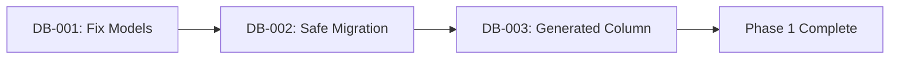

# ORCHESTRATOR PHASE 1: Database & Model Alignment

## Phase Overview
**Priority**: BLOCKER - Must complete before any other phases  
**Total Duration**: 6.5 hours  
**Risk Level**: CRITICAL - Database inconsistencies will cause production failures  
**Success Gate**: All ORM operations work without errors

## Context
The database schema and SQLAlchemy models are critically misaligned. The database uses 100 LIST partitions while models expect 16 HASH partitions. This phase MUST be completed first as all other components depend on correct database operations.

## Execution Strategy

### Pre-Flight Checklist
- [ ] Full database backup completed
- [ ] Test environment prepared with production-like data
- [ ] Rollback scripts tested and ready
- [ ] Team notified of database maintenance window
- [ ] Monitoring dashboards open

### Ticket Execution Order

#### Stage 1: Model Fixes (2 hours)
**Ticket**: DB-001 - Fix SQLAlchemy Model-Database Schema Mismatch

**Critical Actions**:
1. Create backup of current models.py
2. Update Chunk model to match actual database schema
3. Fix all relationships and foreign keys
4. Test ORM operations in development

**Validation**:
```python
# Test script to run after DB-001
async def validate_model_fixes():
    # Test create
    chunk = Chunk(collection_id="test", document_id="doc1", content="test")
    session.add(chunk)
    await session.commit()
    
    # Test read with composite key
    result = await session.get(Chunk, {
        "id": chunk.id,
        "collection_id": chunk.collection_id,
        "partition_key": chunk.partition_key
    })
    assert result is not None
    
    # Test relationships
    assert chunk.collection is not None
    print("✓ Model fixes validated")
```

**Hold Point**: Do not proceed until validation passes

#### Stage 2: Migration Safety (3 hours)
**Ticket**: DB-002 - Create Safe Migration with Data Preservation

**Critical Actions**:
1. Count existing records in chunks table
2. Create timestamped backup table
3. Create new partitioned structure alongside old
4. Migrate data in 10,000 record batches
5. Verify record counts match
6. Atomic table swap

**Validation**:
```sql
-- Run these checks after DB-002
SELECT 
    (SELECT COUNT(*) FROM chunks) as new_count,
    (SELECT COUNT(*) FROM chunks_backup_YYYYMMDD) as backup_count,
    CASE 
        WHEN (SELECT COUNT(*) FROM chunks) = 
             (SELECT COUNT(*) FROM chunks_backup_YYYYMMDD)
        THEN 'PASS'
        ELSE 'FAIL'
    END as validation_status;
```

**Hold Point**: If counts don't match, STOP and investigate

#### Stage 3: Performance Optimization (1.5 hours)
**Ticket**: DB-003 - Replace Trigger with Generated Column

**Critical Actions**:
1. Check PostgreSQL version (must be 12+)
2. Convert partition_key to GENERATED column
3. Drop trigger and function
4. Verify partition key calculation unchanged
5. Test insert performance

**Validation**:
```python
# Performance test after DB-003
import time

async def test_insert_performance():
    start = time.time()
    chunks = [
        Chunk(collection_id=f"coll-{i}", document_id=f"doc-{i}", content="test")
        for i in range(1000)
    ]
    session.add_all(chunks)
    await session.commit()
    
    duration = time.time() - start
    print(f"1000 inserts took {duration:.2f} seconds")
    assert duration < 5.0  # Should be under 5 seconds
```

### Coordination Points

#### Inter-Ticket Dependencies


#### Critical Data Flows
1. **Model Definition** (DB-001) → Used by all services
2. **Partition Structure** (DB-002) → Required for chunk storage
3. **Performance** (DB-003) → Enables high-volume operations

### Rollback Procedures

#### If DB-001 Fails
```bash
# Restore original models
cp models.py.backup packages/shared/database/models.py
# No database changes yet, safe to revert
```

#### If DB-002 Fails
```sql
-- Restore from backup
BEGIN;
DROP TABLE IF EXISTS chunks CASCADE;
ALTER TABLE chunks_backup_YYYYMMDD RENAME TO chunks;
COMMIT;
```

#### If DB-003 Fails
```sql
-- Revert to trigger-based approach
ALTER TABLE chunks ALTER COLUMN partition_key DROP EXPRESSION;
CREATE OR REPLACE FUNCTION compute_partition_key() ...
CREATE TRIGGER compute_partition_key_trigger ...
```

### Success Criteria

#### Functional Requirements
- [ ] All ORM operations work without errors
- [ ] No data loss during migration
- [ ] Partition key correctly computed
- [ ] All existing queries still work

#### Performance Requirements
- [ ] Insert performance improved by >10%
- [ ] Query performance unchanged or better
- [ ] No increase in database CPU usage
- [ ] Memory usage stable

#### Data Integrity
- [ ] Record counts match pre/post migration
- [ ] Partition distribution remains even (skew < 1.5)
- [ ] All foreign key relationships intact
- [ ] No orphaned records

### Monitoring During Execution

#### Key Metrics to Watch
```sql
-- Monitor partition distribution
SELECT 
    partition_key,
    COUNT(*) as chunk_count,
    COUNT(*) * 100.0 / SUM(COUNT(*)) OVER () as percentage
FROM chunks
GROUP BY partition_key
ORDER BY chunk_count DESC
LIMIT 10;

-- Check for errors
SELECT 
    datname,
    count(*) as error_count,
    max(query) as last_error_query
FROM pg_stat_database
WHERE datname = 'semantik'
GROUP BY datname;
```

#### Alert Thresholds
- Database CPU > 80% - Pause migration
- Memory usage > 90% - Reduce batch size
- Error rate > 1% - Stop and investigate
- Lock wait time > 5s - Check for blocking queries

### Post-Phase Validation

#### Final Checks
1. Run full test suite against updated database
2. Verify all partitions accessible
3. Check application logs for ORM errors
4. Validate foreign key constraints
5. Confirm backup retention

#### Sign-off Checklist
- [ ] All tickets completed successfully
- [ ] No data loss confirmed
- [ ] Performance improvements measured
- [ ] Rollback procedures documented
- [ ] Team notified of completion

### Communication Plan

#### Status Updates
```
Phase 1 Start: "Beginning database migration - Est. 6.5 hours"
After DB-001: "Models updated, beginning data migration"
After DB-002: "Data migration complete, optimizing performance"
After DB-003: "Performance optimization complete"
Phase 1 End: "Database migration successful - No data loss"
```

#### Escalation Path
1. Any data loss → Stop immediately, notify team lead
2. Performance degradation → Complete phase, plan remediation
3. Blocking issues → Escalate to database admin
4. Rollback needed → Follow procedures, document issues

### Handoff to Phase 2

#### Deliverables
1. Updated models.py fully functional
2. 100-partition structure operational
3. Migration completed with zero data loss
4. Performance baseline established
5. Documentation updated

#### Prerequisites for Phase 2
- Database connections stable
- ORM operations verified
- No pending migrations
- Backup available for safety

## Notes for Orchestrating Agent

**Critical Points**:
- NEVER skip validation steps
- ALWAYS maintain backups until phase is verified
- If any validation fails, STOP and investigate
- Document any deviations from plan
- Monitor system health throughout

**Success Indicators**:
- Green checks on all validations
- No errors in application logs
- Database metrics stable
- Team confidence high

**Risk Mitigations**:
- Keep old table for 24 hours after migration
- Run in test environment first
- Have DBA on standby
- Prepare rollback scripts in advance

This phase is the foundation for all subsequent work. Take time to ensure it's done correctly.