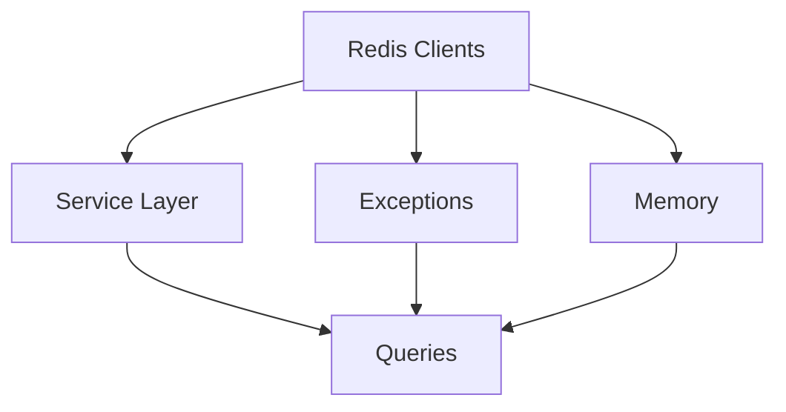

# ORCHESTRATOR PHASE 2: Backend Service Layer Fixes

## Phase Overview
**Priority**: CRITICAL - Backend must work before frontend  
**Total Duration**: 14 hours  
**Risk Level**: HIGH - Service disruptions possible  
**Success Gate**: All backend services operational with proper patterns

## Context
The backend has critical architectural issues: Redis client mismatches causing failures, business logic in wrong layers, missing exception context, memory leaks, and performance bottlenecks. This phase establishes proper service architecture.

## Execution Strategy

### Pre-Flight Checklist
- [ ] Phase 1 completed and validated
- [ ] Redis cluster healthy
- [ ] Test data prepared for validation
- [ ] Load testing tools ready
- [ ] Rollback branches created

### Ticket Execution Order

#### Stage 1: Redis Foundation (3 hours)
**Ticket**: BE-001 - Fix Redis Client Type Mismatch

**Parallel Execution**: NO - This is foundational

**Critical Actions**:
1. Implement RedisManager for client separation
2. Update ServiceFactory with proper initialization
3. Fix all Celery tasks to use sync Redis
4. Update WebSocket manager for async Redis
5. Add type verification at runtime

**Validation**:
```python
# Validation script for BE-001
async def validate_redis_fixes():
    # Test async Redis in services
    service = await ServiceFactory.create_chunking_service(session)
    assert isinstance(service.redis_client, aioredis.Redis)
    
    # Test sync Redis in Celery
    celery_service = ServiceFactory.create_celery_chunking_service(factory)
    assert isinstance(celery_service.redis_client, redis.Redis)
    
    # Test operations work
    await service.cache_preview("test", {"data": "test"})
    result = await service.get_cached_preview("test")
    assert result == {"data": "test"}
    
    print("✓ Redis client fixes validated")
```

**Hold Point**: Redis operations must work before proceeding

#### Stage 2: Architecture Refactoring (4 hours)
**Ticket**: BE-002 - Move Business Logic from Routers to Services

**Parallel Execution**: Can start while BE-001 is being validated

**Critical Actions**:
1. Create ChunkingConfigBuilder class
2. Create ChunkingStrategyFactory class
3. Move all logic from routers to services
4. Update routers to be thin controllers
5. Ensure API responses unchanged

**Validation**:
```python
# API compatibility test
async def validate_api_compatibility():
    # Compare responses before/after refactoring
    old_response = await old_api.preview_chunks(request)
    new_response = await new_api.preview_chunks(request)
    
    assert old_response.status_code == new_response.status_code
    assert old_response.json() == new_response.json()
    
    # Verify router is thin
    router_lines = count_lines("chunking.py")
    assert router_lines < 200  # Should be minimal
    
    print("✓ Service layer refactoring validated")
```

#### Stage 3: Error Handling (2 hours)
**Ticket**: BE-003 - Implement Exception Translation Layer

**Parallel Execution**: Can run parallel with BE-004

**Critical Actions**:
1. Create exception hierarchy with context
2. Implement ExceptionTranslator class
3. Add correlation IDs throughout
4. Update all services to use translator
5. Ensure stack traces preserved

**Validation**:
```python
# Exception handling test
async def validate_exception_handling():
    # Test domain exception translation
    try:
        await service.process_large_document(size=999999999)
    except ApplicationException as e:
        assert e.correlation_id is not None
        assert e.cause is not None
        assert e.code == "DOCUMENT_TOO_LARGE"
    
    # Test API error response
    response = await client.post("/preview", json=invalid_data)
    assert "correlation_id" in response.json()["error"]
    
    print("✓ Exception translation validated")
```

#### Stage 4: Memory Management (2 hours)
**Ticket**: BE-004 - Fix Memory Pool Resource Leaks

**Parallel Execution**: Can run parallel with BE-003

**Critical Actions**:
1. Implement context manager for buffers
2. Add automatic cleanup on exceptions
3. Implement leak detection
4. Add memory monitoring
5. Ensure thread safety

**Validation**:
```python
# Memory leak test
async def validate_memory_fixes():
    pool = MemoryPool(max_size=10*1024*1024)
    
    # Test exception cleanup
    for _ in range(100):
        try:
            async with pool.acquire_async(1024*1024) as buffer:
                raise ValueError("Test error")
        except ValueError:
            pass
    
    # No leaks after exceptions
    stats = pool.get_stats()
    assert stats["active_buffers"] == 0
    assert stats["leak_count"] == 0
    
    print("✓ Memory pool fixes validated")
```

#### Stage 5: Performance Optimization (3 hours)
**Ticket**: BE-005 - Optimize Database Queries and Add Indexes

**Parallel Execution**: NO - Requires careful database changes

**Critical Actions**:
1. Fix N+1 queries with aggregation
2. Add composite indexes via migration
3. Implement query result caching
4. Add query performance monitoring
5. Optimize chunk retrieval

**Validation**:
```sql
-- Performance validation queries
-- Check index usage
EXPLAIN (ANALYZE, BUFFERS) 
SELECT * FROM operations 
WHERE collection_id = 'test' AND type = 'chunking';

-- Verify aggregation performance
EXPLAIN (ANALYZE, BUFFERS)
SELECT 
    COUNT(*) FILTER (WHERE status = 'completed'),
    AVG(processing_time)
FROM operations
WHERE collection_id = 'test';
```

```python
# Cache validation
async def validate_caching():
    # First call - cache miss
    start = time.time()
    stats1 = await service.get_statistics("collection1")
    duration1 = time.time() - start
    
    # Second call - cache hit
    start = time.time()
    stats2 = await service.get_statistics("collection1")
    duration2 = time.time() - start
    
    assert duration2 < duration1 * 0.1  # 10x faster
    assert cache.get_stats()["hit_rate"] > 0
    
    print("✓ Query optimization validated")
```

### Coordination Matrix

#### Parallel Execution Plan
```
Time →
0h   [BE-001: Redis Clients        ]
3h        [BE-002: Service Layer    ]
5h            [BE-003: Exceptions ][BE-004: Memory ]
7h                    [BE-005: Database Queries    ]
10h  [Integration Testing & Validation           ]
```

#### Service Dependencies


### Risk Mitigation

#### Service Disruption Plan
1. **Feature Flags**: Each fix behind a flag
2. **Canary Deployment**: 10% traffic first
3. **Rollback Triggers**: 
   - Error rate > 5%
   - Response time > 2x baseline
   - Memory usage > 2GB

#### Performance Degradation Response
```python
# Monitor during deployment
while deploying:
    metrics = get_metrics()
    if metrics.error_rate > 0.05:
        rollback()
    if metrics.p99_latency > baseline * 2:
        investigate()
    if metrics.memory_usage > 2000:  # MB
        scale_down()
```

### Integration Points

#### Critical Service Interactions
1. **ChunkingService** ← → **Redis** (BE-001)
2. **API Routers** → **Services** (BE-002)
3. **Services** → **Exception Translator** (BE-003)
4. **Streaming** → **Memory Pool** (BE-004)
5. **Services** → **Database** (BE-005)

#### API Contract Validation
```python
# Ensure no breaking changes
async def validate_api_contracts():
    endpoints = [
        "/api/v2/chunking/preview",
        "/api/v2/chunking/apply",
        "/api/v2/chunking/strategies",
        "/api/v2/chunking/statistics"
    ]
    
    for endpoint in endpoints:
        old_spec = get_old_openapi_spec(endpoint)
        new_spec = get_new_openapi_spec(endpoint)
        assert old_spec == new_spec, f"Contract broken for {endpoint}"
```

### Success Criteria

#### Functional Requirements
- [ ] All Redis operations working (async/sync)
- [ ] Business logic properly layered
- [ ] Exceptions preserve context
- [ ] No memory leaks under stress
- [ ] Query performance improved

#### Performance Metrics
- [ ] Statistics query < 100ms (was > 1s)
- [ ] Preview operation < 500ms
- [ ] Memory usage stable under load
- [ ] Cache hit rate > 80%
- [ ] Zero timeout errors

#### Code Quality
- [ ] Routers < 50 lines each
- [ ] Services properly isolated
- [ ] All exceptions typed
- [ ] No manual memory management
- [ ] Queries use indexes

### Load Testing Protocol

```python
# Run after all tickets complete
async def phase_2_load_test():
    users = 50
    duration = 300  # 5 minutes
    
    async with LoadTester(users=users) as tester:
        await tester.run_scenario("preview_heavy", duration)
        
        stats = tester.get_stats()
        assert stats.error_rate < 0.01
        assert stats.p99_latency < 1000  # ms
        assert stats.memory_stable
        
        print(f"✓ Load test passed: {stats}")
```

### Post-Phase Validation

#### System Health Checks
1. Run full backend test suite
2. Verify all endpoints responding
3. Check Redis connections stable
4. Validate database indexes used
5. Confirm no memory leaks

#### Performance Baseline
```python
# Establish new baseline
baseline = {
    "preview_p50": measure_latency("preview", percentile=50),
    "preview_p99": measure_latency("preview", percentile=99),
    "statistics_p50": measure_latency("statistics", percentile=50),
    "memory_usage": get_memory_usage(),
    "cache_hit_rate": get_cache_stats()["hit_rate"]
}

save_baseline(baseline)
print(f"New baseline established: {baseline}")
```

### Handoff to Phase 3

#### Deliverables
1. All backend services refactored
2. Redis clients properly typed
3. Exception handling comprehensive
4. Memory leaks eliminated
5. Performance optimized

#### API Documentation Updates
```yaml
# Update OpenAPI spec
paths:
  /api/v2/chunking/preview:
    post:
      description: "Preview chunking with real backend"
      parameters:
        - name: X-Correlation-ID
          in: header
          required: false
      responses:
        400:
          content:
            schema:
              $ref: '#/components/schemas/ErrorResponse'
```

### Communication Templates

#### Progress Updates
```
BE-001 Complete: "Redis client issues resolved - All services operational"
BE-002 Complete: "Service architecture refactored - APIs unchanged"
BE-003 Complete: "Exception handling improved - Better error messages"
BE-004 Complete: "Memory leaks fixed - Stable under load"
BE-005 Complete: "Database queries optimized - 10x performance improvement"
Phase 2 Complete: "Backend fully operational - Ready for frontend integration"
```

#### Issue Escalation
- Redis connection failures → Infrastructure team
- Database performance issues → DBA team
- Memory exhaustion → Scale horizontally
- API contract breaks → Hold deployment

## Notes for Orchestrating Agent

**Execution Principles**:
1. Maintain API compatibility at all costs
2. Test each fix in isolation before integration
3. Monitor system metrics continuously
4. Document any deviations from plan
5. Prioritize stability over speed

**Quality Gates**:
- Each ticket must pass its validation
- Integration tests must pass
- Load test must succeed
- No increase in error rates
- Performance metrics improved or stable

**Contingency Plans**:
- If Redis fixes fail: Use in-memory cache temporarily
- If service refactor breaks: Keep old code path
- If exceptions lose context: Add extensive logging
- If memory leaks persist: Increase pool size temporarily
- If queries still slow: Add read replicas

This phase establishes the foundation for a robust backend. Take time to validate thoroughly before proceeding to frontend work.