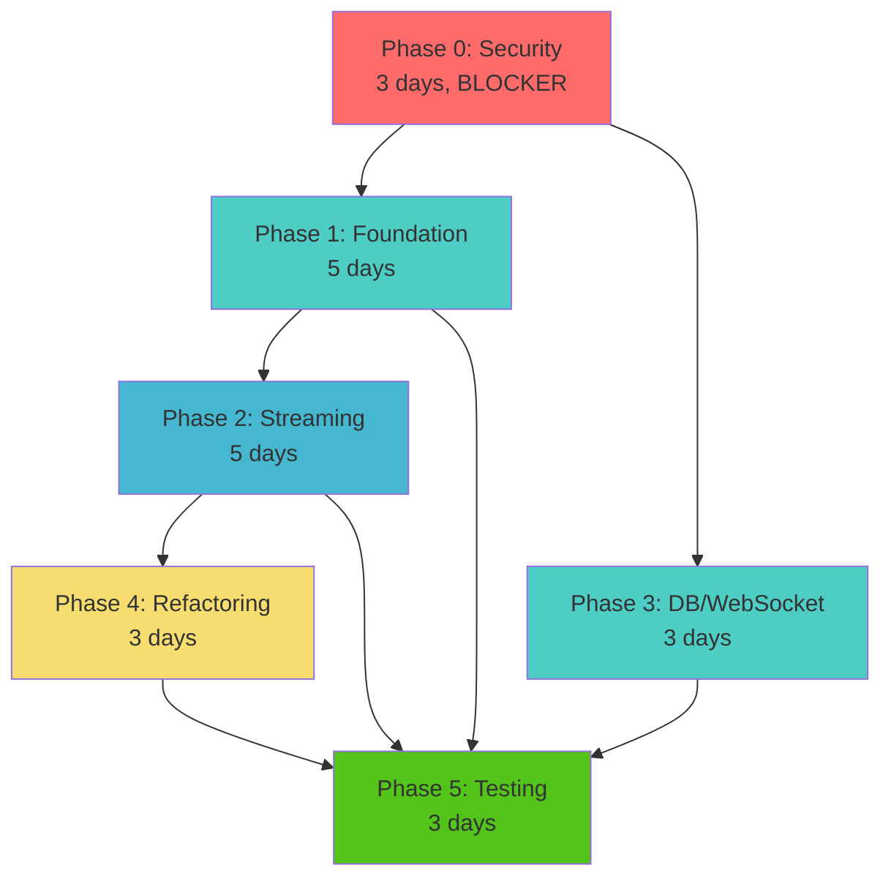

# Orchestrator Master Guide - Chunking Feature Implementation

**Document Purpose**: Complete context and execution strategy for orchestrator agents managing the chunking feature fix  
**Project Status**: Pre-release application with complete freedom to rebuild  
**Timeline**: 6-7 weeks total  
**Team Structure**: Multiple AI agents working in parallel where possible  

---

## 🚨 CRITICAL CONTEXT - READ THIS FIRST

### We Are Pre-Release - This Changes Everything

**What this means**:
- We have ZERO production users
- We have NO data to migrate
- We have NO backwards compatibility requirements
- We CAN break any interface
- We CAN drop and recreate any database table
- We CAN delete and replace any code

**How this affects implementation**:
```python
# ❌ NEVER do this:
def new_feature():
    if legacy_mode:
        return old_implementation()
    else:
        return new_implementation()

# ✅ ALWAYS do this:
def new_feature():
    return optimal_implementation()  # Just build it right!
```

**Key Instruction for All Agents**: When you see old code, DELETE IT. Don't wrap it, don't create adapters, don't maintain compatibility. Replace it with the correct implementation.

---

## The Problem We're Solving

### Current State (BROKEN)
We have a chunking feature with 46,000+ lines of changes that is fundamentally broken:

1. **Memory Exhaustion**: Documents >100MB cause OOM (loads entire file into memory)
2. **Security Vulnerabilities**: Path traversal, no rate limiting, Redis memory leaks
3. **Cannot Scale**: Fixed 16 partitions, in-memory WebSockets, 2100-line monolithic service
4. **Poor Architecture**: Mixed concerns, no streaming, tight coupling, untestable

### Target State (FIXED)
A production-ready chunking system that:

1. **Handles Any File Size**: Streaming with <100MB memory usage
2. **Secure**: No vulnerabilities, rate limited, memory bounded
3. **Scalable**: 100 partitions, distributed WebSockets, 10K concurrent connections
4. **Clean Architecture**: DDD, modular monolith, <500 lines per service

---

## Strategic Approach

### Core Principles
1. **Fix Root Causes, Not Symptoms** - Don't patch broken code, replace it
2. **Simple Over Complex** - 100 direct partitions, not 1M virtual mappings
3. **Pragmatic Over Perfect** - Modular monolith, not microservices
4. **Delete Over Refactor** - Remove old code entirely, build fresh

### Key Technical Decisions (FINAL)

| Area | Decision | Why | NOT This |
|------|----------|-----|----------|
| **Partitions** | 100 direct LIST partitions | Simple, maintainable | ❌ Virtual mapping (complex) |
| **Streaming** | AsyncIO with 64KB buffers | Native Python, proven | ❌ Reactive Streams (overkill) |
| **WebSockets** | Redis Pub/Sub | Simple, <100ms latency | ❌ Proxy tier (complex) |
| **Architecture** | Modular monolith | Team can maintain | ❌ Microservices (10x overhead) |

---

## Phase Execution Strategy

### Execution Timeline
```
Week 1: Phase 0 (Security) + Start Phase 1 & 3
Week 2: Complete Phase 1 & 3, Start Phase 2
Week 3-4: Complete Phase 2, Start Phase 4
Week 5: Complete Phase 4, Start Phase 5
Week 6: Complete Phase 5, Production ready
```

### Phase Dependencies & Parallelization



### Parallel Execution Opportunities

| When | What Can Run in Parallel | Agents Needed |
|------|--------------------------|---------------|
| Day 1 | SEC-001 + SEC-002 | 2 agents |
| Day 4-8 | Phase 1 (ARCH-001 + ARCH-002) + Phase 3 (DB-001 + DB-002 + WS-001) | 5 agents |
| Week 3 | STREAM-001 (critical path) | 1 expert agent |
| Week 6 | TEST-001 + TEST-002 | 2 agents |

---

## Phase-by-Phase Orchestration

### Phase 0: Security Fixes [BLOCKER - Days 1-3]
**Goal**: Eliminate critical vulnerabilities  
**Status**: MUST COMPLETE FIRST - System is currently exploitable  

**Tickets**:
- SEC-001: Path Traversal Fix (4 hours)
- SEC-002: Rate Limiting (4 hours) 
- SEC-003: Redis TTL (2 hours)

**Orchestration**:
1. Morning Day 1: Launch SEC-001 and SEC-002 in parallel
2. Afternoon Day 1: Launch SEC-003
3. Day 2-3: Testing and validation

**Success Gate**: Security scanner shows 0 vulnerabilities

---

### Phase 1: Foundation Refactoring [Days 4-8]
**Goal**: Establish clean architecture with DDD  
**Status**: Can start immediately after Phase 0  

**Tickets**:
- ARCH-001: Extract Domain Layer (2 days)
- ARCH-002: Create Application Layer (2 days)

**Orchestration**:
1. Both tickets can run in parallel
2. Agents should coordinate on interfaces Day 1
3. Integration testing on Day 5

**Key Instruction**: DELETE `packages/webui/services/chunking_service.py` (2100 lines) entirely

**Success Gate**: Domain layer has 0 infrastructure imports

---

### Phase 2: Streaming Implementation [Week 3]
**Goal**: Handle unlimited file sizes with bounded memory  
**Status**: CRITICAL PATH - Most complex technical challenge  

**Tickets**:
- STREAM-001: Core Streaming Pipeline (3 days) - MUST complete first
- STREAM-002: Adapt Strategies (2 days) - Depends on STREAM-001

**Critical Requirements**:
- UTF-8 boundary safety (NEVER split multi-byte characters)
- Memory <100MB for any file size
- Checkpoint/resume capability

**Success Gate**: Process 10GB file with <100MB memory

---

### Phase 3: Database & WebSocket Scaling [Days 4-6]
**Goal**: Production-ready infrastructure  
**Status**: Can run parallel with Phase 1  

**Tickets**:
- DB-001: 100 Direct Partitions (2 days)
- DB-002: Partition Monitoring (1 day)
- WS-001: Redis Pub/Sub WebSockets (3 days)

**Critical Decision Reminder**:
```sql
-- ✅ CORRECT: 100 direct LIST partitions
PARTITION BY LIST (hashtext(collection_id::text) % 100);

-- ❌ WRONG: No virtual mappings, no 1M partitions
```

**Success Gate**: 100 partitions balanced, WebSockets scale to 3+ instances

---

### Phase 4: Service Refactoring [Week 5]
**Goal**: Break apart monolithic service  
**Status**: Depends on Phase 2 completion  

**Approach**:
- Split into 5 services, each <500 lines
- Single responsibility per service
- Dependency injection

**Success Gate**: No service >500 lines, all tests pass

---

### Phase 5: Testing & Hardening [Week 6]
**Goal**: Verify production readiness  
**Status**: Final phase after all implementation  

**Parallel Testing**:
- TEST-001: Chaos Engineering (2 days)
- TEST-002: Load Testing (2 days)

**Success Gate**: Survives all failure modes, 24-hour stability

---

## Agent Assignment Strategy

### Matching Agents to Tickets

```python
def assign_agent_to_ticket(ticket_id, available_agents):
    expertise_map = {
        "SEC-": ["security", "OWASP", "rate_limiting"],
        "ARCH-": ["DDD", "clean_architecture", "SOLID"],
        "STREAM-": ["asyncio", "streaming", "UTF-8"],
        "DB-": ["PostgreSQL", "partitioning", "SQL"],
        "WS-": ["WebSockets", "Redis", "pub_sub"],
        "TEST-": ["chaos_engineering", "load_testing"],
    }
    
    for prefix, required_skills in expertise_map.items():
        if ticket_id.startswith(prefix):
            return find_agent_with_skills(required_skills)
```

### Agent Coordination

**For Parallel Work**:
1. Agents define interfaces first (morning Day 1)
2. Share interface contracts via code comments
3. Mock dependencies for testing
4. Integrate when both complete

**For Sequential Work**:
1. First agent completes and documents approach
2. Second agent reads output and continues
3. No rework of previous agent's code

---

## Common Pitfalls & Solutions

### Pitfall 1: Trying to Maintain Compatibility
**Symptom**: Agent creates adapters, wrappers, or dual-mode code  
**Solution**: Remind agent we're pre-release - DELETE old code  

### Pitfall 2: Over-Engineering
**Symptom**: Agent proposes complex architecture (microservices, event sourcing)  
**Solution**: Remind agent to keep it simple - modular monolith is enough  

### Pitfall 3: Incomplete Security Fixes
**Symptom**: Agent fixes some attack vectors but not all  
**Solution**: Must handle ALL OWASP patterns, not just common ones  

### Pitfall 4: UTF-8 Corruption in Streaming
**Symptom**: Multi-byte characters split at buffer boundaries  
**Solution**: CRITICAL - Must implement proper boundary detection  

---

## Success Metrics & Validation

### Per-Phase Success Criteria

| Phase | Must Achieve | How to Verify |
|-------|--------------|---------------|
| 0 | Zero vulnerabilities | `npm run security:scan` |
| 1 | Pure domain layer | `grep -r "import sqlalchemy" domain/` returns nothing |
| 2 | Streaming works | Process 10GB file with <100MB RAM |
| 3 | Partitions balanced | `SELECT * FROM partition_health` shows <20% skew |
| 4 | Services focused | No file >500 lines |
| 5 | Production ready | 24-hour load test passes |

### Overall Success Metrics
- ✅ Process 1GB files with <100MB memory
- ✅ Support 10,000 concurrent WebSockets
- ✅ Zero security vulnerabilities
- ✅ P99 latency <1 second
- ✅ All tests passing (100% critical path coverage)

---

## Resource Allocation Guide

### Optimal Agent Distribution

**Week 1 (7 agents ideal)**:
- 2 agents: Phase 0 security fixes
- 2 agents: Phase 1 architecture
- 3 agents: Phase 3 infrastructure

**Week 2-3 (3 agents ideal)**:
- 1 expert agent: Phase 2 streaming (critical path)
- 2 agents: Continue Phase 1/3 or start documentation

**Week 4-5 (2 agents ideal)**:
- 1 agent: Phase 4 refactoring
- 1 agent: Prepare test scenarios

**Week 6 (2-3 agents ideal)**:
- 2 agents: Parallel testing
- 1 agent: Documentation and handoff

---

## Escalation Procedures

### When to Escalate

1. **Immediate Escalation**:
   - Security vulnerability not fully fixed
   - UTF-8 corruption in streaming
   - Data loss or corruption

2. **2-Hour Rule**:
   - Agent blocked for >2 hours
   - Agent attempting compatibility code
   - Agent over-engineering solution

3. **Phase Gate Failures**:
   - Security scan still shows vulnerabilities
   - Memory usage exceeds limits
   - Tests failing after implementation

### Escalation Template
```
ESCALATION REQUIRED
Ticket: [TICKET-ID]
Agent: [Agent identifier]
Issue: [Specific blocker]
Attempted: [What was tried]
Error: [Error messages if any]
Recommendation: [Suggested resolution]
```

---

## Quick Reference Commands

```bash
# Security validation (after Phase 0)
npm run security:scan
python tests/security/test_path_traversal.py

# Memory testing (after Phase 2)
python tests/streaming/test_memory_usage.py --file-size=10gb

# Partition health (after Phase 3)
psql -c "SELECT * FROM partition_health;"

# WebSocket scaling (after Phase 3)
docker-compose up --scale webui=3
python tests/load/websocket_test.py --connections=1000

# Full test suite (Phase 5)
pytest tests/ -v --cov=packages/shared/chunking

# Load test
locust -f tests/load/load_test.py --users=1000 --spawn-rate=10
```

---

## Final Reminders for Orchestrators

1. **Phase 0 is BLOCKER** - Nothing else can start until security is fixed
2. **Maximize parallelization** - Run Phase 1 and 3 simultaneously
3. **UTF-8 boundaries are CRITICAL** - Data corruption is unacceptable
4. **Delete old code** - We're pre-release, build it right
5. **Keep it simple** - Reject over-engineered solutions
6. **Document decisions** - Future agents need context

---

## Communication Templates

### Phase Start Announcement
```
Starting Phase [N]: [Name]
Tickets: [List of ticket IDs]
Agents assigned: [Agent assignments]
Parallel execution: [Yes/No - which tickets]
Expected completion: [Date/time]
Dependencies: [What must complete first]
```

### Phase Completion Report
```
Phase [N] Complete: [Name]
✅ Success criteria met:
  - [Criterion 1]: [Result]
  - [Criterion 2]: [Result]
✅ All tickets completed
✅ Tests passing: [X/Y]
✅ Performance metrics: [Key metrics]
Ready for Phase [Next]: [Name]
```

### Daily Status Update
```
Day [N] Status:
Active: [Phase(s) and tickets in progress]
Completed today: [What finished]
Blocked: [Any blockers]
Tomorrow: [What starts next]
Overall progress: [X]% complete
```

---

## Appendix: File Locations

### Key Documentation
- `/chunking-implementation/README.md` - Quick start guide
- `/chunking-implementation/CHUNKING_REDESIGN_BLUEPRINT.md` - Architecture decisions
- `/chunking-implementation/CHUNKING_FIX_TICKETS_FOR_AI_AGENTS_OPTIMIZED.md` - All tickets

### Phase Orchestrator Guides
- `/chunking-implementation/phase-0-security/ORCHESTRATOR-PHASE-0.md`
- `/chunking-implementation/phase-1-foundation/ORCHESTRATOR-PHASE-1.md`
- `/chunking-implementation/phase-2-streaming/ORCHESTRATOR-PHASE-2.md`
- `/chunking-implementation/phase-3-database-websocket/ORCHESTRATOR-PHASE-3.md`
- `/chunking-implementation/phase-4-refactoring/ORCHESTRATOR-PHASE-4.md`
- `/chunking-implementation/phase-5-testing/ORCHESTRATOR-PHASE-5.md`

### Individual Tickets
Each phase directory contains `TICKET-*.md` files with detailed implementation instructions.

---

**Remember: We are PRE-RELEASE. This is our opportunity to build it RIGHT from the beginning. Use this freedom wisely!**