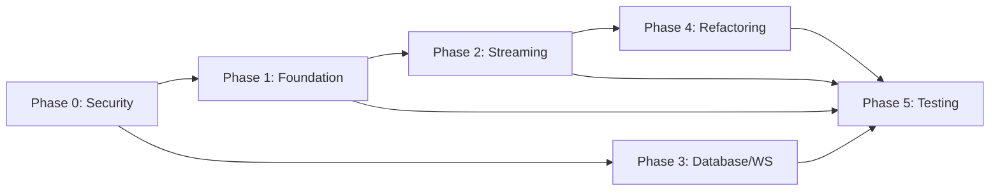

# Chunking Feature Implementation Guide

**Status**: Ready for AI Agent Execution  
**Timeline**: 6-7 weeks  
**Context**: PRE-RELEASE APPLICATION - No backwards compatibility needed  

## 🚨 Critical Context for All Agents

**WE ARE PRE-RELEASE - This changes EVERYTHING:**
- ✅ Delete old code, don't wrap it
- ✅ Drop tables and recreate them  
- ✅ Change any interface freely
- ✅ Implement the RIGHT solution
- ❌ NO migration code
- ❌ NO compatibility layers
- ❌ NO gradual transitions

## Directory Structure

```
chunking-implementation/
├── README.md                          # This file
├── CHUNKING_ORCHESTRATION_GUIDE_ENHANCED.md  # Master coordination guide
├── CHUNKING_FIX_TICKETS_FOR_AI_AGENTS_OPTIMIZED.md  # All tickets in one file
├── CHUNKING_REDESIGN_BLUEPRINT.md     # Architecture decisions
├── CHUNKING_PLAN_VALIDATION_CHECKLIST.md  # Validation checklist
│
├── phase-0-security/                  # BLOCKER - Must complete first
│   ├── ORCHESTRATOR-PHASE-0.md       # Phase coordination
│   ├── TICKET-SEC-001.md             # Path traversal fix
│   ├── TICKET-SEC-002.md             # Rate limiting
│   └── TICKET-SEC-003.md             # Redis TTL
│
├── phase-1-foundation/                # Architecture refactoring
│   ├── ORCHESTRATOR-PHASE-1.md
│   ├── TICKET-ARCH-001.md            # Domain layer
│   └── TICKET-ARCH-002.md            # Application layer
│
├── phase-2-streaming/                 # Streaming implementation
│   ├── ORCHESTRATOR-PHASE-2.md
│   ├── TICKET-STREAM-001.md          # Core pipeline
│   └── TICKET-STREAM-002.md          # Strategy adaptation
│
├── phase-3-database-websocket/       # Infrastructure scaling
│   ├── ORCHESTRATOR-PHASE-3.md
│   ├── TICKET-DB-001.md              # 100 partitions
│   └── TICKET-WS-001.md              # WebSocket scaling
│
├── phase-4-refactoring/              # Service decomposition
│   └── ORCHESTRATOR-PHASE-4.md
│
└── phase-5-testing/                  # Hardening
    └── ORCHESTRATOR-PHASE-5.md
```

## Execution Order & Dependencies



## Quick Start for Orchestrator Agent

1. **Start with Phase 0** (Security) - These are BLOCKERS
   - Read `phase-0-security/ORCHESTRATOR-PHASE-0.md`
   - Assign tickets to available agents
   - Must complete before ANY other work

2. **Parallel Opportunities After Phase 0**:
   - Phase 1 (Foundation) - 2 agents in parallel
   - Phase 3 (Database/WebSocket) - 3 agents in parallel

3. **Sequential Requirements**:
   - Phase 2 must wait for Phase 1
   - Phase 4 must wait for Phase 2
   - Phase 5 should wait for all implementation

## Key Technical Decisions (FINAL)

| Decision | Choice | NOT This |
|----------|--------|----------|
| **Partitions** | 100 direct LIST partitions | ❌ Virtual mapping, 1M partitions |
| **Streaming** | AsyncIO with 64KB buffers | ❌ Reactive Streams, queues |
| **WebSockets** | Redis Pub/Sub | ❌ Proxy tier, GraphQL |
| **Architecture** | Modular monolith | ❌ Microservices |

## Agent Assignment Guide

| Phase | Tickets | Agent Skills Needed | Parallel? |
|-------|---------|-------------------|-----------|
| 0 | SEC-001,002,003 | Security, Rate Limiting, Redis | Yes (001 & 002) |
| 1 | ARCH-001,002 | DDD, Clean Architecture | Yes |
| 2 | STREAM-001,002 | AsyncIO, Streaming, UTF-8 | No (002 needs 001) |
| 3 | DB-001, WS-001 | PostgreSQL, WebSockets | Yes |
| 4 | REFACTOR-001 | Refactoring, SOLID | Single |
| 5 | TEST-001,002 | Chaos, Load Testing | Yes |

## Success Metrics

### Phase Gates
Each phase must meet success criteria before proceeding:

**Phase 0**: Zero security vulnerabilities  
**Phase 1**: Domain layer has zero infrastructure imports  
**Phase 2**: Process 10GB file with <100MB memory  
**Phase 3**: 100 partitions balanced, WebSockets scale to 3 instances  
**Phase 4**: No service >500 lines  
**Phase 5**: All chaos tests pass, 24-hour stability  

### Overall Success
- Process 1GB files with <100MB memory ✓
- Support 10,000 concurrent WebSockets ✓
- Zero security vulnerabilities ✓
- <1s response time at P99 ✓
- All tests passing ✓

## Common Agent Instructions

### For Every Ticket

```python
# ❌ NEVER DO THIS:
if backwards_compatible:
    use_old_code()
else:
    use_new_code()

# ✅ ALWAYS DO THIS:
use_optimal_solution()  # We're pre-release!
```

### When Blocked

1. Check if trying to maintain compatibility (DON'T!)
2. Check if over-engineering (KEEP IT SIMPLE!)
3. Review the pre-release advantage
4. Escalate to orchestrator if still blocked

## Critical Reminders

1. **Partition Strategy**: 100 direct LIST partitions, NO virtual mapping
2. **UTF-8 Boundaries**: CRITICAL in streaming - never split characters
3. **Pre-Release**: Delete old code, don't wrap it
4. **Simplicity**: Choose simple solutions over complex

## Useful Commands

```bash
# Run security scan after Phase 0
npm run security:scan

# Test streaming memory usage
python tests/streaming/test_memory_usage.py

# Check partition distribution
psql -c "SELECT * FROM partition_health;"

# Load test WebSockets
python tests/load/websocket_test.py --connections=1000

# Run full test suite
pytest tests/ -v --cov
```

## Documentation References

- **Why**: See `CHUNKING_REDESIGN_BLUEPRINT.md` for decisions
- **What**: See individual ticket files for implementation
- **How**: See orchestrator guides for coordination
- **When**: See `CHUNKING_IMPLEMENTATION_ROADMAP.md` for timeline

## Contact for Escalation

If an agent is blocked for >2 hours on any ticket, escalate to the orchestrator agent with:
1. Ticket ID
2. Specific blocker
3. What was tried
4. Error messages if any

---

**Remember: We are PRE-RELEASE. This is our chance to build it RIGHT from the start!**