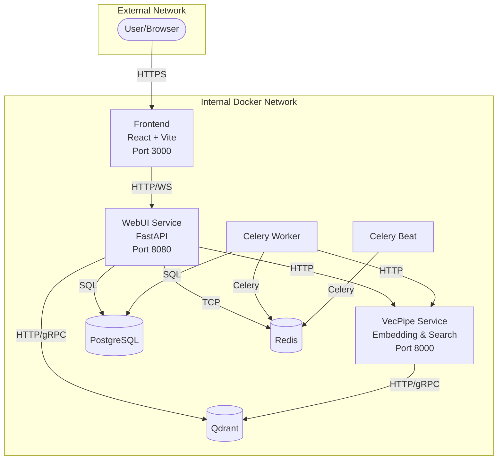
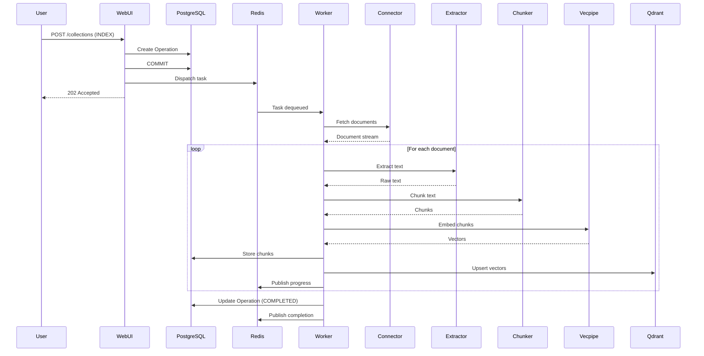
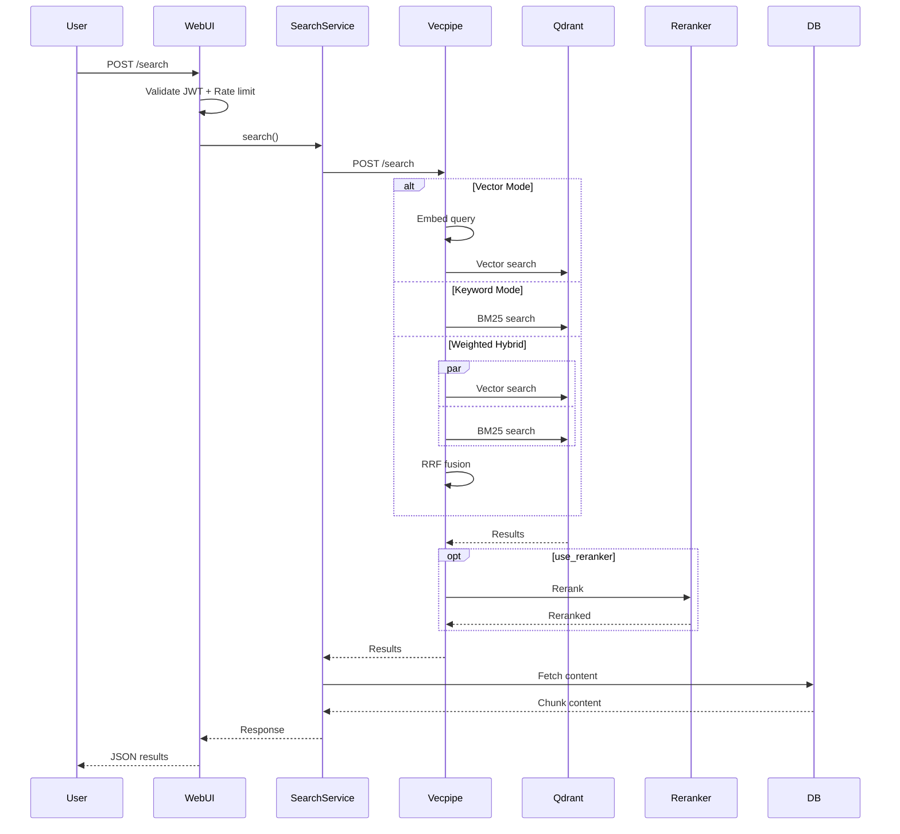
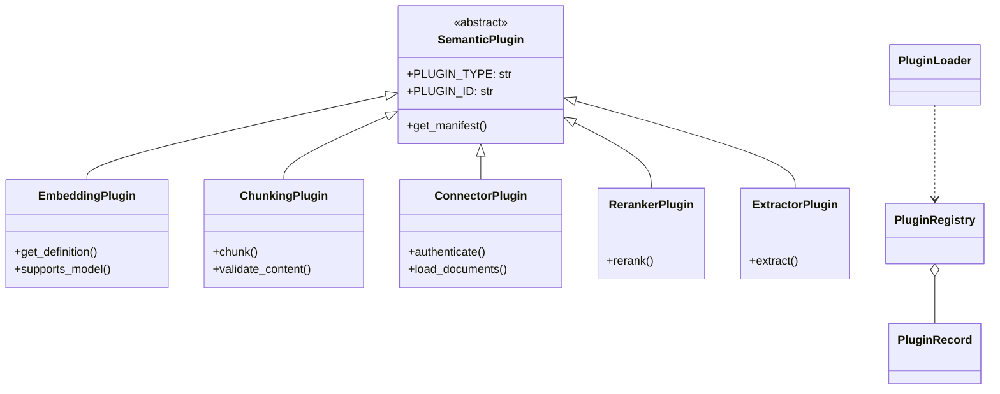
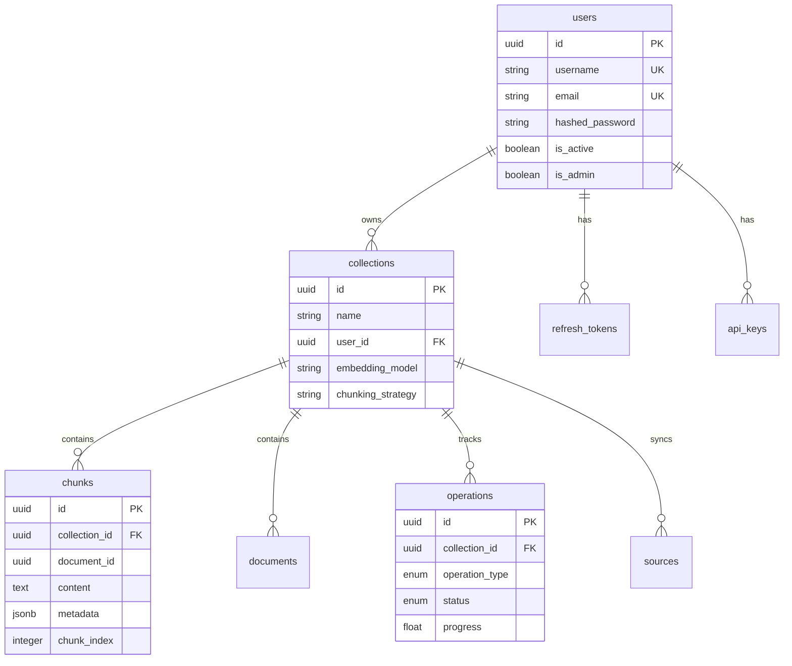

# Semantik Architecture Review

**Generated**: 2026-01-05
**Scope**: Comprehensive codebase analysis for AI reviewer context
**Codebase Size**: ~650 files, ~2M tokens

---

## Executive Summary

Semantik is a **self-hosted semantic search engine** that enables organizations to index, chunk, embed, and search their documents using modern vector similarity techniques. The system follows a **collection-centric architecture** where documents are organized into searchable collections with configurable chunking strategies and embedding models.

### Key Strengths

1. **Well-Architected Plugin System**: Extensible 5-plugin-type architecture (embedding, chunking, connector, reranker, extractor) with entry-point-based discovery
2. **Production-Ready Infrastructure**: Comprehensive Docker deployment, GPU memory management with LRU eviction, connection pooling, rate limiting
3. **Modern Tech Stack**: FastAPI + React 19, async-first design, TypeScript frontend with proper state management (Zustand + TanStack Query)
4. **Robust Background Processing**: Celery with commit-before-dispatch pattern preventing race conditions
5. **Real-time Updates**: WebSocket system with Redis Pub/Sub for scalable multi-instance deployments
6. **Flexible Search**: Three search modes (vector, keyword, weighted hybrid) with optional cross-encoder reranking

### Key Concerns

1. **Documentation Drift**: Several discrepancies between documentation and implementation (see Documentation Issues section)
2. **Test Coverage**: Integration tests exist but some areas (WebSocket, GPU memory) have limited coverage
3. **Security Hardening**: JWT implementation is functional but lacks some advanced features (key rotation, token introspection)

### Technology Stack

| Layer | Technology |
|-------|------------|
| Frontend | React 19, Vite 7, TypeScript, Zustand, TanStack Query, Tailwind CSS |
| API | FastAPI, Pydantic v2, WebSocket |
| Background | Celery, Redis (broker), beat scheduler |
| Database | PostgreSQL 16 (relational), Qdrant 1.12 (vector) |
| ML/Embedding | PyTorch, sentence-transformers, Qwen3-Embedding models |
| Infrastructure | Docker Compose, CUDA support, nginx (optional) |

---

## System Architecture

### High-Level Overview



### Service Descriptions

| Service | Purpose | Key Responsibilities |
|---------|---------|---------------------|
| **webui** | API Gateway | REST endpoints, JWT auth, WebSocket, rate limiting |
| **vecpipe** | ML Service | Embedding generation, vector search, reranking |
| **worker** | Task Processor | Document ingestion, chunking, batch embedding |
| **scheduler** | Cron Jobs | Periodic tasks, health checks, cleanup |
| **postgres** | Relational DB | Users, collections, chunks, operations metadata |
| **qdrant** | Vector DB | Embedding storage, similarity search |
| **redis** | Message Broker | Celery queue, WebSocket pub/sub, caching |
| **frontend** | Web UI | React SPA for collection management and search |

---

## Package Structure

```
semantik/
├── packages/
│   ├── webui/           # FastAPI backend (API gateway)
│   │   ├── api/v2/      # REST endpoints
│   │   ├── services/    # Business logic
│   │   ├── tasks/       # Celery tasks
│   │   └── websocket/   # Real-time updates
│   ├── vecpipe/         # Embedding & search service
│   │   ├── embedding/   # Model management
│   │   ├── search/      # HybridSearchEngine
│   │   └── reranking/   # Cross-encoder reranker
│   └── shared/          # Common utilities
│       ├── database/    # SQLAlchemy models
│       ├── plugins/     # Plugin system
│       ├── chunking/    # 6 chunking strategies
│       └── contracts/   # Pydantic schemas
├── apps/
│   └── webui-react/     # React frontend (192 files)
└── tests/               # pytest test suite
```

---

## Domain Analysis Summaries

### 1. API Layer (`packages/webui/api/`)

**Architecture**: FastAPI routers organized by domain (collections, search, operations, plugins, auth)

**Key Patterns**:
- V2 API at `/api/v2/` with versioned endpoints
- Dependency injection via FastAPI's `Depends()`
- Rate limiting middleware (30-60 req/min based on endpoint)
- Pydantic v2 schemas for request/response validation

**Critical Endpoints**:
| Endpoint | Purpose |
|----------|---------|
| `POST /api/v2/collections` | Create collection, start indexing |
| `POST /api/v2/search/single` | Single collection search |
| `POST /api/v2/search` | Multi-collection search |
| `GET /api/v2/operations/{id}` | Check operation status |
| `GET /api/v2/plugins` | List available plugins |

**Strengths**: Clean separation, comprehensive validation, proper error handling
**Concerns**: Some endpoints lack pagination defaults

---

### 2. Services Layer (`packages/webui/services/`)

**Architecture**: Service classes with factory pattern for dependency injection

**Key Services**:
- `CollectionService`: CRUD operations, source management
- `SearchService`: Orchestrates search across vecpipe
- `OperationService`: Tracks long-running operations
- `ChunkingOrchestrator`: Manages chunk pipeline

**Patterns**:
- Async-first design with `async/await`
- Repository pattern for database access
- Commit-before-dispatch for Celery tasks (prevents race conditions)

**Code Sample** (commit-before-dispatch):
```python
# packages/webui/services/collection_service.py
async with session.begin():
    operation = Operation(collection_id=collection.id, type=OperationType.INDEX)
    session.add(operation)
    # COMMIT happens here before task dispatch
await dispatch_celery_task(operation.id)  # Safe: operation exists in DB
```

---

### 3. Database Layer (`packages/shared/database/`)

**Architecture**: SQLAlchemy 2.x async with PostgreSQL-specific optimizations

**Key Tables**:
| Table | Purpose | Special Features |
|-------|---------|------------------|
| `users` | Authentication | bcrypt passwords |
| `collections` | Document containers | embedding_model, chunking_strategy |
| `chunks` | Text segments | **100 LIST partitions** by collection_id |
| `documents` | Source tracking | JSONB metadata |
| `operations` | Task tracking | status enum, progress float |
| `sources` | Sync configuration | connector type, schedule |

**Partitioning Strategy**:
- Chunks table partitioned by `collection_id % 100`
- Enables efficient collection deletion and queries
- Migration: `alembic/versions/chunk_partitioning.py`

**Connection Pooling**:
```python
# packages/shared/database/session.py
engine = create_async_engine(
    DATABASE_URL,
    pool_size=20,
    max_overflow=40,
    pool_pre_ping=True
)
```

---

### 4. Chunking System (`packages/shared/chunking/`)

**Architecture**: Strategy pattern with `UnifiedChunkingStrategy` base class

**Available Strategies**:
| Strategy | Description | Use Case |
|----------|-------------|----------|
| `character` | Fixed character splits | Simple documents |
| `recursive` | Hierarchical separators | Code, structured text |
| `markdown` | Header-aware splits | Documentation |
| `semantic` | ML-based boundaries | High-quality retrieval |
| `hierarchical` | Parent-child chunks | Context preservation |
| `hybrid` | Combines strategies | Complex documents |

**Safety Features**:
- ReDoS protection (timeout on regex operations)
- UTF-8 boundary safety (never splits mid-character)
- Content validation before chunking

**Configuration**:
```python
ChunkingConfig(
    strategy="recursive",
    chunk_size=1000,
    chunk_overlap=200,
    separators=["\n\n", "\n", ". ", " "]
)
```

---

### 5. Embedding & Vector System (`packages/vecpipe/`)

**Architecture**: GPU-managed embedding service with LRU model caching

**Key Components**:
- `GPUMemoryGovernor`: LRU eviction with CPU offloading
- `ModelManager`: Async model loading and inference
- `HybridSearchEngine`: Vector + keyword fusion
- `CrossEncoderReranker`: Qwen3-Reranker for result refinement

**GPU Memory Management**:
```
< 60% usage  → Normal operation
60-80%       → Evict models idle > 120s
80-90%       → Evict models idle > 30s
> 90%        → Force unload all idle models
```

**Default Embedding Model**: `Qwen3-Embedding-0.6B` (int8 quantized)

**Search Modes**:
1. **vector**: Pure cosine similarity
2. **keyword**: BM25 via sparse vectors
3. **weighted**: RRF fusion (alpha=0.7 vector, 0.3 keyword)

---

### 6. Plugin System (`packages/shared/plugins/`)

**Architecture**: Entry-point-based discovery with 5 plugin types

**Plugin Types**:
| Type | Purpose | Built-in Examples |
|------|---------|-------------------|
| `embedding` | Vector generation | sentence-transformers, OpenAI |
| `chunking` | Document splitting | All 6 strategies |
| `connector` | Source ingestion | LocalFile, Git, IMAP |
| `reranker` | Result refinement | Qwen3-Reranker |
| `extractor` | Text extraction | PDF, DOCX, XLSX, PPTX |

**Registration** (pyproject.toml):
```toml
[project.entry-points."semantik.plugins"]
dense-local = "semantik.embedding.dense_local:DenseLocalEmbeddingProvider"
```

**Thread Safety**: `PluginRegistry` uses `RLock` for concurrent access

---

### 7. Frontend (`apps/webui-react/`)

**Architecture**: React 19 SPA with modern tooling

**Stack**:
- Build: Vite 7
- State: Zustand (global) + TanStack Query (server)
- Styling: Tailwind CSS 4
- Router: TanStack Router

**Key Features**:
- PDF viewer with annotation support
- Embedding atlas visualization
- Real-time operation progress via WebSocket
- Responsive layout with dark mode

**State Stores**:
| Store | Purpose |
|-------|---------|
| `authStore` | JWT tokens, user info |
| `searchStore` | Query state, results |
| `uiStore` | Theme, sidebar, modals |
| `chunkingStore` | Strategy configuration |

---

### 8. WebSocket System (`packages/webui/websocket/`)

**Architecture**: ScalableWebSocketManager with Redis Pub/Sub

**Features**:
- Subprotocol-based JWT authentication
- Connection limits: 10/user, 10,000 total
- Room-based subscriptions (collection, operation)
- Cross-instance message routing via Redis

**Message Flow**:
```
Worker → Redis PUBLISH → All WebUI instances → Connected clients
```

**Event Types**:
- `operation-progress`: Ingestion progress updates
- `operation-complete`: Task completion
- `collection-update`: Collection metadata changes

---

### 9. Authentication & Security (`packages/webui/auth/`)

**Architecture**: JWT-based with refresh token rotation

**Token Configuration**:
| Token Type | Lifetime | Storage |
|------------|----------|---------|
| Access Token | 24 hours | Client memory |
| Refresh Token | 30 days | HttpOnly cookie |

**Security Features**:
- bcrypt password hashing (work factor 12)
- Rate limiting with circuit breaker
- CSP middleware with stricter policies for sensitive endpoints
- API key support for programmatic access

**Concerns**:
- No key rotation mechanism
- Missing token introspection endpoint
- No MFA support

---

### 10. Connectors (`packages/shared/connectors/`)

**Architecture**: Plugin-based source ingestion

**Available Connectors**:
| Connector | Source | Features |
|-----------|--------|----------|
| `LocalFileConnector` | Filesystem | Recursive scanning, glob patterns |
| `GitConnector` | Git repositories | Clone/pull, branch selection |
| `IMAPConnector` | Email servers | Folder selection, attachment extraction |

**Document Flow**:
```
Connector → IngestedDocument → Extractor → Raw Text → Chunker → Chunks
```

---

### 11. Background Tasks (`packages/webui/tasks/`)

**Architecture**: Celery with Redis broker

**Key Tasks**:
| Task | Purpose |
|------|---------|
| `process_collection_operation` | INDEX, APPEND, REINDEX, REMOVE_SOURCE |
| `parallel_ingestion` | Multi-worker document processing |
| `blue_green_reindex` | Zero-downtime reindexing |

**Patterns**:
- Commit-before-dispatch (prevents race conditions)
- Exponential backoff with max 3 retries
- Dead letter queue for failed tasks

**Concurrency**: 4 workers default, configurable via `CELERY_CONCURRENCY`

---

### 12. DevOps & Deployment

**Docker Configuration**:
- Multi-stage builds (builder → runtime)
- CUDA support for GPU containers
- Health checks for all services
- Volume mounts for persistence

**Services** (docker-compose.yml):
```yaml
services:
  webui:     # FastAPI API
  vecpipe:   # Embedding service
  worker:    # Celery worker
  scheduler: # Celery beat
  postgres:  # Database
  qdrant:    # Vector store
  redis:     # Message broker
  frontend:  # React app
```

**Environment Variables**: Validated at startup via Pydantic Settings

---

### 13. Test Architecture (`tests/`)

**Framework**: pytest with async support

**Coverage**:
| Area | Coverage | Notes |
|------|----------|-------|
| API endpoints | Good | Integration tests with TestClient |
| Services | Moderate | Unit tests with mocks |
| Chunking | Good | Strategy-specific tests |
| Database | Good | Transaction rollback fixtures |
| Frontend | Limited | Vitest setup exists |

**Fixtures**:
- `db_session`: Async session with rollback
- `test_user`: Authenticated user context
- `test_collection`: Sample collection with chunks

---

## Documentation Issues Found

During verification against actual code, the following discrepancies were identified:

### Critical Issues

| Document | Claim | Reality |
|----------|-------|---------|
| DATABASE_ARCH.md | Source type "github" | Actual: "git" |
| API docs | Batch search limit 256 | Actual: **100** |
| Search docs | Hybrid mode "rerank" | Actual: **"weighted"** |

### Missing Documentation

- `OperationType.DELETE` - undocumented
- `OperationType.PROJECTION_BUILD` - undocumented
- `projection_runs` table - not in schema docs
- `plugin_configs` table - not in schema docs
- New chunking strategies (hierarchical, hybrid) - incomplete docs

### Recommendations

1. **Update DATABASE_ARCH.md** with correct source types
2. **Document new operation types** and tables
3. **Add API changelog** for breaking changes

---

## Architecture Diagrams

### Document Ingestion Pipeline



### Search Flow



### Plugin System



---

## Data Model (ER Diagram)



---

## Recommendations for Future Development

### High Priority

1. **Fix documentation accuracy** - Update API limits and remove any stale claims
2. **Add integration test coverage** for WebSocket and GPU memory management
3. **Implement JWT key rotation** for production security
4. **Add API versioning strategy** documentation

### Medium Priority

1. **Add MFA support** for admin accounts
2. **Implement token introspection** endpoint
3. **Add metrics/observability** (Prometheus/OpenTelemetry)
4. **Document deployment best practices**

### Low Priority

1. **Add GraphQL API** as alternative to REST
2. **Add E2E test suite** with Playwright
3. **Create developer onboarding guide**

---

## Appendix: File Counts by Package

| Package | Files | Lines (approx) |
|---------|-------|----------------|
| `packages/webui` | ~150 | 15,000 |
| `packages/vecpipe` | ~50 | 5,000 |
| `packages/shared` | ~100 | 10,000 |
| `apps/webui-react` | ~192 | 20,000 |
| `tests` | ~80 | 8,000 |
| `docs` | ~40 | 5,000 |
| **Total** | **~650** | **~63,000** |

---

*This document was generated through comprehensive subagent analysis of all major codebase domains. Each section represents synthesized findings from domain-specific deep dives into the actual implementation.*
