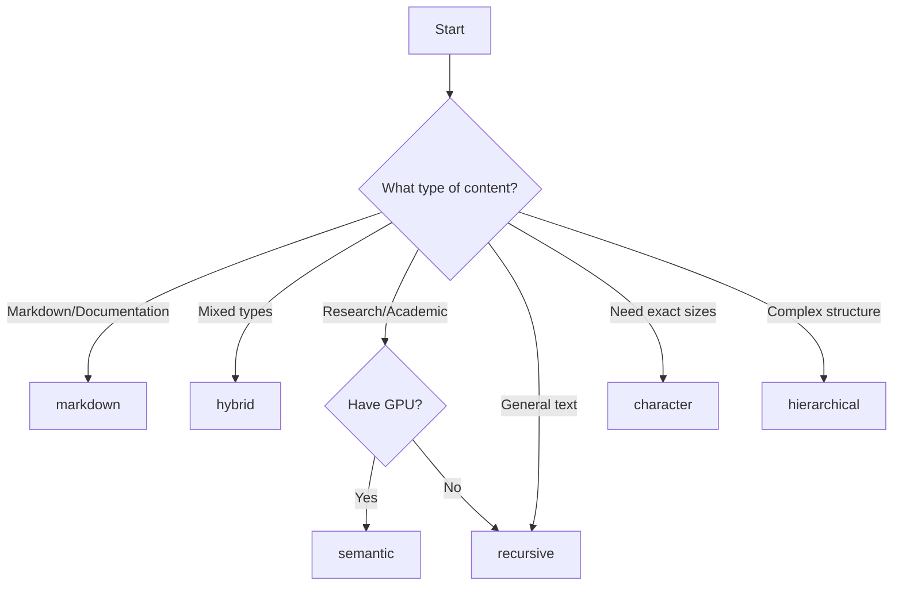

# Chunking Strategies Guide

This guide explains the 6 available text chunking strategies in Semantik and when to use each one.

## Strategy Overview

| Strategy | Best For | Performance | Privacy | Hardware Requirements |
|----------|----------|-------------|---------|----------------------|
| **character** | Simple, predictable chunks | ⭐⭐⭐⭐⭐ | ⭐⭐⭐⭐⭐ | None |
| **recursive** | General purpose text | ⭐⭐⭐⭐⭐ | ⭐⭐⭐⭐⭐ | None |
| **markdown** | Documentation, wikis | ⭐⭐⭐⭐ | ⭐⭐⭐⭐⭐ | None |
| **semantic** | High-quality topic coherence | ⭐⭐ | ⭐⭐⭐⭐⭐ | GPU recommended |
| **hierarchical** | Complex document structures | ⭐⭐⭐ | ⭐⭐⭐⭐⭐ | None |
| **hybrid** | Mixed content types | ⭐⭐⭐ | ⭐⭐⭐⭐⭐ | GPU recommended |

## Detailed Strategy Guide

### 1. Character Strategy
**Best for:** Simple, predictable chunking with fixed sizes

**Use cases:**
- Legal documents where exact character counts matter
- Data processing where uniform chunk sizes are required
- Testing and debugging

**Parameters:**
- `chunk_size` (default: 1000) - Characters per chunk
- `chunk_overlap` (default: 200) - Character overlap between chunks

**Example:**
```json
{
  "chunking_strategy": "character",
  "chunking_params": {
    "chunk_size": 1500,
    "chunk_overlap": 300
  }
}
```

### 2. Recursive Strategy (Default)
**Best for:** General-purpose text chunking with sentence awareness

**Use cases:**
- Most document types
- Balanced performance and quality
- When you need reliable, fast chunking

**Parameters:**
- `chunk_size` (default: 600) - Target characters per chunk
- `chunk_overlap` (default: 100) - Character overlap

**Example:**
```json
{
  "chunking_strategy": "recursive",
  "chunking_params": {
    "chunk_size": 800,
    "chunk_overlap": 150
  }
}
```

### 3. Markdown Strategy
**Best for:** Markdown documents, technical documentation

**Use cases:**
- GitHub repositories
- Technical documentation
- Wiki content
- README files

**Parameters:** None required - automatically detects markdown structure

**Example:**
```json
{
  "chunking_strategy": "markdown",
  "chunking_params": {}
}
```

### 4. Semantic Strategy ⚡ GPU Recommended
**Best for:** Highest quality topic-coherent chunks

**Use cases:**
- Research papers and academic content
- Long-form articles and blogs
- Content where topic coherence is critical
- High-quality RAG applications

**Requirements:**
- GPU with 4GB+ VRAM recommended
- Local embedding models (preserves privacy)

**Parameters:**
- `breakpoint_percentile_threshold` (default: 95) - Sensitivity for topic boundaries (0-100)
- `buffer_size` (default: 1) - Context sentences around breakpoints
- `max_chunk_size` (default: 3000) - Maximum chunk size for safety

**Example:**
```json
{
  "chunking_strategy": "semantic",
  "chunking_params": {
    "breakpoint_percentile_threshold": 90,
    "buffer_size": 2,
    "max_chunk_size": 2500
  }
}
```

**Privacy Note:** 🔒 Semantic chunking uses **local embedding models only** - your data never leaves your system.

### 5. Hierarchical Strategy
**Best for:** Complex documents with clear structure

**Use cases:**
- Technical manuals with multiple sections
- Academic papers with hierarchical structure
- Long documents where context relationships matter
- Applications needing parent-child chunk relationships

**Parameters:**
- `chunk_sizes` (default: [2048, 512, 128]) - Hierarchy levels from largest to smallest
- `chunk_overlap` (default: 20) - Overlap between chunks

**Example:**
```json
{
  "chunking_strategy": "hierarchical",
  "chunking_params": {
    "chunk_sizes": [3000, 800, 200],
    "chunk_overlap": 50
  }
}
```

### 6. Hybrid Strategy 🤖 Intelligent
**Best for:** Mixed content types with automatic strategy selection

**Use cases:**
- Document collections with varied formats
- When you're unsure which strategy to use
- Applications needing adaptive chunking

**How it works:**
- Analyzes content characteristics
- Selects optimal strategy automatically:
  - `.md` files → markdown strategy
  - High topic diversity → semantic strategy  
  - Default → recursive strategy

**Parameters:**
- `markdown_density_threshold` (default: 0.1) - Threshold for markdown detection
- `topic_diversity_threshold` (default: 0.7) - Threshold for semantic strategy selection

**Example:**
```json
{
  "chunking_strategy": "hybrid",
  "chunking_params": {
    "markdown_density_threshold": 0.15,
    "topic_diversity_threshold": 0.8
  }
}
```

## Performance Guidelines

### Hardware Recommendations

**Basic Setup (CPU Only):**
- character, recursive, markdown strategies
- ~1000+ chunks/second
- Low memory usage

**GPU Setup (4GB+ VRAM):**
- All strategies available
- semantic strategy: ~50-150 chunks/second
- hierarchical: ~200-400 chunks/second
- hybrid: ~300-500 chunks/second

### Choosing the Right Strategy



## Migration Guide

### Updating Existing Collections
To change the chunking strategy for an existing collection:

1. **Create new collection** with desired strategy
2. **Re-index documents** into the new collection
3. **Update applications** to use new collection ID
4. **Delete old collection** when migration is complete

### Backward Compatibility
- Existing collections continue using their original chunking method
- Default strategy remains `recursive` for backward compatibility
- No breaking changes to existing APIs

## Troubleshooting

### Common Issues

**Semantic chunking fails:**
- Ensure GPU has sufficient memory (4GB+ recommended)
- Check that local embedding models are installed
- Verify CUDA drivers are up to date

**Performance issues:**
- Use character/recursive strategies for high-throughput scenarios
- Consider hybrid strategy for automatic optimization
- Monitor GPU memory usage with semantic strategy

**Large documents:**
- Use hierarchical strategy for documents >100MB
- Consider splitting very large files before processing
- Monitor memory usage during processing