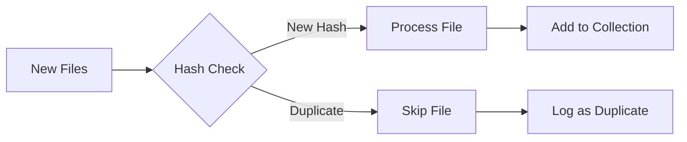

# Collection Management Guide

## Overview

Semantik uses a flexible collection system that allows you to organize, manage, and incrementally build document collections for semantic search. Collections provide logical groupings of related documents while maintaining efficient vector storage and search capabilities.

## Key Concepts

### What is a Collection?

A **collection** in Semantik is a logical grouping of documents that:
- Share the same embedding model and processing settings
- Can be searched together as a unified dataset
- Support incremental additions without reprocessing existing documents
- Maintain consistency through inherited configuration

### Collection Architecture

```mermaid
graph TD
    A[Collection: "technical-docs"] --> B[Job 1: Create Mode]
    A --> C[Job 2: Append Mode]
    A --> D[Job 3: Append Mode]
    
    B --> E[Qdrant: job_abc123]
    C --> F[Qdrant: job_def456]
    D --> G[Qdrant: job_ghi789]
    
    H[Search Query] --> I[Search All Sub-collections]
    I --> E
    I --> F
    I --> G
```

**Key Points**:
- Each collection consists of one or more jobs
- Each job creates its own Qdrant collection for isolation
- Searches aggregate results across all sub-collections
- All jobs in a collection share the same embedding configuration

## Creating Collections

### Initial Collection Creation

Create a new collection by starting an embedding job:

```bash
POST /api/jobs
Content-Type: application/json

{
    "name": "technical-docs",
    "directory_path": "/documents/technical",
    "model_name": "Qwen/Qwen3-Embedding-0.6B",
    "chunk_size": 512,
    "chunk_overlap": 128,
    "batch_size": 32,
    "quantization": "float16",
    "instruction": null
}
```

**Response**:
```json
{
    "job": {
        "id": "abc123...",
        "name": "technical-docs",
        "status": "created",
        "mode": "create",
        "model_name": "Qwen/Qwen3-Embedding-0.6B",
        "directory_path": "/documents/technical",
        "created_at": "2024-01-15T10:00:00Z"
    }
}
```

### Collection Settings

Collections inherit these settings from the initial job:
- **Embedding Model**: Cannot be changed after creation
- **Chunk Size**: Token size for document chunking
- **Chunk Overlap**: Overlap between chunks
- **Quantization**: Model quantization level
- **Instruction**: Optional instruction prompt for embeddings
- **Vector Dimensions**: Determined by the model

## Adding Documents to Collections

### Incremental Document Addition

Add new documents to an existing collection without reprocessing:

```bash
POST /api/jobs/add-to-collection
Content-Type: application/json

{
    "collection_name": "technical-docs",
    "directory_path": "/documents/new-technical-docs"
}
```

**Key Features**:
- Automatically inherits all settings from the parent collection
- **Deduplication**: Skips files already in the collection (by content hash)
- Creates a new job with `mode: "append"`
- Maintains consistency across the collection

### Deduplication Process



**How it works**:
1. Each file's content is hashed (SHA-256)
2. Hash is compared against existing files in the collection
3. Only new files are processed
4. Duplicate files are logged but skipped

### Handling Duplicate Files

When adding to a collection, the response includes:
```json
{
    "job": {
        "id": "def456...",
        "name": "technical-docs",
        "mode": "append",
        "parent_job_id": "abc123..."
    },
    "stats": {
        "new_files": 45,
        "duplicate_files": 15,
        "total_scanned": 60
    },
    "duplicates": [
        {
            "path": "/documents/new-technical-docs/api.md",
            "original_path": "/documents/technical/api.md",
            "hash": "a1b2c3..."
        }
    ]
}
```

## Viewing Collections

### List All Collections

```bash
GET /api/collections
```

**Response**:
```json
{
    "collections": [
        {
            "name": "technical-docs",
            "total_files": 150,
            "total_vectors": 3245,
            "model_name": "Qwen/Qwen3-Embedding-0.6B",
            "created_at": "2024-01-15T10:00:00Z",
            "updated_at": "2024-01-20T15:30:00Z",
            "job_count": 3
        }
    ]
}
```

### Collection Details

Get comprehensive information about a specific collection:

```bash
GET /api/collections/technical-docs
```

**Response**:
```json
{
    "name": "technical-docs",
    "statistics": {
        "total_files": 150,
        "total_vectors": 3245,
        "total_size_mb": 25.6,
        "processed_files": 150,
        "failed_files": 0
    },
    "configuration": {
        "model_name": "Qwen/Qwen3-Embedding-0.6B",
        "chunk_size": 512,
        "chunk_overlap": 128,
        "quantization": "float16",
        "vector_dim": 896,
        "instruction": null
    },
    "source_directories": [
        "/documents/technical",
        "/documents/new-technical-docs",
        "/documents/updates-2024"
    ],
    "jobs": [
        {
            "id": "abc123...",
            "mode": "create",
            "status": "completed",
            "directory_path": "/documents/technical",
            "created_at": "2024-01-15T10:00:00Z"
        }
    ]
}
```

### Collection Files

View all files in a collection (paginated):

```bash
GET /api/collections/technical-docs/files?offset=0&limit=50
```

**Response**:
```json
{
    "files": [
        {
            "id": 1,
            "path": "/documents/technical/api.md",
            "size": 15234,
            "extension": ".md",
            "status": "completed",
            "chunks_created": 12,
            "vectors_created": 12,
            "job_id": "abc123..."
        }
    ],
    "total": 150,
    "offset": 0,
    "limit": 50
}
```

## Modifying Collections

### Renaming a Collection

Change the display name of a collection:

```bash
PUT /api/collections/technical-docs
Content-Type: application/json

{
    "new_name": "engineering-docs"
}
```

**Important**:
- Renames all jobs in the collection
- Preserves all data and configurations
- Updates references throughout the system
- New name must be unique and valid

### Name Validation Rules

Collection names must:
- Be unique across all collections
- Contain only letters, numbers, spaces, hyphens, and underscores
- Not be empty or whitespace-only
- Be reasonable in length (typically < 100 characters)

## Deleting Collections

### Complete Collection Removal

```bash
DELETE /api/collections/technical-docs
```

**Deletion Process**:
1. Removes all job records from database
2. Deletes all file records
3. Removes all Qdrant vector collections
4. Cleans up filesystem artifacts

**Response**:
```json
{
    "message": "Collection 'technical-docs' deleted successfully",
    "details": {
        "jobs_deleted": 3,
        "files_deleted": 150,
        "qdrant_collections_deleted": [
            "job_abc123",
            "job_def456",
            "job_ghi789"
        ],
        "artifacts_cleaned": true
    }
}
```

**Warning**: Deletion is permanent and cannot be undone!

## Searching Collections

### Search Within a Collection

Collections are searched by name through the standard search endpoint:

```bash
GET /api/search?q=API+documentation&k=10&collection=technical-docs
```

**Search Process**:
1. Identifies all jobs in the collection
2. Queries each job's Qdrant collection
3. Aggregates results across all sub-collections
4. Returns unified, ranked results

### Cross-Collection Search

To search across all collections, omit the collection parameter:

```bash
GET /api/search?q=API+documentation&k=10
```

## Collection Metadata

### Metadata Storage Locations

1. **SQLite Database** (`jobs` table):
   - User-friendly collection names
   - Job relationships and hierarchy
   - Processing statistics
   - Configuration settings

2. **Qdrant** (`_collection_metadata`):
   - Quick access to embedding configurations
   - Model information for search operations
   - Vector dimension details

### Collection Consistency

Semantik ensures consistency by:
- Inheriting all settings from parent jobs
- Validating model compatibility
- Preventing configuration mismatches
- Maintaining parent-child relationships

## Best Practices

### 1. Organizing Collections

**By Topic**:
```
technical-docs/
├── API documentation
├── Architecture guides
└── Developer tutorials

user-manuals/
├── Getting started guides
├── Feature documentation
└── Troubleshooting
```

**By Date**:
```
knowledge-base-2023/
knowledge-base-2024/
knowledge-base-current/
```

### 2. Incremental Updates

**Recommended Workflow**:
1. Create initial collection with core documents
2. Add new documents periodically using add-to-collection
3. Monitor for duplicates in the response
4. Keep source directories organized

### 3. Collection Sizing

**Guidelines**:
- **Small Collections**: < 10,000 documents
  - Fast searches
  - Easy management
  
- **Medium Collections**: 10,000 - 100,000 documents
  - Good performance with proper indexing
  - Consider chunking strategy
  
- **Large Collections**: > 100,000 documents
  - May need performance tuning
  - Consider splitting into sub-collections

### 4. Naming Conventions

**Good Examples**:
- `technical-documentation`
- `customer-support-2024`
- `product-specs-v2`
- `research_papers_ml`

**Avoid**:
- Special characters (except `-` and `_`)
- Very long names
- Ambiguous names like `docs` or `files`

## Troubleshooting

### Common Issues

#### 1. Cannot Add to Collection
**Error**: "Parent job configuration not found"
**Solution**: Ensure the collection exists and you have access

#### 2. Duplicate Files Not Detected
**Cause**: Files modified between additions
**Solution**: Deduplication is content-based, not name-based

#### 3. Collection Search Returns No Results
**Possible Causes**:
- No completed jobs in collection
- All jobs failed during processing
- Incorrect collection name

**Debug Steps**:
1. Check collection details endpoint
2. Verify job statuses
3. Check individual job logs

### Performance Considerations

#### Search Performance
- More jobs in a collection = slightly slower searches
- Aggregate across 10+ jobs may add 50-100ms
- Consider consolidating very fragmented collections

#### Storage Efficiency
- Each job creates separate Qdrant collection
- Some overhead for multiple small jobs
- Balance between flexibility and efficiency

## Advanced Topics

### Programmatic Collection Management

```python
import requests

class CollectionManager:
    def __init__(self, base_url, auth_token):
        self.base_url = base_url
        self.headers = {"Authorization": f"Bearer {auth_token}"}
    
    def create_collection(self, name, directory, model="Qwen/Qwen3-Embedding-0.6B"):
        """Create a new collection"""
        return requests.post(
            f"{self.base_url}/api/jobs",
            json={
                "name": name,
                "directory_path": directory,
                "model_name": model
            },
            headers=self.headers
        ).json()
    
    def add_to_collection(self, collection_name, directory):
        """Add documents to existing collection"""
        return requests.post(
            f"{self.base_url}/api/jobs/add-to-collection",
            json={
                "collection_name": collection_name,
                "directory_path": directory
            },
            headers=self.headers
        ).json()
```

### Collection Monitoring

Monitor collection health:
```python
def check_collection_health(collection_name):
    details = get_collection_details(collection_name)
    
    health_checks = {
        "has_completed_jobs": any(j["status"] == "completed" for j in details["jobs"]),
        "has_vectors": details["statistics"]["total_vectors"] > 0,
        "no_failed_files": details["statistics"]["failed_files"] == 0,
        "model_available": check_model_exists(details["configuration"]["model_name"])
    }
    
    return all(health_checks.values()), health_checks
```

## Future Enhancements

Planned improvements for collection management:

1. **Collection Merging**: Combine multiple collections into one
2. **Collection Templates**: Pre-configured settings for common use cases
3. **Automatic Synchronization**: Watch directories for changes
4. **Collection Versioning**: Track changes over time
5. **Collection Sharing**: Share read-only access with other users
6. **Bulk Operations**: Process multiple collections at once

## Conclusion

Semantik's collection management system provides a flexible and powerful way to organize and maintain document sets for semantic search. By understanding the collection lifecycle, deduplication process, and best practices, you can build efficient and well-organized knowledge bases that scale with your needs.