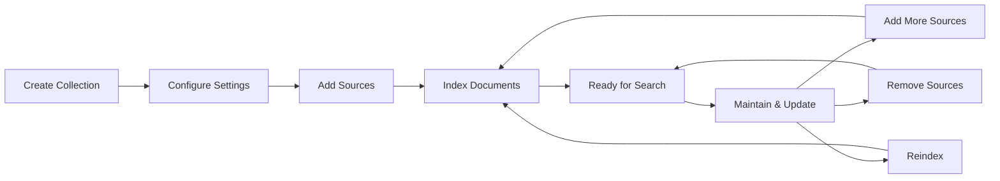

# Collection Management Guide

## Overview

Semantik organizes your documents into **collections** - powerful, searchable knowledge bases that transform your files into AI-ready semantic search repositories. Each collection maintains its own vector store, embedding configuration, and search settings while providing unified management through an intuitive interface.

This guide covers everything you need to know about creating, managing, and optimizing collections in Semantik.

## What Are Collections?

A **collection** in Semantik is:
- A logical grouping of related documents (PDFs, text files, markdown, etc.)
- A dedicated vector store with consistent embedding settings
- A searchable knowledge base with semantic understanding
- A managed entity with access control and operational history

Think of collections as intelligent folders that not only store your documents but understand their content, enabling powerful semantic search across all files.

## Collection Lifecycle



### 1. Creation Phase
- Define collection name and description
- Select embedding model and settings
- Initialize vector store

### 2. Population Phase
- Add source directories or files
- Documents are parsed and embedded
- Vectors stored for semantic search

### 3. Active Phase
- Collection available for search
- Monitor usage and performance
- Add or remove content as needed

### 4. Maintenance Phase
- Reindex for updates
- Manage sources
- Optimize performance

## Creating Your First Collection

### Using the Web Interface

1. **Navigate to Collections**
   - Click "Collections" in the main navigation
   - Click the "New Collection" button

2. **Configure Basic Settings**
   - **Name**: Choose a descriptive, unique name
   - **Description**: Add helpful context about the collection's purpose
   - **Visibility**: Set to private (default) or public

3. **Select Embedding Model**
   - **Qwen/Qwen3-Embedding-0.6B**: Fast, lightweight (recommended for most uses)
   - **Qwen/Qwen3-Embedding-4B**: Higher quality for complex content
   - **BAAI/bge-large-en-v1.5**: General purpose alternative

4. **Configure Processing Settings**
   - **Chunk Size**: How many tokens per text chunk (default: 1000)
   - **Chunk Overlap**: Token overlap between chunks (default: 200)
   - **Quantization**: Memory optimization (float16 recommended)

5. **Create Collection**
   - Click "Create" to initialize the collection
   - Wait for status to change from "pending" to "ready"

### Using the API

```bash
curl -X POST http://localhost:8080/api/v2/collections \
  -H "Authorization: Bearer YOUR_TOKEN" \
  -H "Content-Type: application/json" \
  -d '{
    "name": "Technical Documentation",
    "description": "All technical docs and API references",
    "embedding_model": "Qwen/Qwen3-Embedding-0.6B",
    "quantization": "float16",
    "chunk_size": 1000,
    "chunk_overlap": 200,
    "is_public": false
  }'
```

**Response:**
```json
{
  "id": "550e8400-e29b-41d4-a716-446655440000",
  "name": "Technical Documentation",
  "status": "ready",
  "embedding_model": "Qwen/Qwen3-Embedding-0.6B",
  "created_at": "2024-01-15T10:00:00Z"
}
```

## Understanding Operations

Operations are asynchronous tasks that modify your collections. They run in the background, allowing you to continue working while documents are processed.

### Operation Types

#### INDEX - Initial Document Loading
The first operation when adding documents to a collection.
- Scans the specified directory or file
- Extracts text from supported formats
- Creates embeddings using the collection's model
- Stores vectors in the dedicated vector store

#### APPEND - Add More Documents
Adds new documents to an existing collection.
- Automatically detects and skips duplicates
- Maintains consistent settings with the collection
- Ideal for incremental updates

#### REINDEX - Refresh Embeddings
Re-processes all or specific documents in a collection.
- Use when embedding model updates are available
- Helpful for fixing failed document processing
- Can target only failed documents for efficiency

#### REMOVE_SOURCE - Clean Up Content
Removes all documents from a specific source path.
- Deletes documents and their vectors
- Maintains collection integrity
- Useful for removing outdated content

## Adding Documents to Collections

### Adding Your First Source

#### Via Web Interface

1. **Open Collection Details**
   - Navigate to your collection
   - Click "Add Source" button

2. **Configure Source**
   - **Source Type**: Choose "Directory" for folders
   - **Path**: Enter the full path (e.g., `/documents/technical`)
   - **Recursive**: Enable to include subdirectories
   - **File Types**: Select which formats to include

3. **Start Indexing**
   - Click "Add Source" to begin
   - Monitor progress in real-time
   - View processing statistics

#### Via API

```bash
curl -X POST http://localhost:8080/api/v2/collections/YOUR_COLLECTION_ID/sources \
  -H "Authorization: Bearer YOUR_TOKEN" \
  -H "Content-Type: application/json" \
  -d '{
    "source_type": "directory",
    "source_path": "/documents/technical",
    "filters": {
      "extensions": [".pdf", ".md", ".txt", ".docx"],
      "ignore_patterns": ["**/drafts/**", "**/.git/**"]
    },
    "config": {
      "recursive": true,
      "follow_symlinks": false
    }
  }'
```

### Supported File Formats

Semantik automatically detects and processes:
- **Documents**: PDF, DOCX, ODT, RTF
- **Text**: TXT, MD, RST
- **Code**: Various programming languages
- **Data**: CSV, JSON (structured text)
- **Web**: HTML, XML

### Duplicate Detection

Semantik automatically prevents duplicate documents:
1. **Content Hashing**: Each file's content is hashed (SHA-256)
2. **Collection-Wide Check**: Hashes compared across the entire collection
3. **Smart Skipping**: Duplicates are logged but not reprocessed
4. **Storage Efficiency**: Saves processing time and vector storage

Example duplicate report:
```json
{
  "operation_id": "op_123456",
  "statistics": {
    "total_scanned": 100,
    "new_documents": 85,
    "duplicates_skipped": 15
  }
}
```

## Monitoring Progress

### Real-Time Updates

Semantik provides WebSocket connections for live progress monitoring:

```javascript
// Connect to operation progress
const operationId = 'op_123456';
const token = localStorage.getItem('authToken');
const ws = new WebSocket(`ws://localhost:8080/ws/operations/${operationId}?token=${token}`);

ws.onmessage = (event) => {
    const update = JSON.parse(event.data);
    
    switch(update.type) {
        case 'file_processing':
            console.log(`Processing: ${update.current_file}`);
            console.log(`Progress: ${update.processed_files}/${update.total_files}`);
            break;
            
        case 'operation_completed':
            console.log('Indexing complete!');
            break;
            
        case 'error':
            console.error(`Error: ${update.message}`);
            break;
    }
};
```

### Progress Indicators

The UI displays:
- **Overall Progress**: Percentage and progress bar
- **Current File**: Which document is being processed
- **Statistics**: Files processed, failed, remaining
- **Time Estimates**: Based on processing speed

## Managing Collections

### Viewing Collection Details

Access comprehensive information about your collections:

```bash
GET /api/v2/collections/YOUR_COLLECTION_ID
```

Returns:
- Basic metadata (name, description, owner)
- Configuration (model, chunk settings)
- Statistics (document count, total size)
- Sources (directories and files indexed)
- Recent operations history

### Updating Collection Information

You can update metadata while preserving content:

```bash
PUT /api/v2/collections/YOUR_COLLECTION_ID
{
  "name": "Updated Documentation",
  "description": "Expanded technical documentation",
  "is_public": true
}
```

**Note**: Embedding model and chunk settings cannot be changed after creation to maintain consistency.

### Collection Statistics

Monitor collection health and usage:
- **Document Count**: Total files in collection
- **Chunk Count**: Total text chunks created
- **Vector Count**: Embedded vectors stored
- **Storage Size**: Disk space used
- **Last Updated**: Most recent modification

## Multi-Model Support

### Choosing the Right Model

Different embedding models suit different use cases:

#### Qwen/Qwen3-Embedding-0.6B
- **Best for**: General documentation, fast processing
- **Dimensions**: 896
- **Speed**: Very fast
- **Quality**: Good for most content

#### Qwen/Qwen3-Embedding-4B
- **Best for**: Technical content, higher accuracy needs
- **Dimensions**: 2560
- **Speed**: Slower but more accurate
- **Quality**: Excellent semantic understanding

#### Custom Models
- Support for any HuggingFace-compatible model
- Configure dimensions and processing requirements
- Test thoroughly before production use

### Quantization Options

Optimize memory usage vs. quality:

- **float32**: Full precision (highest quality, most memory)
- **float16**: Half precision (balanced, recommended)
- **int8**: 8-bit quantization (minimal memory, some quality loss)

## Search Integration

### Searching Within Collections

Collections integrate seamlessly with Semantik's search:

```bash
# Search specific collection
GET /api/v2/search?q=docker+configuration&collection_ids=YOUR_COLLECTION_ID

# Search multiple collections
GET /api/v2/search?q=api+endpoints&collection_ids=ID1,ID2,ID3

# Search all accessible collections
GET /api/v2/search?q=user+authentication
```

### Search Features
- **Semantic Understanding**: Finds conceptually related content
- **Multi-Collection**: Search across multiple collections
- **Filtering**: By collection, date, file type
- **Reranking**: Optional ML-based result optimization

## Best Practices

### Collection Organization

#### 1. Logical Grouping
Create collections based on:
- **Topic**: "Engineering Docs", "Marketing Materials"
- **Project**: "Project Alpha", "Q4 Planning"
- **Team**: "Frontend Team", "DevOps Resources"
- **Time Period**: "2024 Archives", "Current Quarter"

#### 2. Naming Conventions
- Use clear, descriptive names
- Include version or date when relevant
- Avoid special characters
- Keep names reasonably short

#### 3. Size Considerations
- **Small** (< 1,000 documents): Fast, easy to manage
- **Medium** (1,000 - 10,000): Good performance with proper settings
- **Large** (> 10,000): May need optimization, consider splitting

### Performance Optimization

#### 1. Chunk Size Selection
- **Smaller chunks** (500-750): Better for precise queries
- **Medium chunks** (1000-1500): Balanced approach
- **Larger chunks** (2000+): Better context retention

#### 2. Model Selection
- Start with lightweight models
- Upgrade to larger models only if needed
- Consider GPU memory constraints

#### 3. Incremental Updates
- Use APPEND operations for new content
- Avoid full reindexing unless necessary
- Schedule updates during low-usage periods

### Maintenance Tips

#### Regular Health Checks
```python
# Check collection health
def check_collection_health(collection_id):
    details = get_collection_details(collection_id)
    
    issues = []
    if details['status'] != 'ready':
        issues.append(f"Collection status: {details['status']}")
    
    if details['document_count'] == 0:
        issues.append("No documents in collection")
    
    failed_ops = [op for op in details['recent_operations'] 
                  if op['status'] == 'failed']
    if failed_ops:
        issues.append(f"{len(failed_ops)} failed operations")
    
    return issues
```

#### Cleanup Procedures
1. Remove outdated sources periodically
2. Reindex failed documents
3. Monitor for orphaned vectors
4. Archive inactive collections

## Error Handling and Recovery

### Common Issues and Solutions

#### "Collection name already exists"
- Collection names must be unique
- Choose a different name or delete the existing collection

#### "Model not available"
- Ensure the embedding model is downloaded
- Check model name spelling
- Verify GPU/CPU compatibility

#### "Operation failed"
- Check operation details for specific errors
- Common causes: disk space, file permissions, corrupted files
- Use reindex with `only_failed: true` to retry

#### "Documents not appearing in search"
- Verify operation completed successfully
- Check collection status is "ready"
- Ensure documents were processed (check statistics)

### Recovery Procedures

#### Failed Operations
1. Get operation details to identify the issue
2. Fix underlying problem (permissions, disk space, etc.)
3. Retry with appropriate operation type
4. Monitor progress closely

#### Corrupted Collections
1. Export document list for reference
2. Create new collection with same settings
3. Re-add all sources
4. Verify document count matches
5. Delete old collection once verified

## Advanced Topics

### Programmatic Collection Management

```python
import httpx
import asyncio
from typing import Dict, List, Optional

class CollectionManager:
    def __init__(self, base_url: str, token: str):
        self.base_url = base_url
        self.headers = {"Authorization": f"Bearer {token}"}
        self.client = httpx.AsyncClient()
    
    async def create_collection(
        self, 
        name: str, 
        description: str,
        model: str = "Qwen/Qwen3-Embedding-0.6B"
    ) -> Dict:
        """Create a new collection with specified settings."""
        response = await self.client.post(
            f"{self.base_url}/api/v2/collections",
            json={
                "name": name,
                "description": description,
                "embedding_model": model,
                "quantization": "float16",
                "chunk_size": 1000,
                "chunk_overlap": 200
            },
            headers=self.headers
        )
        return response.json()
    
    async def add_directory(
        self, 
        collection_id: str, 
        directory: str,
        extensions: List[str] = None
    ) -> Dict:
        """Add a directory to the collection."""
        response = await self.client.post(
            f"{self.base_url}/api/v2/collections/{collection_id}/sources",
            json={
                "source_type": "directory",
                "source_path": directory,
                "filters": {
                    "extensions": extensions or [".pdf", ".md", ".txt"]
                },
                "config": {"recursive": True}
            },
            headers=self.headers
        )
        return response.json()
    
    async def monitor_operation(
        self, 
        operation_id: str,
        callback: Optional[callable] = None
    ):
        """Monitor operation progress with optional callback."""
        while True:
            response = await self.client.get(
                f"{self.base_url}/api/v2/operations/{operation_id}",
                headers=self.headers
            )
            data = response.json()
            
            if callback:
                callback(data)
            
            if data["status"] in ["completed", "failed", "cancelled"]:
                return data
            
            await asyncio.sleep(2)

# Usage example
async def main():
    manager = CollectionManager("http://localhost:8080", "your-token")
    
    # Create collection
    collection = await manager.create_collection(
        "Research Papers",
        "Academic papers and research documents"
    )
    
    # Add documents
    operation = await manager.add_directory(
        collection["id"],
        "/documents/research",
        [".pdf", ".tex"]
    )
    
    # Monitor progress
    def progress_callback(data):
        if "progress" in data:
            print(f"Progress: {data['progress']['percentage']:.1f}%")
    
    result = await manager.monitor_operation(
        operation["id"], 
        progress_callback
    )
    
    print(f"Operation completed: {result['status']}")

asyncio.run(main())
```

### WebSocket Progress Monitoring

```typescript
class OperationMonitor {
    private ws: WebSocket | null = null;
    
    constructor(
        private baseUrl: string,
        private token: string
    ) {}
    
    monitorOperation(
        operationId: string,
        onProgress: (data: any) => void,
        onComplete: (data: any) => void,
        onError: (error: any) => void
    ) {
        const wsUrl = `${this.baseUrl.replace('http', 'ws')}/ws/operations/${operationId}?token=${this.token}`;
        this.ws = new WebSocket(wsUrl);
        
        this.ws.onmessage = (event) => {
            const data = JSON.parse(event.data);
            
            switch(data.type) {
                case 'file_processing':
                case 'progress_update':
                    onProgress(data);
                    break;
                    
                case 'operation_completed':
                    onComplete(data);
                    this.disconnect();
                    break;
                    
                case 'error':
                    onError(data);
                    this.disconnect();
                    break;
            }
        };
        
        this.ws.onerror = (error) => {
            onError({ type: 'connection_error', error });
            this.disconnect();
        };
    }
    
    disconnect() {
        if (this.ws) {
            this.ws.close();
            this.ws = null;
        }
    }
}

// Usage
const monitor = new OperationMonitor('http://localhost:8080', authToken);

monitor.monitorOperation(
    operationId,
    (progress) => {
        updateProgressBar(progress.percentage);
        updateCurrentFile(progress.current_file);
    },
    (result) => {
        showSuccessMessage('Indexing completed successfully!');
        refreshCollectionView();
    },
    (error) => {
        showErrorMessage(`Operation failed: ${error.message}`);
    }
);
```

## Security Considerations

### Access Control
- Collections are private by default
- Only owners can modify collections
- Public collections allow read-only access
- Future: Granular sharing permissions

### Data Privacy
- All processing happens locally
- No data leaves your infrastructure
- Embeddings stored in your vector database
- File content remains on your filesystem

### Best Practices
1. Regular access audits
2. Principle of least privilege
3. Monitor public collection content
4. Secure API token storage

## Troubleshooting Guide

### Collection Creation Issues

**Problem**: Collection stuck in "pending" status
- **Check**: Vector database connectivity
- **Check**: Available disk space
- **Solution**: Restart vector database service

**Problem**: "Model not found" error
- **Check**: Model name spelling
- **Check**: Model downloaded to cache
- **Solution**: Pre-download model or fix name

### Indexing Problems

**Problem**: Documents not being processed
- **Check**: File permissions
- **Check**: Supported file formats
- **Check**: Operation status and errors
- **Solution**: Fix permissions, check logs

**Problem**: Slow indexing speed
- **Check**: GPU availability
- **Check**: Chunk size settings
- **Check**: System resources
- **Solution**: Optimize settings, add resources

### Search Issues

**Problem**: No search results
- **Check**: Collection status is "ready"
- **Check**: Documents indexed successfully
- **Check**: Search permissions
- **Solution**: Reindex if needed

## Conclusion

Semantik's collection management system provides a powerful, flexible way to organize and search your documents. By understanding collections, operations, and best practices, you can build efficient knowledge bases that scale with your needs.

Key takeaways:
- Collections are the foundation of Semantik's search capabilities
- Operations handle all asynchronous document processing
- Real-time monitoring keeps you informed of progress
- Proper organization and maintenance ensure optimal performance

For more information, see:
- [API Reference](./API_REFERENCE.md) - Complete API documentation
- [WebSocket API](./WEBSOCKET_API.md) - Real-time updates
- [Search System](./SEARCH_SYSTEM.md) - Advanced search features