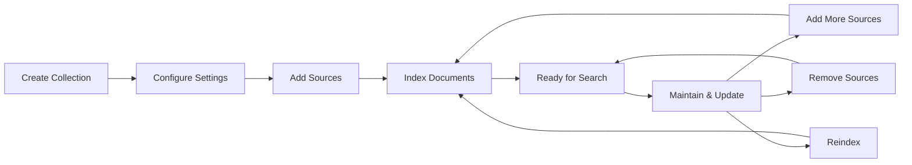

# Collection Management Guide

## Overview

Collections are searchable knowledge bases. Each one maintains its own vector store, embedding config, and search settings.

## What Are Collections?

A collection is:
- Related documents grouped together (PDFs, text, markdown, etc.)
- A dedicated vector store with consistent embedding settings
- A searchable knowledge base
- Managed entity with access control and operation history

## Collection Lifecycle



### 1. Creation Phase
- Define collection name and description
- Select embedding model and settings
- Initialize vector store

### 2. Population Phase
- Add source directories or files
- Documents are parsed and embedded
- Vectors stored for semantic search

### 3. Active Phase
- Collection available for search
- Monitor usage and performance
- Add or remove content as needed

### 4. Maintenance Phase
- Reindex for updates
- Manage sources
- Optimize performance

## Creating Your First Collection

### Using the Web Interface

1. **Navigate to Collections**
   - Click "Collections" in the main navigation
   - Click the "New Collection" button

2. **Configure Basic Settings**
   - **Name**: Choose a descriptive, unique name
   - **Description**: Add helpful context about the collection's purpose
   - **Visibility**: Set to private (default) or public

3. **Select Embedding Model**
   - **Qwen/Qwen3-Embedding-0.6B**: Fast, lightweight (recommended for most uses)
   - **Qwen/Qwen3-Embedding-4B**: Higher quality for complex content
   - **Qwen/Qwen3-Embedding-8B**: Highest quality, largest model

4. **Configure Processing Settings**
   - **Chunk Size**: How many tokens per text chunk (default: 1000)
   - **Chunk Overlap**: Token overlap between chunks (default: 200)
   - **Quantization**: Memory optimization (float16 recommended)
   - **Chunking Strategy**: Select from 6 available strategies (see below)

5. **Create Collection**
   - Click "Create" to initialize the collection
   - Wait for status to change from "pending" to "ready"

### Using the API

```bash
curl -X POST http://localhost:8080/api/v2/collections \
  -H "Authorization: Bearer YOUR_TOKEN" \
  -H "Content-Type: application/json" \
  -d '{
    "name": "Technical Documentation",
    "description": "All technical docs and API references",
    "embedding_model": "Qwen/Qwen3-Embedding-0.6B",
    "quantization": "float16",
    "chunk_size": 1000,
    "chunk_overlap": 200,
    "chunking_strategy": "recursive",
    "is_public": false
  }'
```

**Response:**
```json
{
  "id": "550e8400-e29b-41d4-a716-446655440000",
  "name": "Technical Documentation",
  "status": "pending",
  "embedding_model": "Qwen/Qwen3-Embedding-0.6B",
  "created_at": "2024-01-15T10:00:00Z",
  "initial_operation_id": "op_abc123-def456-789xyz"
}
```

The `initial_operation_id` field contains the UUID of the initial INDEX operation that was automatically triggered. You can use this to track the progress of the initial setup via WebSocket or polling.

## Understanding Operations

Operations are async tasks that modify collections. They run in the background.

### Operation Types

**INDEX** - Initial document loading
- Scans directory or file
- Extracts text
- Creates embeddings
- Stores vectors

**APPEND** - Add more documents
- Auto-detects duplicates
- Maintains collection settings
- Incremental updates

**REINDEX** - Refresh embeddings
- Update to new model
- Fix failed documents
- Target only failures
- Uses blue-green deployment (zero downtime)

**REMOVE_SOURCE** - Clean up content
- Deletes documents and vectors
- Removes outdated content

### Blue-Green Reindexing

Zero-downtime reindexing:

1. Create new vector store alongside existing one
2. Re-embed documents into new store (old one still serves searches)
3. Atomic swap to new index
4. Clean up old index

Benefits:
- Searches continue during reindexing
- No partial states (old or new, never mixed)
- Rollback if reindexing fails
- Safe config changes

## Adding Documents to Collections

### Adding Your First Source

#### Via Web Interface

1. **Open Collection Details**
   - Navigate to your collection
   - Click "Add Source" button

2. **Configure Source**
   - **Source Type**: Choose "Directory" for folders
   - **Path**: Enter the full path (e.g., `/documents/technical`)
   - **Recursive**: Enable to include subdirectories
   - **File Types**: Select which formats to include

3. **Start Indexing**
   - Click "Add Source" to begin
   - Monitor progress in real-time
   - View processing statistics

#### Via API

**New format (preferred):**
```bash
curl -X POST http://localhost:8080/api/v2/collections/YOUR_COLLECTION_ID/sources \
  -H "Authorization: Bearer YOUR_TOKEN" \
  -H "Content-Type: application/json" \
  -d '{
    "source_type": "directory",
    "source_config": {
      "path": "/documents/technical",
      "recursive": true
    },
    "config": {
      "chunk_size": 1000,
      "chunk_overlap": 200,
      "metadata": {"department": "engineering"}
    }
  }'
```

**Legacy format (deprecated):**
```bash
curl -X POST http://localhost:8080/api/v2/collections/YOUR_COLLECTION_ID/sources \
  -H "Authorization: Bearer YOUR_TOKEN" \
  -H "Content-Type: application/json" \
  -d '{
    "source_path": "/documents/technical",
    "config": {
      "recursive": true
    }
  }'
```

### Supported File Formats

Semantik automatically detects and processes the following file types:

| Category | Extensions |
|----------|------------|
| **Documents** | `.pdf`, `.docx`, `.doc`, `.pptx` (PowerPoint) |
| **Text** | `.txt`, `.text`, `.md` (Markdown) |
| **Email** | `.eml` |
| **Web** | `.html` |

**Note**: CSV, JSON, and XML files are not currently supported for direct ingestion. These structured data formats should be converted to a supported format before indexing.

### Duplicate Detection

Automatic deduplication via SHA-256 content hashing:
1. Hash each file's content
2. Check against collection
3. Skip duplicates (logged but not reprocessed)

Example report:
```json
{
  "operation_id": "op_123456",
  "statistics": {
    "total_scanned": 100,
    "new_documents": 85,
    "duplicates_skipped": 15
  }
}
```

## Collection Sources

Each collection tracks its data sources via `CollectionSource` model:

### Source Model Fields

| Field | Type | Description |
|-------|------|-------------|
| `id` | Integer | Auto-incremented primary key |
| `collection_id` | String | UUID of the parent collection |
| `source_path` | String | Path or identifier for the source |
| `source_type` | String | Type of source: `directory`, `web`, `slack`, etc. |
| `source_config` | JSON | Connector-specific configuration |
| `document_count` | Integer | Number of documents from this source |
| `size_bytes` | Integer | Total size of documents in bytes |
| `last_indexed_at` | DateTime | When this source was last indexed |
| `created_at` | DateTime | When the source was added |
| `meta` | JSON | Additional metadata |

### Unique Constraint

Sources uniquely identified by `(collection_id, source_path)`. Prevents duplicates and enables efficient removal.

## Monitoring Progress

### Real-Time Updates

Semantik provides WebSocket connections for live progress monitoring:

```javascript
// Connect to operation progress
const operationId = 'op_123456';
const token = localStorage.getItem('authToken');
const ws = new WebSocket(`ws://localhost:8080/ws/operations/${operationId}?token=${token}`);

ws.onmessage = (event) => {
    const update = JSON.parse(event.data);

    switch(update.type) {
        case 'file_processing':
            console.log(`Processing: ${update.current_file}`);
            console.log(`Progress: ${update.processed_files}/${update.total_files}`);
            break;

        case 'operation_completed':
            console.log('Indexing complete!');
            break;

        case 'error':
            console.error(`Error: ${update.message}`);
            break;
    }
};
```

### Progress Indicators

The UI displays:
- **Overall Progress**: Percentage and progress bar
- **Current File**: Which document is being processed
- **Statistics**: Files processed, failed, remaining
- **Time Estimates**: Based on processing speed

## Managing Collections

### Viewing Collection Details

Access comprehensive information about your collections:

```bash
GET /api/v2/collections/YOUR_COLLECTION_ID
```

Returns:
- Basic metadata (name, description, owner)
- Configuration (model, chunk settings)
- Statistics (document count, total size)
- Sources (directories and files indexed)
- Recent operations history

### Updating Collection Information

You can update metadata while preserving content:

```bash
PUT /api/v2/collections/YOUR_COLLECTION_ID
{
  "name": "Updated Documentation",
  "description": "Expanded technical documentation",
  "is_public": true
}
```

**Note**: Embedding model and chunk settings cannot be changed after creation to maintain consistency.

### Collection Statistics

Monitor collection health and usage:
- **Document Count**: Total files in collection
- **Chunk Count**: Total text chunks created
- **Vector Count**: Embedded vectors stored
- **Storage Size**: Disk space used
- **Last Updated**: Most recent modification

## Chunking Strategies

Semantik supports 6 chunking strategies for different document types and use cases:

### Available Strategies

| Strategy | Description | Best For |
|----------|-------------|----------|
| `character` | Simple character-based splitting | Plain text, logs |
| `recursive` | Intelligent recursive splitting (default) | General documents |
| `markdown` | Respects Markdown structure | Documentation, READMEs |
| `semantic` | Uses embeddings to find semantic boundaries | Technical content |
| `hierarchical` | Creates parent-child chunk relationships | Long documents |
| `hybrid` | Combines semantic and structural approaches | Mixed content |

### Strategy Selection

```bash
curl -X POST http://localhost:8080/api/v2/collections \
  -H "Authorization: Bearer YOUR_TOKEN" \
  -H "Content-Type: application/json" \
  -d '{
    "name": "Documentation",
    "chunking_strategy": "markdown",
    "chunking_config": {
      "preserve_headers": true,
      "min_chunk_size": 100
    }
  }'
```

## Multi-Model Support

### Choosing the Right Model

Different embedding models suit different use cases:

#### Qwen/Qwen3-Embedding-0.6B
- **Best for**: General documentation, fast processing
- **Vector Dimensions**: 896
- **Speed**: Very fast
- **Quality**: Good for most content
- **Memory (float16)**: ~1,200 MB

#### Qwen/Qwen3-Embedding-4B
- **Best for**: Technical content, higher accuracy needs
- **Vector Dimensions**: 2,560
- **Speed**: Slower but more accurate
- **Quality**: Excellent semantic understanding
- **Memory (float16)**: ~8,000 MB

#### Qwen/Qwen3-Embedding-8B
- **Best for**: Maximum quality, complex technical content
- **Vector Dimensions**: TBD
- **Speed**: Slowest, highest accuracy
- **Quality**: Best-in-class semantic understanding
- **Memory (float16)**: ~16,000 MB

### Memory Requirements by Quantization

| Model | float32 | float16 | int8 |
|-------|---------|---------|------|
| 0.6B | 2,400 MB | 1,200 MB | 600 MB |
| 4B | 16,000 MB | 8,000 MB | 4,000 MB |
| 8B | 32,000 MB | 16,000 MB | 8,000 MB |

*Note: Actual memory usage includes ~20% overhead for activations and temporary buffers.*

### Quantization Options

Optimize memory usage vs. quality:

- **float32**: Full precision (highest quality, most memory)
- **float16**: Half precision (balanced, recommended)
- **int8**: 8-bit quantization (minimal memory, some quality loss)

## Search Integration

### Searching Within Collections

Collections integrate seamlessly with Semantik's search:

```bash
# Search a specific collection
curl -X POST http://localhost:8080/api/v2/search \
  -H "Authorization: Bearer $TOKEN" \
  -H "Content-Type: application/json" \
  -d '{
    "collection_uuids": ["YOUR_COLLECTION_ID"],
    "query": "docker configuration",
    "k": 10
  }'

# Search multiple collections
curl -X POST http://localhost:8080/api/v2/search \
  -H "Authorization: Bearer $TOKEN" \
  -H "Content-Type: application/json" \
  -d '{
    "collection_uuids": ["ID1", "ID2", "ID3"],
    "query": "api endpoints",
    "k": 10
  }'
```

To search "all accessible collections", first list collections (`GET /api/v2/collections`) and pass their UUIDs to `POST /api/v2/search`.

### Advanced Search Parameters

| Parameter | Type | Default | Description |
|-----------|------|---------|-------------|
| `collection_uuids` | list[str] | *required* | Collection UUIDs to search (max 10) |
| `query` | string | *required* | Search query text (max 1000 chars) |
| `k` | int | 10 | Number of results (1-100) |
| `search_type` | string | "semantic" | Search mode: `semantic`, `hybrid`, `question`, `code` |
| `score_threshold` | float | 0.0 | Minimum score filter (0.0-1.0) |
| `metadata_filter` | object | null | Filter by document metadata |
| `use_reranker` | bool | true | Enable cross-encoder reranking |
| `rerank_model` | string | null | Override default reranker model |
| `hybrid_alpha` | float | 0.7 | Vector vs keyword weight (0.0=keyword, 1.0=vector) |
| `hybrid_mode` | string | "weighted" | Hybrid fusion mode: `weighted` or `rrf` (Reciprocal Rank Fusion) |
| `keyword_mode` | string | "any" | Keyword matching: `any` (OR) or `all` (AND) |
| `include_content` | bool | true | Include chunk text in results |

### Search Examples

**Hybrid search with keyword emphasis:**
```bash
curl -X POST http://localhost:8080/api/v2/search \
  -H "Authorization: Bearer $TOKEN" \
  -H "Content-Type: application/json" \
  -d '{
    "collection_uuids": ["YOUR_COLLECTION_ID"],
    "query": "kubernetes deployment yaml",
    "search_type": "hybrid",
    "hybrid_alpha": 0.3,
    "hybrid_mode": "rrf",
    "k": 20
  }'
```

**Filtered search with reranking:**
```bash
curl -X POST http://localhost:8080/api/v2/search \
  -H "Authorization: Bearer $TOKEN" \
  -H "Content-Type: application/json" \
  -d '{
    "collection_uuids": ["YOUR_COLLECTION_ID"],
    "query": "authentication best practices",
    "score_threshold": 0.5,
    "metadata_filter": {"department": "security"},
    "use_reranker": true,
    "rerank_model": "Qwen/Qwen3-Reranker-4B"
  }'
```

### Search Features
- **Semantic Understanding**: Finds conceptually related content
- **Multi-Collection**: Search across multiple collections
- **Filtering**: By collection, date, file type
- **Reranking**: Optional ML-based result optimization

## Rate Limiting

The collection API endpoints are rate-limited to prevent abuse and ensure fair usage:

| Endpoint | Rate Limit | Description |
|----------|------------|-------------|
| `DELETE /collections/{id}` | 5/hour | Delete a collection |
| `POST /collections/{id}/sources` | 10/hour | Add a source to collection |
| `DELETE /collections/{id}/sources` | 10/hour | Remove a source from collection |
| `POST /collections/{id}/reindex` | 1/5 minutes | Trigger full reindex |

Rate limit responses return HTTP 429 with a `Retry-After` header indicating when to retry.

## Best Practices

### Collection Organization

#### 1. Logical Grouping
Create collections based on:
- **Topic**: "Engineering Docs", "Marketing Materials"
- **Project**: "Project Alpha", "Q4 Planning"
- **Team**: "Frontend Team", "DevOps Resources"
- **Time Period**: "2024 Archives", "Current Quarter"

#### 2. Naming Conventions
- Use clear, descriptive names
- Include version or date when relevant
- Avoid special characters
- Keep names reasonably short

#### 3. Size Considerations
- **Small** (< 1,000 documents): Fast, easy to manage
- **Medium** (1,000 - 10,000): Good performance with proper settings
- **Large** (> 10,000): May need optimization, consider splitting

### Performance Optimization

#### 1. Chunk Size Selection
- **Smaller chunks** (500-750): Better for precise queries
- **Medium chunks** (1000-1500): Balanced approach
- **Larger chunks** (2000+): Better context retention

#### 2. Model Selection
- Start with lightweight models
- Upgrade to larger models only if needed
- Consider GPU memory constraints

#### 3. Incremental Updates
- Use APPEND operations for new content
- Avoid full reindexing unless necessary
- Schedule updates during low-usage periods

### Maintenance Tips

#### Regular Health Checks
```python
# Check collection health
def check_collection_health(collection_id):
    details = get_collection_details(collection_id)

    issues = []
    if details['status'] != 'ready':
        issues.append(f"Collection status: {details['status']}")

    if details['document_count'] == 0:
        issues.append("No documents in collection")

    failed_ops = [op for op in details['recent_operations']
                  if op['status'] == 'failed']
    if failed_ops:
        issues.append(f"{len(failed_ops)} failed operations")

    return issues
```

#### Cleanup Procedures
1. Remove outdated sources periodically
2. Reindex failed documents
3. Monitor for orphaned vectors
4. Archive inactive collections

## Error Handling and Recovery

### Common Issues and Solutions

#### "Collection name already exists"
- Collection names must be unique
- Choose a different name or delete the existing collection

#### "Model not available"
- Ensure the embedding model is downloaded
- Check model name spelling
- Verify GPU/CPU compatibility

#### "Operation failed"
- Check operation details for specific errors
- Common causes: disk space, file permissions, corrupted files
- Use reindex with `only_failed: true` to retry

#### "Documents not appearing in search"
- Verify operation completed successfully
- Check collection status is "ready"
- Ensure documents were processed (check statistics)

### Recovery Procedures

#### Failed Operations
1. Get operation details to identify the issue
2. Fix underlying problem (permissions, disk space, etc.)
3. Retry with appropriate operation type
4. Monitor progress closely

#### Corrupted Collections
1. Export document list for reference
2. Create new collection with same settings
3. Re-add all sources
4. Verify document count matches
5. Delete old collection once verified

## Advanced Topics

### Programmatic Collection Management

```python
import httpx
import asyncio
from typing import Dict, List, Optional

class CollectionManager:
    def __init__(self, base_url: str, token: str):
        self.base_url = base_url
        self.headers = {"Authorization": f"Bearer {token}"}
        self.client = httpx.AsyncClient()

    async def create_collection(
        self,
        name: str,
        description: str,
        model: str = "Qwen/Qwen3-Embedding-0.6B"
    ) -> Dict:
        """Create a new collection with specified settings."""
        response = await self.client.post(
            f"{self.base_url}/api/v2/collections",
            json={
                "name": name,
                "description": description,
                "embedding_model": model,
                "quantization": "float16",
                "chunk_size": 1000,
                "chunk_overlap": 200
            },
            headers=self.headers
        )
        return response.json()

    async def add_directory(
        self,
        collection_id: str,
        directory: str,
        extensions: List[str] = None
    ) -> Dict:
        """Add a directory to the collection."""
        response = await self.client.post(
            f"{self.base_url}/api/v2/collections/{collection_id}/sources",
            json={
                "source_type": "directory",
                "source_config": {
                    "path": directory,
                    "recursive": True
                },
                "config": {
                    "metadata": {"source_dir": directory}
                }
            },
            headers=self.headers
        )
        return response.json()

    async def monitor_operation(
        self,
        operation_id: str,
        callback: Optional[callable] = None
    ):
        """Monitor operation progress with optional callback."""
        while True:
            response = await self.client.get(
                f"{self.base_url}/api/v2/operations/{operation_id}",
                headers=self.headers
            )
            data = response.json()

            if callback:
                callback(data)

            if data["status"] in ["completed", "failed", "cancelled"]:
                return data

            await asyncio.sleep(2)

# Usage example
async def main():
    manager = CollectionManager("http://localhost:8080", "your-token")

    # Create collection
    collection = await manager.create_collection(
        "Research Papers",
        "Academic papers and research documents"
    )

    # Add documents
    operation = await manager.add_directory(
        collection["id"],
        "/documents/research"
    )

    # Monitor progress
    def progress_callback(data):
        if "progress" in data:
            print(f"Progress: {data['progress']['percentage']:.1f}%")

    result = await manager.monitor_operation(
        operation["id"],
        progress_callback
    )

    print(f"Operation completed: {result['status']}")

asyncio.run(main())
```

### WebSocket Progress Monitoring

```typescript
class OperationMonitor {
    private ws: WebSocket | null = null;

    constructor(
        private baseUrl: string,
        private token: string
    ) {}

    monitorOperation(
        operationId: string,
        onProgress: (data: any) => void,
        onComplete: (data: any) => void,
        onError: (error: any) => void
    ) {
        const wsUrl = `${this.baseUrl.replace('http', 'ws')}/ws/operations/${operationId}?token=${this.token}`;
        this.ws = new WebSocket(wsUrl);

        this.ws.onmessage = (event) => {
            const data = JSON.parse(event.data);

            switch(data.type) {
                case 'file_processing':
                case 'progress_update':
                    onProgress(data);
                    break;

                case 'operation_completed':
                    onComplete(data);
                    this.disconnect();
                    break;

                case 'error':
                    onError(data);
                    this.disconnect();
                    break;
            }
        };

        this.ws.onerror = (error) => {
            onError({ type: 'connection_error', error });
            this.disconnect();
        };
    }

    disconnect() {
        if (this.ws) {
            this.ws.close();
            this.ws = null;
        }
    }
}

// Usage
const monitor = new OperationMonitor('http://localhost:8080', authToken);

monitor.monitorOperation(
    operationId,
    (progress) => {
        updateProgressBar(progress.percentage);
        updateCurrentFile(progress.current_file);
    },
    (result) => {
        showSuccessMessage('Indexing completed successfully!');
        refreshCollectionView();
    },
    (error) => {
        showErrorMessage(`Operation failed: ${error.message}`);
    }
);
```

## Security Considerations

### Access Control
- Collections are private by default
- Only owners can modify collections
- Public collections allow read-only access
- Future: Granular sharing permissions

### Data Privacy
- All processing happens locally
- No data leaves your infrastructure
- Embeddings stored in your vector database
- File content remains on your filesystem

### Best Practices
1. Regular access audits
2. Principle of least privilege
3. Monitor public collection content
4. Secure API token storage

## Troubleshooting Guide

### Collection Creation Issues

**Problem**: Collection stuck in "pending" status
- **Check**: Vector database connectivity
- **Check**: Available disk space
- **Solution**: Restart vector database service

**Problem**: "Model not found" error
- **Check**: Model name spelling
- **Check**: Model downloaded to cache
- **Solution**: Pre-download model or fix name

### Indexing Problems

**Problem**: Documents not being processed
- **Check**: File permissions
- **Check**: Supported file formats
- **Check**: Operation status and errors
- **Solution**: Fix permissions, check logs

**Problem**: Slow indexing speed
- **Check**: GPU availability
- **Check**: Chunk size settings
- **Check**: System resources
- **Solution**: Optimize settings, add resources

### Search Issues

**Problem**: No search results
- **Check**: Collection status is "ready"
- **Check**: Documents indexed successfully
- **Check**: Search permissions
- **Solution**: Reindex if needed

## Conclusion

Semantik's collection management system provides a powerful, flexible way to organize and search your documents. By understanding collections, operations, and best practices, you can build efficient knowledge bases that scale with your needs.

Key takeaways:
- Collections are the foundation of Semantik's search capabilities
- Operations handle all asynchronous document processing
- Real-time monitoring keeps you informed of progress
- Proper organization and maintenance ensure optimal performance

For more information, see:
- [API Reference](./API_REFERENCE.md) - Complete API documentation
- [WebSocket API](./WEBSOCKET_API.md) - Real-time updates
- [Search System](./SEARCH_SYSTEM.md) - Advanced search features
