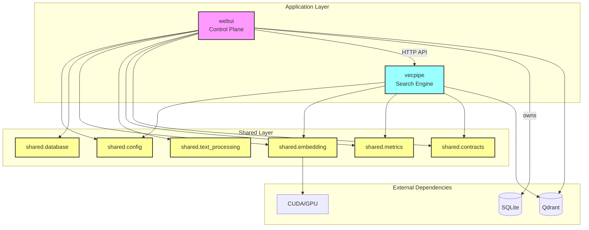

# Semantik Dependency Analysis - Clean Architecture

## Executive Summary

Following the architectural refactoring, Semantik now implements a clean three-package architecture with no circular dependencies. This document outlines the dependency structure and demonstrates how the refactoring has resolved all architectural issues.

## Package Structure

```
packages/
├── shared/             # Common utilities (no external package dependencies)
├── vecpipe/           # Core search engine (depends on shared)
└── webui/             # Control plane and UI (depends on shared)
```

## Dependency Graph



## Key Architectural Improvements

### 1. No Circular Dependencies
- **Before**: `vecpipe` imported from `webui.embedding_service` while `webui` imported from `vecpipe.config`
- **After**: Both packages only import from `shared`, creating a clean dependency hierarchy

### 2. Clear Service Boundaries
- **WebUI**: Owns SQLite database, handles authentication, manages jobs
- **Vecpipe**: Pure search functionality, stateless, no database access
- **Shared**: Common utilities used by both services

### 3. Database Ownership
- **Before**: Both services directly accessed SQLite database
- **After**: WebUI exclusively owns the database; Vecpipe has no database access

## Shared Package Components

### shared.config
- **Purpose**: Centralized configuration management
- **Components**:
  - `base.py`: Base configuration class
  - `vecpipe.py`: Vecpipe-specific settings
  - `webui.py`: WebUI-specific settings
- **Used by**: Both vecpipe and webui

### shared.embedding
- **Purpose**: Unified embedding service
- **Components**:
  - `base.py`: Abstract embedding interface
  - `dense.py`: Dense embedding implementation
  - `service.py`: Main embedding service
- **Used by**: Both services for embedding generation

### shared.database
- **Purpose**: Repository pattern for database access
- **Components**:
  - `sqlite_repository.py`: SQLite implementation
  - `legacy_wrappers.py`: Deprecated legacy functions
- **Used by**: WebUI only (vecpipe has no database access)

### shared.text_processing
- **Purpose**: Document processing utilities
- **Components**:
  - `extraction.py`: Text extraction from various formats
  - `chunking.py`: Token-based text chunking
- **Used by**: WebUI for job processing

### shared.metrics
- **Purpose**: Prometheus metrics collection
- **Components**:
  - `prometheus.py`: Metrics definitions and registry
- **Used by**: Both services for monitoring

### shared.contracts
- **Purpose**: API contract definitions
- **Components**:
  - `search.py`: Search API models
  - `jobs.py`: Job management models
  - `errors.py`: Error response models
- **Used by**: Both services for API consistency

## Service Communication

### HTTP API Communication
- WebUI → Vecpipe: Search requests via HTTP API
- No direct code imports between services
- Clean API contracts defined in shared.contracts

### Data Flow
```
1. User Request → WebUI
2. WebUI → SQLite (via repository)
3. WebUI → Shared Services (embedding, text processing)
4. WebUI → Vecpipe API (search requests)
5. Vecpipe → Shared Services (embedding)
6. Vecpipe → Qdrant (vector search)
```

## Testing Benefits

### 1. Isolated Unit Testing
- Each package can be tested independently
- Shared components have their own test suites
- No complex mocking of circular dependencies

### 2. Clear Mock Boundaries
- Mock shared services for vecpipe tests
- Mock vecpipe API for webui tests
- Mock external services (Qdrant, SQLite)

### 3. Integration Testing
- Test service communication via HTTP
- Test shared component integration
- End-to-end testing with clear boundaries

## Deployment Benefits

### 1. Independent Scaling
- Vecpipe can scale based on search load
- WebUI can scale based on user load
- No shared state between service instances

### 2. Service Isolation
- Services can be updated independently
- Different resource requirements per service
- Failure isolation between services

### 3. Clear Monitoring
- Separate metrics per service
- Clear service boundaries for debugging
- Independent health checks

## Migration from Legacy Code

### Deprecated Components
- `packages/vecpipe/config.py` → `shared.config`
- `packages/vecpipe/metrics.py` → `shared.metrics`
- `packages/vecpipe/extract_chunks.py` → `shared.text_processing`
- `packages/webui/embedding_service.py` → `shared.embedding`

### Legacy Database Access
- All direct database access replaced with repository pattern
- Legacy functions wrapped with `@deprecated` decorator
- Clear migration path to new patterns

## Compliance with Clean Architecture Principles

### 1. Dependency Rule
✅ Dependencies only point inward (app layer → shared layer)

### 2. Abstraction Principle
✅ Shared package provides abstractions (base classes, interfaces)

### 3. Separation of Concerns
✅ Each package has a single, well-defined responsibility

### 4. Independent Deployability
✅ Services can be deployed and scaled independently

### 5. Testability
✅ Each component can be tested in isolation

## Future Considerations

### Potential Enhancements
1. **Message Queue**: For async communication between services
2. **Service Mesh**: For advanced service communication
3. **API Gateway**: For external API management
4. **Shared Cache**: Redis for cross-service caching

### Maintaining Clean Architecture
1. **Code Reviews**: Enforce no cross-package imports
2. **CI/CD Checks**: Automated dependency validation
3. **Documentation**: Keep architecture docs updated
4. **Regular Audits**: Periodic dependency analysis

## Conclusion

The refactoring has successfully transformed Semantik from a tightly coupled system with circular dependencies into a clean, maintainable architecture. The three-package structure (webui, vecpipe, shared) provides clear boundaries, enables independent scaling, and follows established software architecture principles.

This architecture positions Semantik for future growth while maintaining code quality and system reliability.