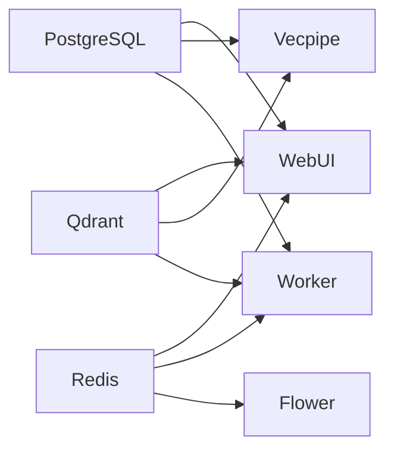

# Deployment Guide for Semantik

## Overview

This guide covers deploying Semantik in various environments, from development to production. Semantik is designed as a containerized microservices architecture using Docker Compose for orchestration.

## Architecture Overview

Semantik consists of the following services:
- **Qdrant**: Vector database for semantic search
- **PostgreSQL**: Relational database for user data and metadata
- **Redis**: Message broker for Celery task queue
- **Vecpipe**: Search API service for embeddings and search
- **WebUI**: Web interface and REST API
- **Worker**: Celery worker for background tasks
- **Flower**: Task monitoring dashboard

## Deployment Options

### 1. Docker Deployment (Recommended)
- **Best for**: Production, staging, consistent environments
- **Benefits**: Isolated dependencies, easy scaling, reproducible builds
- **Requirements**: Docker 20.10+, Docker Compose 2.0+

### 2. Kubernetes Deployment
- **Best for**: Large-scale production, auto-scaling
- **Benefits**: Orchestration, self-healing, rolling updates
- **Requirements**: Kubernetes 1.24+, Helm 3.0+

### 3. Manual Deployment
- **Best for**: Development, debugging, custom setups
- **Benefits**: Direct control, easy debugging
- **Requirements**: Python 3.12+, CUDA toolkit (optional)

## Quick Start

### Using the Setup Wizard (Recommended)

```bash
# Interactive setup wizard
make wizard
```

The wizard will:
- Detect GPU availability
- Generate secure passwords
- Configure environment
- Create necessary directories
- Start all services

### Manual Docker Deployment

```bash
# Clone the repository
git clone https://github.com/your-org/semantik.git
cd semantik

# Copy and configure environment
cp .env.docker.example .env
# Edit .env with your settings

# Start all services
make docker-up

# Verify deployment
docker compose ps
```

## Environment Variables

### Core Configuration

```bash
# Environment Settings
ENVIRONMENT=production              # development, staging, production
LOG_LEVEL=INFO                     # DEBUG, INFO, WARNING, ERROR

# Security (REQUIRED - Generate new values!)
JWT_SECRET_KEY=                    # Generate: openssl rand -hex 32
POSTGRES_PASSWORD=                 # Generate: openssl rand -hex 32
ACCESS_TOKEN_EXPIRE_MINUTES=1440   # 24 hours

# Service URLs (Docker handles internally)
QDRANT_HOST=qdrant                # Qdrant container name
QDRANT_PORT=6333                  # Qdrant port
POSTGRES_HOST=postgres            # PostgreSQL container name
POSTGRES_PORT=5432                # PostgreSQL port
REDIS_URL=redis://redis:6379/0    # Redis connection URL
```

### Model Configuration

```bash
# Embedding Models
DEFAULT_EMBEDDING_MODEL=Qwen/Qwen3-Embedding-0.6B
DEFAULT_QUANTIZATION=float16      # float32, float16, int8
USE_MOCK_EMBEDDINGS=false         # Use mock embeddings (testing)
MODEL_UNLOAD_AFTER_SECONDS=300    # Auto-unload inactive models

# GPU Configuration
CUDA_VISIBLE_DEVICES=0            # GPU device ID
MODEL_MAX_MEMORY_GB=8             # GPU memory limit
```

### Storage Configuration

```bash
# Volume Paths
DOCUMENT_PATH=./documents         # Source documents directory
HF_CACHE_DIR=./models            # Model cache directory

# Operation Paths (inside containers)
EXTRACT_DIR=/app/operations/extract
INGEST_DIR=/app/operations/ingest
```

### Database Configuration

```bash
# PostgreSQL
POSTGRES_DB=semantik
POSTGRES_USER=semantik
POSTGRES_PASSWORD=${SECURE_PASSWORD}

# Connection Pool Settings
DB_POOL_SIZE=20
DB_MAX_OVERFLOW=40
DB_POOL_TIMEOUT=30
DB_POOL_RECYCLE=3600
DB_POOL_PRE_PING=true

# Redis
CELERY_BROKER_URL=redis://redis:6379/0
CELERY_RESULT_BACKEND=redis://redis:6379/0
```

## Docker Deployment

### Service Dependencies



### Docker Compose Profiles

#### Default Profile
Core services for basic functionality:
```bash
docker compose up -d
# Starts: PostgreSQL, Redis, Qdrant, Vecpipe, WebUI
```

#### Backend Profile
Includes background task processing:
```bash
docker compose --profile backend up -d
# Additionally starts: Worker, Flower
```

### Production Docker Compose

Create `docker-compose.prod.yml`:

```yaml
version: '3.8'

services:
  # Apply production settings to all services
  qdrant:
    restart: always
    logging:
      driver: "json-file"
      options:
        max-size: "100m"
        max-file: "5"

  postgres:
    restart: always
    environment:
      - POSTGRES_PASSWORD_FILE=/run/secrets/postgres_password
    secrets:
      - postgres_password

  webui:
    restart: always
    environment:
      - ENVIRONMENT=production
      - JWT_SECRET_KEY_FILE=/run/secrets/jwt_secret
    secrets:
      - jwt_secret

  vecpipe:
    restart: always
    deploy:
      replicas: 2  # Scale for performance

secrets:
  postgres_password:
    external: true
  jwt_secret:
    external: true
```

Deploy with:
```bash
docker compose -f docker-compose.yml -f docker-compose.prod.yml up -d
```

### Health Checks

All services include health checks:

```yaml
healthcheck:
  test: ["CMD", "curl", "-f", "http://localhost:8080/api/health/readyz"]
  interval: 30s
  timeout: 10s
  retries: 3
  start_period: 60s
```

Monitor health:
```bash
# Check all services
docker compose ps

# Detailed health status
docker inspect semantik-webui --format='{{.State.Health.Status}}'
```

## Service Management

### Starting Services

```bash
# Start all services
make docker-up

# Start with GPU support
docker compose -f docker-compose.yml -f docker-compose.cuda.yml up -d

# Start specific service
docker compose up -d webui
```

### Stopping Services

```bash
# Stop all services (preserves data)
make docker-down

# Stop and remove volumes (CAUTION: deletes data)
docker compose down -v
```

### Scaling Services

```bash
# Scale search API
docker compose up -d --scale vecpipe=3

# Scale workers
docker compose --profile backend up -d --scale worker=5
```

## Volume Management

### Persistent Volumes

1. **postgres_data**: PostgreSQL database
   - Critical user and collection data
   - Must be backed up regularly

2. **qdrant_storage**: Vector indices
   - Can be rebuilt from source documents
   - Large size, consider SSD storage

3. **redis_data**: Task queue data
   - Can be recreated if lost
   - Small size, temporary data

### Bind Mounts

```bash
# Create required directories
mkdir -p ./data ./models ./logs ./documents

# Set permissions
sudo chown -R 1000:1000 ./data ./models ./logs
```

### Backup Strategy

```bash
#!/bin/bash
# backup.sh

BACKUP_DIR="/backups/semantik/$(date +%Y%m%d_%H%M%S)"
mkdir -p "$BACKUP_DIR"

# Backup PostgreSQL
docker compose exec -T postgres pg_dump -U semantik semantik > "$BACKUP_DIR/postgres.sql"

# Backup Qdrant
docker compose exec qdrant curl -X POST "http://localhost:6333/snapshots" \
  -H "Content-Type: application/json" \
  -d '{"wait": true}'

# Backup configuration
cp .env docker-compose*.yml "$BACKUP_DIR/"

# Compress
tar czf "$BACKUP_DIR.tar.gz" "$BACKUP_DIR"
rm -rf "$BACKUP_DIR"
```

## Production Configuration

### Nginx Reverse Proxy

```nginx
server {
    listen 443 ssl http2;
    server_name semantik.example.com;
    
    ssl_certificate /etc/letsencrypt/live/semantik.example.com/fullchain.pem;
    ssl_certificate_key /etc/letsencrypt/live/semantik.example.com/privkey.pem;
    
    # Security headers
    add_header X-Frame-Options "SAMEORIGIN" always;
    add_header X-Content-Type-Options "nosniff" always;
    add_header X-XSS-Protection "1; mode=block" always;
    add_header Strict-Transport-Security "max-age=31536000" always;
    
    # WebUI
    location / {
        proxy_pass http://localhost:8080;
        proxy_set_header Host $host;
        proxy_set_header X-Real-IP $remote_addr;
        proxy_set_header X-Forwarded-For $proxy_add_x_forwarded_for;
        proxy_set_header X-Forwarded-Proto $scheme;
        
        # WebSocket support
        proxy_http_version 1.1;
        proxy_set_header Upgrade $http_upgrade;
        proxy_set_header Connection "upgrade";
        proxy_read_timeout 86400;
    }
    
    # Search API (optional direct access)
    location /api/v1/search {
        proxy_pass http://localhost:8000;
        proxy_set_header Host $host;
        proxy_set_header X-Real-IP $remote_addr;
    }
}
```

### Security Hardening

#### 1. Generate Secure Secrets

```bash
# Generate secrets
JWT_SECRET=$(openssl rand -hex 32)
POSTGRES_PASSWORD=$(openssl rand -hex 32)
FLOWER_PASSWORD=$(openssl rand -hex 16)

# Store in Docker secrets
echo "$JWT_SECRET" | docker secret create jwt_secret -
echo "$POSTGRES_PASSWORD" | docker secret create postgres_password -
```

#### 2. Network Isolation

```yaml
# docker-compose.prod.yml
networks:
  frontend:
    driver: bridge
  backend:
    driver: bridge
    internal: true

services:
  webui:
    networks:
      - frontend
      - backend
  
  postgres:
    networks:
      - backend
```

#### 3. Read-Only Containers

```yaml
services:
  vecpipe:
    read_only: true
    tmpfs:
      - /tmp
      - /app/tmp
```

### Resource Limits

```yaml
services:
  webui:
    deploy:
      resources:
        limits:
          cpus: '2'
          memory: 4G
        reservations:
          cpus: '1'
          memory: 2G

  vecpipe:
    deploy:
      resources:
        limits:
          cpus: '4'
          memory: 8G
        reservations:
          cpus: '2'
          memory: 4G
          devices:
            - driver: nvidia
              count: 1
              capabilities: [gpu]
```

## Monitoring and Logging

### Prometheus Metrics

Services expose metrics on internal ports:

```yaml
# prometheus.yml
global:
  scrape_interval: 15s

scrape_configs:
  - job_name: 'semantik'
    static_configs:
      - targets:
        - 'webui:9091'
        - 'vecpipe:9091'
```

### Centralized Logging

```yaml
# docker-compose.prod.yml
services:
  webui:
    logging:
      driver: "fluentd"
      options:
        fluentd-address: "localhost:24224"
        tag: "semantik.webui"
```

### Health Monitoring

```bash
#!/bin/bash
# health-check.sh

# Check all services
services=("webui:8080" "vecpipe:8000" "qdrant:6333" "postgres:5432" "redis:6379")

for service in "${services[@]}"; do
    name="${service%%:*}"
    port="${service##*:}"
    
    if docker compose exec $name nc -z localhost $port; then
        echo "✓ $name is healthy"
    else
        echo "✗ $name is unhealthy"
        exit 1
    fi
done
```

## Scaling Strategies

### Horizontal Scaling

#### 1. Stateless Services (WebUI, Vecpipe)
```bash
# Scale WebUI
docker compose up -d --scale webui=3

# Scale Search API
docker compose up -d --scale vecpipe=5
```

#### 2. Worker Scaling
```bash
# Scale Celery workers
docker compose --profile backend up -d --scale worker=10

# Monitor with Flower
open http://localhost:5555
```

### Load Balancing

Use Docker Swarm or Kubernetes for built-in load balancing, or configure Nginx:

```nginx
upstream webui_backend {
    least_conn;
    server localhost:8080;
    server localhost:8081;
    server localhost:8082;
}

server {
    location / {
        proxy_pass http://webui_backend;
    }
}
```

## Troubleshooting

### Service Won't Start

```bash
# Check logs
docker compose logs webui

# Verify configuration
docker compose config

# Check port availability
sudo lsof -i :8080
```

### Database Connection Issues

```bash
# Test PostgreSQL connection
docker compose exec postgres psql -U semantik -d semantik -c "SELECT 1"

# Check Redis
docker compose exec redis redis-cli ping

# Verify Qdrant
curl http://localhost:6333/health
```

### Memory Issues

```bash
# Check container resources
docker stats

# Adjust limits in docker-compose.yml
# Reduce batch size
export BATCH_SIZE=16
export DEFAULT_QUANTIZATION=int8
```

### GPU Not Available

```bash
# Verify NVIDIA runtime
docker run --rm --gpus all nvidia/cuda:11.8.0-base nvidia-smi

# Check Docker GPU support
docker compose exec vecpipe nvidia-smi
```

## Maintenance

### Regular Tasks

#### Daily
- Monitor service logs for errors
- Check disk usage
- Verify backup completion

#### Weekly
- Review performance metrics
- Clean old operation files
- Update container images

#### Monthly
- Security updates
- Performance optimization
- Capacity planning

### Update Procedure

```bash
# 1. Backup current state
./backup.sh

# 2. Pull latest changes
git pull origin main

# 3. Update images
docker compose pull

# 4. Rebuild custom images
docker compose build

# 5. Apply database migrations
docker compose run --rm webui alembic upgrade head

# 6. Restart services
docker compose down
docker compose up -d

# 7. Verify health
./health-check.sh
```

## Disaster Recovery

### Backup Restoration

```bash
# 1. Stop services
docker compose down

# 2. Restore PostgreSQL
docker compose up -d postgres
docker compose exec -T postgres psql -U semantik -d postgres < backup/postgres.sql

# 3. Restore Qdrant
docker compose up -d qdrant
# Upload snapshot through Qdrant API

# 4. Start remaining services
docker compose up -d
```

### Rollback Procedure

```bash
# Tag current version
docker tag semantik:latest semantik:rollback

# Deploy previous version
docker compose down
docker tag semantik:v1.0.0 semantik:latest
docker compose up -d
```

## Security Checklist

- [ ] Change all default passwords
- [ ] Generate new JWT secret key
- [ ] Enable HTTPS with valid certificates
- [ ] Configure firewall rules
- [ ] Implement rate limiting
- [ ] Enable audit logging
- [ ] Regular security updates
- [ ] Encrypt sensitive data at rest
- [ ] Use Docker secrets for credentials
- [ ] Implement network segmentation

## Performance Tuning

### Database Optimization

```sql
-- PostgreSQL tuning
ALTER SYSTEM SET shared_buffers = '256MB';
ALTER SYSTEM SET work_mem = '16MB';
ALTER SYSTEM SET maintenance_work_mem = '64MB';
ALTER SYSTEM SET effective_cache_size = '1GB';
```

### Redis Optimization

```bash
# Redis configuration
maxmemory 2gb
maxmemory-policy allkeys-lru
save ""  # Disable RDB saves for performance
```

### GPU Optimization

```bash
# Memory optimization
PYTORCH_CUDA_ALLOC_CONF=max_split_size_mb:512

# Use TensorCores
TORCH_CUDNN_V8_API_ENABLED=1

# Enable mixed precision
USE_AMP=true
```

## Support

For deployment issues:
1. Check service logs first
2. Verify environment configuration
3. Review this deployment guide
4. Check GitHub issues
5. Contact support team