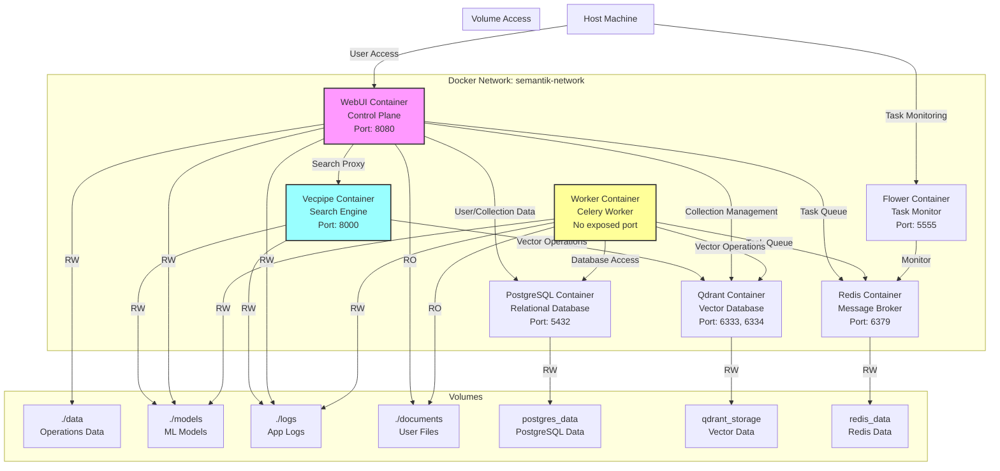

# Docker Guide for Semantik

## Overview

This guide provides comprehensive documentation for running Semantik with Docker, including architecture details, configuration options, and best practices for both development and production environments.

## Quick Start

### Prerequisites

Before running the wizard or any Docker workflow, ensure the following are installed and up to date:
- Docker Engine 24+ (or Docker Desktop on macOS/Windows)
- Docker Compose v2 (`docker compose` CLI)
- Docker Buildx plugin (required for Bake-driven builds). On Debian/Ubuntu run `sudo apt-get install docker-buildx-plugin`; Docker Desktop already bundles Buildx.

### Using the Interactive Wizard (Recommended)

The easiest way to get started is using the interactive setup wizard:

```bash
make wizard
# or
python wizard_launcher.py
```

The wizard will:
- Configure GPU/CPU deployment
- Auto-generate secure PostgreSQL password
- Auto-generate secure JWT secret key
- Set up document directories
- Create optimized .env configuration

### Manual Setup

1. Copy the Docker environment template:
   ```bash
   cp .env.docker.example .env
   ```

2. Start all services:
   ```bash
   make docker-up
   ```

3. Access the application at http://localhost:8080

## Docker Architecture

### Container Structure
```
semantik/
├── docker-compose.yml          # Main configuration with all services
├── docker-compose.cuda.yml     # GPU/CUDA override configuration
├── docker-compose.dev.yml      # Development configuration
├── docker-compose.prod.yml     # Production configuration
├── Dockerfile                  # Multi-stage Dockerfile
├── docker-entrypoint.sh        # Container entrypoint script
└── .env.docker.example         # Environment template
```

### Service Architecture


## Docker Services

### Core Services

#### 1. Qdrant (Vector Database)
- **Image**: `qdrant/qdrant:latest`
- **Ports**: 6333 (HTTP), 6334 (gRPC)
- **Volume**: `qdrant_storage:/qdrant/storage`
- **Health Check**: HTTP endpoint on port 6333
- **Resource Limits**: 2 CPUs, 4GB memory

#### 2. PostgreSQL (Relational Database)
- **Image**: `postgres:16-alpine`
- **Port**: 5432
- **Volume**: `postgres_data:/var/lib/postgresql/data`
- **Health Check**: `pg_isready` command
- **Resource Limits**: 2 CPUs, 2GB memory
- **Configuration**: UTF-8 encoding, en_US.utf8 locale

#### 3. Redis (Message Broker)
- **Image**: `redis:7-alpine`
- **Port**: 6379
- **Volume**: `redis_data:/data`
- **Health Check**: `redis-cli ping`
- **Resource Limits**: 0.5 CPUs, 512MB memory
- **Configuration**: AOF persistence enabled

#### 4. Vecpipe (Search API Service)
- **Build**: From Dockerfile
- **Port**: 8000
- **Depends On**: PostgreSQL (healthy), Qdrant, Redis
- **GPU Support**: Optional (via deploy.resources)
- **Resource Limits**: 2 CPUs, 4GB memory
- **Health Check**: HTTP endpoint on port 8000

#### 5. WebUI (Web Interface & API)
- **Build**: From Dockerfile
- **Port**: 8080
- **Depends On**: PostgreSQL (healthy), Vecpipe, Redis
- **Resource Limits**: 1 CPU, 2GB memory
- **Health Check**: HTTP endpoint on port 8080/api/health/readyz

#### 6. Worker (Celery Background Tasks)
- **Build**: From Dockerfile
- **Profile**: backend
- **Depends On**: PostgreSQL (healthy), Redis, Qdrant
- **Resource Limits**: 2 CPUs, 4GB memory
- **Health Check**: Celery inspect ping

#### 7. Flower (Task Monitoring)
- **Build**: From Dockerfile
- **Profile**: backend
- **Port**: 5555
- **Depends On**: Redis
- **Resource Limits**: 0.5 CPUs, 512MB memory
- **Health Check**: HTTP endpoint on port 5555

## Docker Profiles

### Default Profile
Runs core services: Qdrant, PostgreSQL, Redis, Vecpipe, and WebUI

```bash
docker compose up -d
```

### Backend Profile
Includes Worker and Flower services for full background task processing

```bash
docker compose --profile backend up -d
```

## Volume Management

### Named Volumes

1. **qdrant_storage**: Vector database storage
   - Persistent across container restarts
   - Contains all vector indices and collections

2. **postgres_data**: PostgreSQL database files
   - Contains user data, collections metadata, operations history
   - Critical for data persistence

3. **redis_data**: Redis persistence files
   - Contains task queue data
   - Can be recreated if lost

### Bind Mounts

1. **./data**: Application data directory
   - Operation files (extract, ingest)
   - Processing state files

2. **./models**: HuggingFace model cache
   - Downloaded embedding models
   - Reused across container restarts

3. **./logs**: Application logs
   - Service logs from all containers
   - Rotated automatically

4. **${DOCUMENT_PATH}**: User documents
   - Mounted read-only
   - Source documents for processing

### Volume Configuration Examples

```yaml
# Create volumes with specific drivers
volumes:
  qdrant_storage:
    driver: local
    driver_opts:
      type: none
      o: bind
      device: /mnt/fast-ssd/qdrant

# Set volume permissions
volumes:
  - ./data:/app/data:rw
  - ./documents:/mnt/docs:ro
```

## GPU Configuration

### Enabling GPU Support

#### Standard Configuration (docker-compose.yml)
The main docker-compose.yml includes basic GPU support:

```yaml
deploy:
  resources:
    reservations:
      devices:
        - driver: nvidia
          count: 1
          capabilities: [gpu]
```

#### CUDA-Optimized Configuration
For INT8 quantization support, use the CUDA override:

```bash
docker compose -f docker-compose.yml -f docker-compose.cuda.yml up -d --build
```

The CUDA override adds:
- Proper CUDA library paths
- Bitsandbytes compilation support
- C/C++ compiler configuration

### GPU Environment Variables

```bash
# Select GPU device
CUDA_VISIBLE_DEVICES=0

# GPU memory limit
MODEL_MAX_MEMORY_GB=8

# Quantization mode
DEFAULT_QUANTIZATION=float16  # or int8 with CUDA build
```

### GPU Memory Requirements

| Model | float32 | float16 | int8 |
|-------|---------|---------|------|
| Qwen3-Embedding-0.6B | ~2.4GB | ~1.2GB | ~0.6GB |
| Qwen3-Embedding-4B | ~16GB | ~8GB | ~4GB |

## Environment Configuration

### Essential Variables

```bash
# Authentication (auto-generated by make docker-up if using defaults)
JWT_SECRET_KEY=CHANGE_THIS_TO_A_STRONG_SECRET_KEY
POSTGRES_PASSWORD=CHANGE_THIS_TO_A_STRONG_PASSWORD

# Model Configuration
DEFAULT_EMBEDDING_MODEL=Qwen/Qwen3-Embedding-0.6B
DEFAULT_QUANTIZATION=float16
USE_MOCK_EMBEDDINGS=false

# Collection Settings
DEFAULT_COLLECTION=work_docs

# Paths
DOCUMENT_PATH=./documents
HF_CACHE_DIR=./models
```

### Complete Environment Reference

See [CONFIGURATION.md](./CONFIGURATION.md) for a complete list of environment variables.

## Health Checks

All services include health checks for reliability:

```yaml
healthcheck:
  test: ["CMD", "curl", "-f", "http://localhost:8080/api/health/readyz"]
  interval: 30s
  timeout: 10s
  retries: 3
  start_period: 60s
```

### Checking Service Health

```bash
# Check all services
docker compose ps

# Check specific service health
docker inspect semantik-webui | jq '.[0].State.Health'

# View health check logs
docker compose logs webui | grep health
```

## Networking

### Default Network
All services communicate through the `semantik-network` bridge network.

### Service Discovery
Services communicate using container names:
- `postgres:5432` - PostgreSQL database
- `qdrant:6333` - Vector database
- `redis:6379` - Message broker
- `vecpipe:8000` - Search API
- `webui:8080` - Web interface

### Port Mappings

| Service | Internal Port | External Port | Purpose |
|---------|--------------|---------------|---------|
| WebUI | 8080 | 8080 | Web interface |
| Vecpipe | 8000 | 8000 | Search API |
| Qdrant | 6333 | 6333 | Vector DB HTTP |
| Qdrant | 6334 | 6334 | Vector DB gRPC |
| PostgreSQL | 5432 | 5432 | Database |
| Redis | 6379 | 6379 | Message broker |
| Flower | 5555 | 5555 | Task monitor |

## Security Configuration

### Container Security

All containers run with security restrictions:

```yaml
security_opt:
  - no-new-privileges:true
cap_drop:
  - ALL
cap_add:
  - NET_BIND_SERVICE
```

### User Permissions

Containers run as non-root user (UID 1000):

```dockerfile
USER 1000:1000
```

### Secret Management

Sensitive data should use Docker secrets or environment files:

```bash
# Generate secure keys
openssl rand -hex 32 > jwt_secret.txt
docker secret create jwt_secret jwt_secret.txt
```

## Common Docker Commands

### Service Management

```bash
# Start all services
make docker-up

# Stop all services
make docker-down

# Restart services
make docker-restart

# View logs
make docker-logs

# View specific service logs
docker compose logs -f webui
docker compose logs -f vecpipe
```

### Maintenance Commands

```bash
# Rebuild images without cache
make docker-build-fresh

# Remove unused images
docker image prune -a

# Clean build cache
docker builder prune

# Full system cleanup (careful!)
docker system prune -a --volumes
```

### Debugging Commands

```bash
# Access container shell
docker compose exec webui /bin/bash

# Check resource usage
docker stats

# Inspect container
docker inspect semantik-webui

# Copy files from container
docker cp semantik-webui:/app/logs/error.log ./
```

## Development with Docker

### Local Development Setup

For local development with hot reload:

```bash
# Start only backend services
make docker-dev-up

# Run webui locally
make dev-local
```

### Testing in Containers

```bash
# Run tests in container
docker compose run --rm webui pytest

# Run specific test
docker compose run --rm webui pytest tests/test_search.py
```

## Production Deployment

### Production Environment File

Create a production `.env`:

```bash
# Environment
ENVIRONMENT=production

# Security (generate new values!)
JWT_SECRET_KEY=$(openssl rand -hex 32)
POSTGRES_PASSWORD=$(openssl rand -hex 32)

# Disable debug features
USE_MOCK_EMBEDDINGS=false
DISABLE_AUTH=false

# Performance
DEFAULT_QUANTIZATION=int8
MODEL_UNLOAD_AFTER_SECONDS=600
```

### Production Docker Compose Override

Use docker-compose.prod.yml for production settings:

```bash
docker compose -f docker-compose.yml -f docker-compose.prod.yml up -d
```

### Backup Procedures

```bash
# Backup PostgreSQL
make docker-postgres-backup

# Backup Qdrant
docker exec semantik-qdrant \
  curl -X POST "http://localhost:6333/snapshots"

# Backup volumes
docker run --rm \
  -v semantik_postgres_data:/data \
  -v $(pwd)/backups:/backup \
  alpine tar czf /backup/postgres-backup.tar.gz -C /data .
```

## Troubleshooting

### Container Won't Start

```bash
# Check logs
docker compose logs webui

# Check for port conflicts
lsof -i :8080

# Verify environment
docker compose config
```

### Permission Denied

```bash
# Fix volume permissions
sudo chown -R 1000:1000 ./data ./models ./logs

# Or using docker
docker compose run --rm webui chown -R 1000:1000 /app/data
```

### Out of Memory

```bash
# Check memory usage
docker stats

# Reduce memory usage
export DEFAULT_QUANTIZATION=int8
export BATCH_SIZE=16
```

### GPU Not Available

```bash
# Check NVIDIA runtime
docker run --rm --gpus all nvidia/cuda:11.8.0-base-ubuntu22.04 nvidia-smi

# Install nvidia-container-toolkit
sudo apt-get install nvidia-container-toolkit
sudo systemctl restart docker
```

### Database Connection Issues

```bash
# Check PostgreSQL logs
docker compose logs postgres

# Test connection
docker compose exec postgres psql -U semantik -d semantik

# Reset database password
docker compose down
rm -rf postgres_data
make docker-up
```

## Monitoring

### Viewing Metrics

Metrics are exposed on port 9091 (not exposed by default):

```bash
# Access metrics
docker compose exec webui curl http://localhost:9091/metrics
```

### Using Flower for Task Monitoring

```bash
# Start with backend profile
docker compose --profile backend up -d

# Access Flower UI
open http://localhost:5555
# Log in with FLOWER_USERNAME/FLOWER_PASSWORD from your .env (generated by `make wizard`).
# Rerun `make wizard` to rotate these credentials if needed.
```

### Container Resource Monitoring

```bash
# Real-time stats
docker stats

# Detailed resource usage
docker compose top
```

## Best Practices

### Image Management

1. **Use specific image tags** in production
2. **Regularly update base images** for security
3. **Clean unused images** to save space
4. **Use multi-stage builds** to minimize image size

### Security

1. **Always change default passwords**
2. **Use secrets for sensitive data**
3. **Keep containers updated**
4. **Limit container capabilities**
5. **Use read-only mounts** where possible

### Performance

1. **Use SSD storage** for volumes
2. **Configure appropriate resource limits**
3. **Enable GPU for better performance**
4. **Use INT8 quantization** to reduce memory usage

### Maintenance

1. **Regular backups** of persistent data
2. **Monitor disk usage**
3. **Rotate logs** to prevent disk fill
4. **Update dependencies** monthly

## Migration from Legacy Setup

If migrating from the old job-based system:

1. **Backup existing data**
2. **Update environment variables** (job → operation paths)
3. **Run database migrations** if needed
4. **Update volume mounts** to new structure
5. **Test thoroughly** before switching production

## Support

For Docker-related issues:
1. Check container logs first
2. Verify environment configuration
3. Ensure all dependencies are running
4. Consult the [troubleshooting section](#troubleshooting)
5. Check GitHub issues for similar problems
