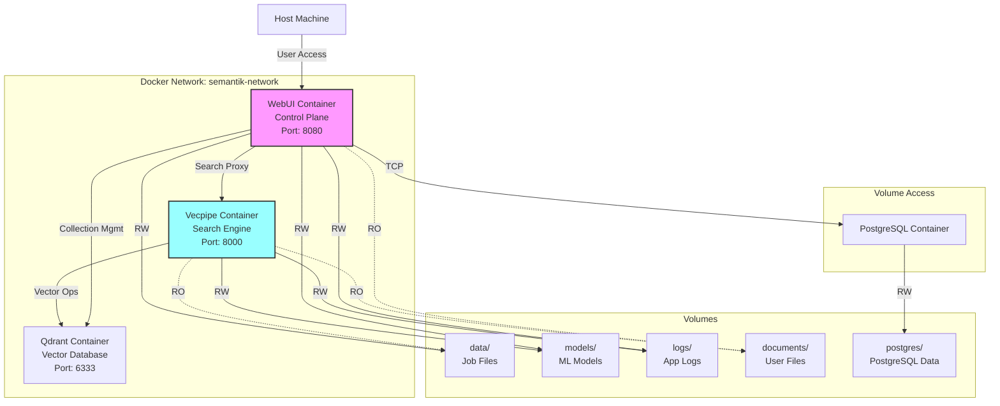

# Docker Guide for Semantik

## Overview

This guide provides comprehensive documentation for running Semantik with Docker, including architecture details, configuration options, and best practices for both development and production environments.

## Docker Architecture

### Container Structure
```
semantik/
├── docker-compose.yml          # Development configuration
├── docker-compose.prod.yml     # Production configuration
├── docker-compose.cuda.yml     # GPU-enabled configuration
├── Dockerfile                  # Standard CPU image
├── Dockerfile.cuda            # CUDA-enabled image
└── docker-entrypoint.sh      # Container entrypoint script
```

### Service Architecture


## Docker Images

### Base Image Structure

#### CPU Image (Dockerfile)
```dockerfile
FROM python:3.12-slim

# Install system dependencies
RUN apt-get update && apt-get install -y \
    build-essential \
    curl \
    git \
    && rm -rf /var/lib/apt/lists/*

# Set working directory
WORKDIR /app

# Install Poetry
RUN pip install poetry

# Copy dependency files
COPY pyproject.toml poetry.lock ./

# Install dependencies
RUN poetry config virtualenvs.create false \
    && poetry install --no-interaction --no-ansi

# Copy application code
COPY packages/ packages/
COPY scripts/ scripts/

# Set environment variables
ENV PYTHONPATH=/app:$PYTHONPATH
ENV PYTHONUNBUFFERED=1

# Create non-root user
RUN useradd -m -u 1000 semantik \
    && chown -R semantik:semantik /app

USER semantik

# Default command
CMD ["python", "-m", "webui.main"]
```

#### CUDA Image (Dockerfile.cuda)
```dockerfile
FROM nvidia/cuda:11.8.0-cudnn8-runtime-ubuntu22.04

# Install Python and system dependencies
RUN apt-get update && apt-get install -y \
    python3.12 \
    python3.12-dev \
    python3-pip \
    build-essential \
    curl \
    git \
    && rm -rf /var/lib/apt/lists/*

# Set Python 3.12 as default
RUN update-alternatives --install /usr/bin/python python /usr/bin/python3.12 1

WORKDIR /app

# Install Poetry
RUN pip install poetry

# Copy and install dependencies
COPY pyproject.toml poetry.lock ./
RUN poetry config virtualenvs.create false \
    && poetry install --no-interaction --no-ansi

# Install PyTorch with CUDA support
RUN pip install torch torchvision torchaudio --index-url https://download.pytorch.org/whl/cu118

# Copy application
COPY packages/ packages/
COPY scripts/ scripts/

# Environment setup
ENV PYTHONPATH=/app:$PYTHONPATH
ENV PYTHONUNBUFFERED=1
ENV CUDA_VISIBLE_DEVICES=0

# Create user
RUN useradd -m -u 1000 semantik \
    && chown -R semantik:semantik /app

USER semantik

CMD ["python", "-m", "webui.main"]
```

### Building Images

```bash
# Build CPU image
docker build -t semantik:latest .

# Build CUDA image
docker build -f Dockerfile.cuda -t semantik:cuda .

# Build with specific Python version
docker build --build-arg PYTHON_VERSION=3.12 -t semantik:py312 .

# Multi-platform build
docker buildx build --platform linux/amd64,linux/arm64 -t semantik:multi .
```

## Docker Compose Configurations

### Development Configuration (docker-compose.yml)
```yaml
version: '3.8'

services:
  # Vector Database
  qdrant:
    image: qdrant/qdrant:latest
    container_name: semantik-qdrant
    restart: unless-stopped
    ports:
      - "6333:6333"
      - "6334:6334"  # gRPC port
    volumes:
      - qdrant_storage:/qdrant/storage
      - ./qdrant_config.yaml:/qdrant/config/config.yaml:ro
    environment:
      - QDRANT__SERVICE__HTTP_PORT=6333
      - QDRANT__SERVICE__GRPC_PORT=6334
      - QDRANT__LOG_LEVEL=INFO
    healthcheck:
      test: ["CMD", "wget", "--spider", "-q", "http://localhost:6333/health"]
      interval: 30s
      timeout: 10s
      retries: 3
      start_period: 40s

  # Core Search Engine (Vecpipe)
  vecpipe:
    build:
      context: .
      dockerfile: Dockerfile
    image: semantik:latest
    container_name: semantik-vecpipe
    restart: unless-stopped
    ports:
      - "8000:8000"
      - "9091:9091"  # Metrics port
    volumes:
      - ./data:/app/data:ro  # Read-only access to job files
      - ./models:/app/models
      - ./logs:/app/logs
      - ./documents:/documents:ro
      - ./packages:/app/packages:ro  # Hot reload in dev
    environment:
      - QDRANT_HOST=qdrant
      - QDRANT_PORT=6333
      - USE_MOCK_EMBEDDINGS=${USE_MOCK_EMBEDDINGS:-false}
      - DEFAULT_EMBEDDING_MODEL=${DEFAULT_EMBEDDING_MODEL:-Qwen/Qwen3-Embedding-0.6B}
      - DEFAULT_QUANTIZATION=${DEFAULT_QUANTIZATION:-float16}
      - LOG_LEVEL=${LOG_LEVEL:-INFO}
      - METRICS_PORT=9091
    depends_on:
      qdrant:
        condition: service_healthy
    command: ["python", "-m", "vecpipe.search_api"]
    networks:
      - semantik-network

  # Control Plane and UI (WebUI)
  webui:
    build:
      context: .
      dockerfile: Dockerfile
    image: semantik:latest
    container_name: semantik-webui
    restart: unless-stopped
    ports:
      - "8080:8080"
      - "9092:9092"  # Metrics port
    volumes:
      - ./data:/app/data  # Full access to job files
      - ./models:/app/models
      - ./logs:/app/logs
      - ./documents:/documents:ro
      - ./packages:/app/packages:ro  # Hot reload in dev
    environment:
      - QDRANT_HOST=qdrant
      - QDRANT_PORT=6333
      - VECPIPE_API_URL=http://vecpipe:8000
      - JWT_SECRET_KEY=${JWT_SECRET_KEY:-dev-secret-key}
      - DISABLE_AUTH=${DISABLE_AUTH:-false}
      - LOG_LEVEL=${LOG_LEVEL:-INFO}
      - METRICS_PORT=9092
    depends_on:
      - vecpipe
      - qdrant
    command: ["python", "-m", "webui.main"]
    networks:
      - semantik-network

volumes:
  qdrant_storage:
    driver: local

networks:
  semantik-network:
    driver: bridge
```

### Production Configuration (docker-compose.prod.yml)
```yaml
version: '3.8'

services:
  # Vector Database
  qdrant:
    image: qdrant/qdrant:v1.8.0
    deploy:
      resources:
        limits:
          memory: 4G
        reservations:
          memory: 2G
    volumes:
      - /opt/semantik/qdrant:/qdrant/storage
    environment:
      - QDRANT__SERVICE__HTTP_PORT=6333
      - QDRANT__SERVICE__ENABLE_TLS=true
      - QDRANT__SERVICE__API_KEY=${QDRANT_API_KEY}
    logging:
      driver: "json-file"
      options:
        max-size: "100m"
        max-file: "5"

  # Core Search Engine (Vecpipe) - Can scale independently
  vecpipe:
    image: semantik:cuda
    deploy:
      replicas: 2  # Scale search independently
      resources:
        limits:
          memory: 8G
        reservations:
          memory: 4G
          devices:
            - driver: nvidia
              count: 1
              capabilities: [gpu]
    volumes:
      - /opt/semantik/data:/app/data:ro  # Read-only job file access
      - /opt/semantik/models:/app/models
      - /opt/semantik/logs/vecpipe:/app/logs
      - /mnt/documents:/documents:ro
    environment:
      - ENVIRONMENT=production
      - SERVICE_NAME=vecpipe
      - USE_MOCK_EMBEDDINGS=false
      - CUDA_VISIBLE_DEVICES=0
    logging:
      driver: "json-file"
      options:
        max-size: "100m"
        max-file: "10"

  # Control Plane (WebUI) - Can scale independently
  webui:
    image: semantik:latest
    deploy:
      replicas: 2  # Scale UI independently
      resources:
        limits:
          memory: 4G
        reservations:
          memory: 2G
    volumes:
      - /opt/semantik/data:/app/data  # Full access (owns DB)
      - /opt/semantik/logs/webui:/app/logs
      - /opt/semantik/models:/app/models:ro  # Read-only models
    environment:
      - ENVIRONMENT=production
      - SERVICE_NAME=webui
      - VECPIPE_API_URL=http://vecpipe:8000
      - JWT_SECRET_KEY_FILE=/run/secrets/jwt_secret
    secrets:
      - jwt_secret
    logging:
      driver: "json-file"
      options:
        max-size: "100m"
        max-file: "10"

  nginx:
    image: nginx:alpine
    ports:
      - "80:80"
      - "443:443"
    volumes:
      - ./nginx.conf:/etc/nginx/nginx.conf:ro
      - /etc/letsencrypt:/etc/letsencrypt:ro
    depends_on:
      - webui
      - search-api
    deploy:
      resources:
        limits:
          memory: 512M

secrets:
  jwt_secret:
    external: true
```

### GPU Configuration (docker-compose.cuda.yml)
```yaml
version: '3.8'

services:
  search-api:
    build:
      context: .
      dockerfile: Dockerfile.cuda
    runtime: nvidia
    environment:
      - NVIDIA_VISIBLE_DEVICES=all
      - NVIDIA_DRIVER_CAPABILITIES=compute,utility
    deploy:
      resources:
        reservations:
          devices:
            - driver: nvidia
              count: 1
              capabilities: [gpu]
```

## Volume Management

### Volume Types and Purposes

1. **Data Volume** (`/app/data`)
   - Job processing files
   - Temporary extraction data
   - Processing state files
   - **Persistence**: Required
   - **Backup**: Critical

2. **Models Volume** (`/app/models`)
   - Downloaded embedding models
   - Model cache
   - **Persistence**: Recommended
   - **Backup**: Optional (can re-download)

3. **Logs Volume** (`/app/logs`)
   - Application logs
   - Error logs
   - **Persistence**: Recommended
   - **Backup**: Optional

4. **Documents Volume** (`/documents`)
   - Source documents
   - Read-only mount
   - **Persistence**: External
   - **Backup**: User responsibility

### Volume Configuration
```yaml
volumes:
  # Named volumes (managed by Docker)
  semantik_data:
    driver: local
    driver_opts:
      type: none
      o: bind
      device: /opt/semantik/data
  
  # Bind mounts (direct host paths)
  - type: bind
    source: ./data
    target: /app/data
    read_only: false
  
  # Temporary volumes
  - type: tmpfs
    target: /tmp
    tmpfs:
      size: 1G
```

### Volume Permissions
```bash
# Fix ownership issues
docker exec semantik-webui chown -R 1000:1000 /app/data

# Create volumes with correct permissions
mkdir -p data models logs
chmod 755 data models logs
chown 1000:1000 data models logs
```

## Network Configuration

### Default Network
```yaml
networks:
  semantik-network:
    driver: bridge
    ipam:
      config:
        - subnet: 172.20.0.0/16
```

### Service Discovery
Services can communicate using container names:
- `qdrant:6333` - Vector database
- `vecpipe:8000` - Core search engine API
- `webui:8080` - Control plane and web interface

**Communication Flow**:
- WebUI → Vecpipe: Search requests (HTTP)
- WebUI → Qdrant: Collection management
- Vecpipe → Qdrant: Vector search operations
- WebUI → PostgreSQL: All relational data operations
- WebUI owns PostgreSQL database exclusively

### External Access
```yaml
# Expose only necessary ports
ports:
  - "8080:8080"  # WebUI - User-facing interface
  
# Internal services (not exposed externally)
expose:
  - "8000"  # Vecpipe API (internal only)
  - "6333"  # Qdrant (internal only)
  - "9091"  # Vecpipe metrics (internal)
  - "9092"  # WebUI metrics (internal)
```

## Environment Variables

### Container Environment
```bash
# .env file for docker-compose
COMPOSE_PROJECT_NAME=semantik
DOCKER_BUILDKIT=1

# Application settings
DEFAULT_EMBEDDING_MODEL=Qwen/Qwen3-Embedding-0.6B
DEFAULT_QUANTIZATION=float16
USE_MOCK_EMBEDDINGS=false

# Security
JWT_SECRET_KEY=your-secret-key-here

# Resources
MAX_WORKERS=4
BATCH_SIZE=32

# Paths
DOCUMENTS_DIR=/path/to/documents
```

### Runtime Configuration
```bash
# Override at runtime
docker-compose run -e LOG_LEVEL=DEBUG webui

# Using env file
docker-compose --env-file .env.prod up
```

## Health Checks

### Service Health Checks
```yaml
healthcheck:
  test: ["CMD", "curl", "-f", "http://localhost:8080/health"]
  interval: 30s
  timeout: 10s
  retries: 3
  start_period: 40s
```

### Custom Health Check Script
```bash
#!/bin/bash
# healthcheck.sh

# Check WebUI
curl -f http://localhost:8080/health || exit 1

# Check Search API
curl -f http://localhost:8000/ || exit 1

# Check Qdrant
curl -f http://localhost:6333/health || exit 1

echo "All services healthy"
```

## Docker Commands

### Basic Operations
```bash
# Start all services
docker-compose up -d

# Stop all services
docker-compose down

# Restart specific service
docker-compose restart webui

# View logs
docker-compose logs -f search-api

# Execute command in container
docker-compose exec webui python -m pytest
```

### Maintenance Commands
```bash
# Remove unused images
docker image prune -a

# Clean build cache
docker builder prune

# Remove all stopped containers
docker container prune

# Full cleanup (careful!)
docker system prune -a --volumes
```

### Debugging Commands
```bash
# Interactive shell
docker-compose run --rm webui bash

# Check resource usage
docker stats

# Inspect container
docker inspect semantik-webui

# View container processes
docker-compose top

# Copy files from container
docker cp semantik-webui:/app/logs/error.log ./
```

## Development Workflow

### Hot Reload Setup
```yaml
# Mount source code for development
volumes:
  - ./packages:/app/packages:ro
  - ./apps:/app/apps:ro

# Enable reload
environment:
  - RELOAD=true
```

### Local Development
```bash
# Build and run with local changes
docker-compose -f docker-compose.yml -f docker-compose.dev.yml up --build

# Run tests in container
docker-compose run --rm webui pytest

# Access container shell for debugging
docker-compose exec webui bash
```

## Production Deployment

### Security Hardening
```dockerfile
# Run as non-root user
USER 1000:1000

# Read-only root filesystem
RUN chmod -R 755 /app

# No new privileges
security_opt:
  - no-new-privileges:true
```

### Resource Limits
```yaml
deploy:
  resources:
    limits:
      cpus: '2.0'
      memory: 4G
    reservations:
      cpus: '1.0'
      memory: 2G
```

### Logging Configuration
```yaml
logging:
  driver: "json-file"
  options:
    max-size: "100m"
    max-file: "5"
    labels: "service"
    env: "ENVIRONMENT,LOG_LEVEL"
```

## Troubleshooting

### Common Issues

1. **Container Won't Start**
   ```bash
   # Check logs
   docker-compose logs webui
   
   # Check exit code
   docker-compose ps
   ```

2. **Permission Denied**
   ```bash
   # Fix ownership
   docker-compose exec webui chown -R semantik:semantik /app/data
   ```

3. **Out of Memory**
   ```bash
   # Check memory usage
   docker stats
   
   # Increase limits
   docker-compose -f docker-compose.yml -f docker-compose.mem.yml up
   ```

4. **GPU Not Available**
   ```bash
   # Check NVIDIA runtime
   docker run --rm --gpus all nvidia/cuda:11.8.0-base-ubuntu22.04 nvidia-smi
   
   # Install nvidia-docker2
   sudo apt-get install nvidia-docker2
   ```

### Debug Mode
```yaml
# docker-compose.debug.yml
services:
  webui:
    environment:
      - DEBUG=true
      - LOG_LEVEL=DEBUG
    stdin_open: true
    tty: true
```

## Best Practices

### Image Optimization
1. Use multi-stage builds
2. Minimize layer count
3. Order commands by change frequency
4. Use .dockerignore file

### Security
1. Don't run as root
2. Use secrets for sensitive data
3. Scan images for vulnerabilities
4. Keep base images updated

### Performance
1. Use BuildKit for faster builds
2. Leverage build cache
3. Optimize layer caching
4. Use appropriate resource limits

### Maintenance
1. Tag images properly
2. Clean up unused resources
3. Monitor disk usage
4. Regular backups

## Docker Swarm Deployment

### Initialize Swarm
```bash
# Initialize swarm
docker swarm init

# Deploy stack
docker stack deploy -c docker-compose.prod.yml semantik

# Scale service
docker service scale semantik_webui=3

# Update service
docker service update --image semantik:v2.0 semantik_webui
```

### Service Configuration
```yaml
deploy:
  replicas: 3
  update_config:
    parallelism: 1
    delay: 10s
    failure_action: rollback
  restart_policy:
    condition: on-failure
    delay: 5s
    max_attempts: 3
```

## Kubernetes Migration

### Basic Deployment
```yaml
apiVersion: apps/v1
kind: Deployment
metadata:
  name: semantik-webui
spec:
  replicas: 3
  selector:
    matchLabels:
      app: semantik-webui
  template:
    metadata:
      labels:
        app: semantik-webui
    spec:
      containers:
      - name: webui
        image: semantik:latest
        ports:
        - containerPort: 8080
        env:
        - name: QDRANT_HOST
          value: "qdrant-service"
```

## Monitoring

### Prometheus Integration
```yaml
services:
  prometheus:
    image: prom/prometheus
    volumes:
      - ./prometheus.yml:/etc/prometheus/prometheus.yml
    ports:
      - "9090:9090"
```

### Container Metrics
```bash
# CPU and memory usage
docker stats --format "table {{.Container}}\t{{.CPUPerc}}\t{{.MemUsage}}"

# Disk usage
docker system df
```

## Conclusion

Docker provides a robust, scalable platform for deploying Semantik. This guide covers essential concepts and configurations for both development and production use. Always test configurations thoroughly before deploying to production, and maintain regular backups of your data volumes.