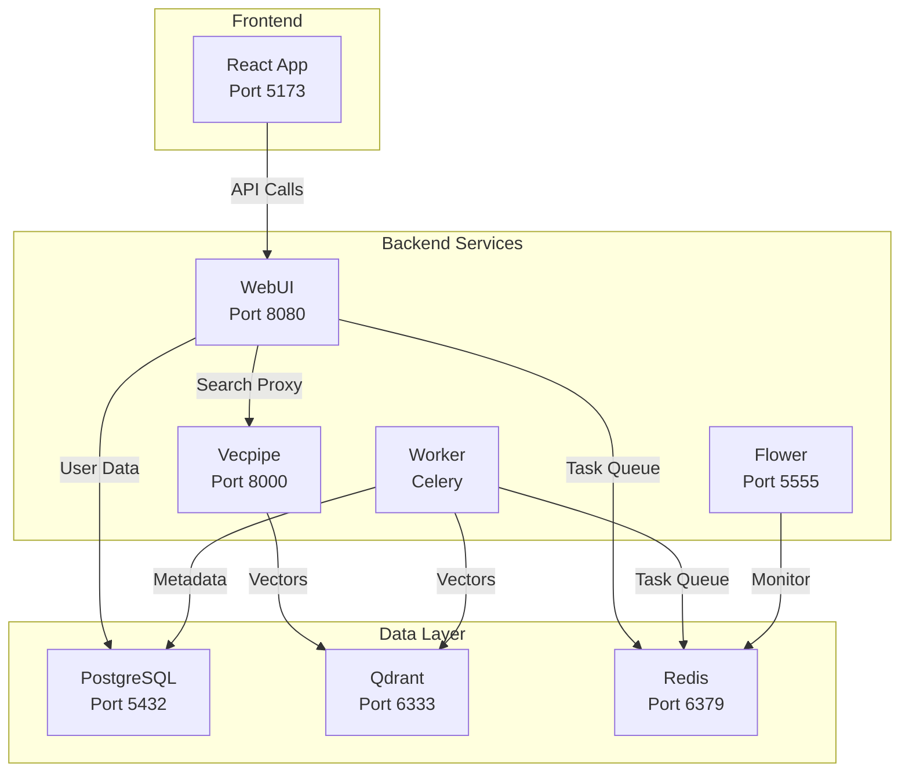

# Infrastructure Documentation

## Table of Contents

1. [Infrastructure Overview](#infrastructure-overview)
2. [Service Architecture](#service-architecture)
3. [Development Environment](#development-environment)
4. [Docker Infrastructure](#docker-infrastructure)
5. [Testing Framework](#testing-framework)
6. [Build System](#build-system)
7. [Service Management](#service-management)
8. [Networking](#networking)
9. [Monitoring and Logging](#monitoring-and-logging)
10. [Security & Operations](#security--operations)
11. [CI/CD Pipeline](#cicd-pipeline)
12. [Troubleshooting Guide](#troubleshooting-guide)

---

## Infrastructure Overview

### System Architecture

```
┌─────────────────────────────────────────────────────────────────┐
│                         Document Sources                          │
│                    (/mnt/docs, ${DOCUMENT_PATH})                  │
└─────────────────────────────────────────────────────────────────┘
                                   │
                                   ▼
┌─────────────────────────────────────────────────────────────────┐
│                      Semantik Services                            │
│  ┌─────────────┐  ┌─────────────┐  ┌──────────────────────┐     │
│  │   WebUI     │  │  Vecpipe    │  │   Celery Worker      │     │
│  │  Port 8080  │  │  Port 8000  │  │   Background Tasks   │     │
│  └─────────────┘  └─────────────┘  └──────────────────────┘     │
└─────────────────────────────────────────────────────────────────┘
                                   │
                                   ▼
┌─────────────────────────────────────────────────────────────────┐
│                        Data Layer                                 │
│  ┌────────────┐  ┌──────────────┐  ┌──────────────────────┐     │
│  │ PostgreSQL │  │    Qdrant    │  │      Redis         │     │
│  │ Port 5432  │  │  Port 6333   │  │    Port 6379       │     │
│  └────────────┘  └──────────────┘  └──────────────────────┘     │
└─────────────────────────────────────────────────────────────────┘
```

### System Requirements

- **Operating System**: Linux (Ubuntu 20.04+ recommended), macOS, Windows (WSL2)
- **Docker**: 20.10+ with Docker Compose 2.0+
- **Python**: 3.12+ (for local development)
- **Node.js**: 18.0+ (for frontend development)
- **GPU**: NVIDIA GPU with CUDA support (optional but recommended)
- **RAM**: Minimum 16GB, 32GB+ recommended
- **Storage**: SSD with at least 100GB free space

---

## Service Architecture

### Core Services

#### 1. **WebUI** (Port 8080)
- **Purpose**: Web interface and REST API
- **Technology**: FastAPI, React
- **Responsibilities**:
  - User authentication and authorization
  - Collection management
  - Operation orchestration
  - WebSocket connections for real-time updates
  - Search API proxy

#### 2. **Vecpipe** (Port 8000)
- **Purpose**: Search and embedding service
- **Technology**: FastAPI, PyTorch
- **Responsibilities**:
  - Document embedding generation
  - Semantic search operations
  - Model management
  - Vector operations with Qdrant

#### 3. **Worker** (No exposed port)
- **Purpose**: Background task processing
- **Technology**: Celery
- **Responsibilities**:
  - Document indexing
  - Collection reindexing
  - Asynchronous operations
  - File processing

#### 4. **Flower** (Port 5555)
- **Purpose**: Task monitoring dashboard
- **Technology**: Flower (Celery monitoring)
- **Profile**: backend
- **Access**: http://localhost:5555 (admin:admin)

### Data Layer Services

#### 1. **PostgreSQL** (Port 5432)
- **Purpose**: Relational database
- **Version**: 16-alpine
- **Data**: Users, collections, operations, metadata

#### 2. **Qdrant** (Port 6333, 6334)
- **Purpose**: Vector database
- **Ports**: 6333 (HTTP), 6334 (gRPC)
- **Data**: Document embeddings, vector indices

#### 3. **Redis** (Port 6379)
- **Purpose**: Message broker and cache
- **Version**: 7-alpine
- **Usage**: Celery task queue, WebSocket pub/sub

### Service Dependencies



---

## Development Environment

### Package Structure

```
semantik/
├── packages/
│   ├── shared/              # Shared library
│   │   ├── database/        # Database models and connections
│   │   ├── config/          # Configuration management
│   │   └── utils/           # Shared utilities
│   ├── vecpipe/             # Search and embedding service
│   │   ├── search_api.py    # FastAPI search service
│   │   ├── embedding/       # Embedding generation
│   │   └── models/          # Model management
│   └── webui/               # Web interface backend
│       ├── main.py          # FastAPI application
│       ├── api/             # API routers
│       ├── services/        # Business logic
│       ├── repositories/    # Data access layer
│       └── tasks.py         # Celery tasks
├── apps/
│   └── webui-react/         # React frontend
│       ├── src/
│       │   ├── components/  # React components
│       │   ├── stores/      # Zustand state management
│       │   ├── services/    # API clients
│       │   └── pages/       # Page components
│       └── package.json
├── docker-compose.yml       # Main Docker configuration
├── Dockerfile              # Multi-stage Dockerfile
├── pyproject.toml          # Python dependencies
└── Makefile                # Development commands
```

### Poetry Configuration

```toml
[tool.poetry]
name = "semantik"
version = "2.0.0"
packages = [
    {include = "shared", from = "packages"},
    {include = "vecpipe", from = "packages"},
    {include = "webui", from = "packages"}
]

[tool.poetry.dependencies]
python = "^3.12"
fastapi = "^0.110.0"
uvicorn = "^0.27.1"
sqlalchemy = "^2.0.25"
asyncpg = "^0.29.0"
qdrant-client = "^1.9.0"
celery = {extras = ["redis"], version = "^5.3.4"}
redis = "^5.0.1"
transformers = "^4.36.2"
torch = "^2.1.2"
```

### Development Dependencies

- **Black**: Code formatting
- **Ruff**: Fast Python linter
- **Mypy**: Static type checking
- **Pytest**: Testing framework
- **Coverage**: Test coverage reporting

---

## Docker Infrastructure

### Docker Compose Services

```yaml
services:
  # Vector Database
  qdrant:
    image: qdrant/qdrant:latest
    ports: ["6333:6333", "6334:6334"]
    volumes: ["qdrant_storage:/qdrant/storage"]
    
  # Relational Database
  postgres:
    image: postgres:16-alpine
    ports: ["5432:5432"]
    volumes: ["postgres_data:/var/lib/postgresql/data"]
    
  # Message Broker
  redis:
    image: redis:7-alpine
    ports: ["6379:6379"]
    volumes: ["redis_data:/data"]
    
  # Search API
  vecpipe:
    build: .
    ports: ["8000:8000"]
    depends_on: [postgres, qdrant, redis]
    
  # Web Interface
  webui:
    build: .
    ports: ["8080:8080"]
    depends_on: [postgres, vecpipe, redis]
    
  # Background Worker
  worker:
    build: .
    profiles: ["backend"]
    depends_on: [postgres, redis, qdrant]
    
  # Task Monitor
  flower:
    build: .
    ports: ["5555:5555"]
    profiles: ["backend"]
    depends_on: [redis]
```

### Volume Management

#### Named Volumes
- `qdrant_storage`: Vector database persistence
- `postgres_data`: PostgreSQL database files
- `redis_data`: Redis persistence (AOF enabled)

#### Bind Mounts
- `./data`: Application data and operations
- `./models`: HuggingFace model cache
- `./logs`: Service logs
- `${DOCUMENT_PATH}`: User documents (read-only)

### Docker Profiles

1. **Default Profile**: Core services only
   ```bash
   docker compose up -d
   ```

2. **Backend Profile**: Includes Worker and Flower
   ```bash
   docker compose --profile backend up -d
   ```

---

## Testing Framework

### Test Structure

```
tests/
├── unit/                    # Unit tests
│   ├── test_models.py
│   ├── test_services.py
│   └── test_repositories.py
├── integration/             # Integration tests
│   ├── test_search_api.py
│   ├── test_websockets.py
│   └── test_celery_tasks.py
├── e2e/                     # End-to-end tests
│   ├── test_collection_flow.py
│   └── test_search_flow.py
├── conftest.py              # Shared fixtures
└── docker-compose.test.yml  # Test infrastructure
```

### Key Test Fixtures

```python
@pytest.fixture
async def test_db():
    """Test database session"""
    
@pytest.fixture
def test_client():
    """FastAPI test client with auth"""
    
@pytest.fixture
def mock_qdrant():
    """Mock Qdrant client"""
    
@pytest.fixture
def celery_worker():
    """Test Celery worker"""
```

### Running Tests

```bash
# Run all tests
make test

# Run with coverage
make test-coverage

# Run specific test category
poetry run pytest tests/unit -v
poetry run pytest tests/integration -v
poetry run pytest tests/e2e -v

# Run frontend tests
make frontend-test
```

---

## Build System

### Docker Build Process

The `Dockerfile` uses a multi-stage build:

```dockerfile
# Stage 1: Dependencies
FROM python:3.12-slim as dependencies
WORKDIR /app
COPY pyproject.toml poetry.lock ./
RUN pip install poetry && poetry export -f requirements.txt > requirements.txt

# Stage 2: Builder
FROM python:3.12-slim as builder
COPY --from=dependencies /app/requirements.txt .
RUN pip install --user -r requirements.txt

# Stage 3: Runtime
FROM python:3.12-slim as runtime
COPY --from=builder /root/.local /root/.local
COPY packages/ /app/packages/
ENV PATH=/root/.local/bin:$PATH
```

### Frontend Build

```bash
# Development build
cd apps/webui-react
npm install
npm run dev

# Production build
npm run build
# Output: packages/webui/static/
```

### Make Commands

```bash
# Docker commands
make wizard              # Interactive setup wizard
make docker-up          # Start all services
make docker-down        # Stop services
make docker-logs        # View logs
make docker-build-fresh # Rebuild without cache

# Development commands
make dev-install        # Install dependencies
make format            # Format code
make lint              # Run linters
make test              # Run tests
make check             # Run all checks

# Frontend commands
make frontend-install   # Install frontend deps
make frontend-build    # Build frontend
make frontend-dev      # Start dev server
make frontend-test     # Run frontend tests
```

---

## Service Management

### Health Checks

All services include health checks:

```yaml
healthcheck:
  test: ["CMD", "curl", "-f", "http://localhost:8080/api/health/readyz"]
  interval: 30s
  timeout: 10s
  retries: 3
  start_period: 60s
```

#### Health Endpoints
- WebUI: `http://localhost:8080/api/health/readyz`
- Vecpipe: `http://localhost:8000/health`
- Qdrant: `http://localhost:6333/health`
- PostgreSQL: `pg_isready` command
- Redis: `redis-cli ping`

### Service Orchestration

Services start in dependency order:
1. Data layer (PostgreSQL, Qdrant, Redis)
2. Search API (Vecpipe)
3. Web interface (WebUI)
4. Background services (Worker, Flower)

### Resource Limits

```yaml
deploy:
  resources:
    limits:
      cpus: '2'
      memory: 4G
    reservations:
      cpus: '1'
      memory: 2G
      devices:
        - driver: nvidia
          count: 1
          capabilities: [gpu]
```

---

## Networking

### Docker Network

All services communicate through `semantik-network`:

```yaml
networks:
  default:
    name: semantik-network
    driver: bridge
```

### Service Discovery

Internal service communication:
- `postgres:5432` - PostgreSQL
- `qdrant:6333` - Qdrant HTTP
- `redis:6379` - Redis
- `vecpipe:8000` - Search API
- `webui:8080` - Web interface

### Port Mappings

| Service | Internal | External | Purpose |
|---------|----------|----------|---------|
| WebUI | 8080 | 8080 | Web interface |
| Vecpipe | 8000 | 8000 | Search API |
| Qdrant | 6333 | 6333 | Vector DB HTTP |
| Qdrant | 6334 | 6334 | Vector DB gRPC |
| PostgreSQL | 5432 | 5432 | Database |
| Redis | 6379 | 6379 | Message broker |
| Flower | 5555 | 5555 | Task monitor |

### WebSocket Configuration

WebUI supports WebSocket connections for real-time updates:
- Endpoint: `ws://localhost:8080/api/v2/ws`
- Protocol: JSON messages
- Authentication: JWT token required

---

## Monitoring and Logging

### Prometheus Metrics

Services expose metrics on internal ports:

```python
# Metrics endpoints
- WebUI: http://localhost:9091/metrics
- Vecpipe: http://localhost:9091/metrics
```

Key metrics:
- Request latency
- Active operations
- Model loading time
- GPU memory usage
- Queue lengths

### Logging Configuration

Services use structured logging:

```python
LOGGING_CONFIG = {
    "version": 1,
    "formatters": {
        "default": {
            "format": "%(asctime)s - %(name)s - %(levelname)s - %(message)s"
        },
        "json": {
            "class": "pythonjsonlogger.jsonlogger.JsonFormatter"
        }
    },
    "handlers": {
        "console": {
            "class": "logging.StreamHandler",
            "formatter": "default"
        },
        "file": {
            "class": "logging.handlers.RotatingFileHandler",
            "filename": "/app/logs/service.log",
            "maxBytes": 10485760,  # 10MB
            "backupCount": 5,
            "formatter": "json"
        }
    }
}
```

### Log Aggregation

For production, use centralized logging:

```yaml
logging:
  driver: "fluentd"
  options:
    fluentd-address: "localhost:24224"
    tag: "semantik.{{.Name}}"
```

---

## Security & Operations

### Container Security

```yaml
security_opt:
  - no-new-privileges:true
cap_drop:
  - ALL
cap_add:
  - NET_BIND_SERVICE
```

### User Permissions

Containers run as non-root (UID 1000):

```dockerfile
RUN useradd -m -u 1000 semantik
USER semantik
```

### Secret Management

```bash
# Create Docker secrets
echo "$JWT_SECRET" | docker secret create jwt_secret -
echo "$DB_PASSWORD" | docker secret create db_password -

# Use in compose
services:
  webui:
    secrets:
      - jwt_secret
      - db_password
```

### Backup Procedures

```bash
#!/bin/bash
# Daily backup script

# Backup PostgreSQL
docker compose exec -T postgres pg_dump -U semantik semantik > backup.sql

# Backup Qdrant
curl -X POST "http://localhost:6333/snapshots"

# Backup volumes
docker run --rm \
  -v semantik_postgres_data:/data \
  -v ./backups:/backup \
  alpine tar czf /backup/postgres.tar.gz /data
```

---

## CI/CD Pipeline

### GitHub Actions Workflow

```yaml
name: CI/CD Pipeline

on:
  push:
    branches: [main, develop]
  pull_request:
    branches: [main]

jobs:
  test:
    runs-on: ubuntu-latest
    services:
      postgres:
        image: postgres:16
      qdrant:
        image: qdrant/qdrant
      redis:
        image: redis:7
    
    steps:
      - uses: actions/checkout@v4
      - uses: actions/setup-python@v4
      - run: pip install poetry
      - run: poetry install
      - run: make check
      - run: make test-coverage
```

### Build Pipeline

1. **Lint & Format**: Black, Ruff, ESLint
2. **Type Check**: Mypy, TypeScript
3. **Unit Tests**: Jest, Pytest
4. **Integration Tests**: API and service tests
5. **Build Images**: Docker multi-stage build
6. **Security Scan**: Trivy, Snyk

---

## Troubleshooting Guide

### Common Issues

#### Service Won't Start
```bash
# Check logs
docker compose logs webui

# Verify ports
sudo lsof -i :8080

# Check environment
docker compose config
```

#### Database Connection Failed
```bash
# Test PostgreSQL
docker compose exec postgres psql -U semantik -c "SELECT 1"

# Check Redis
docker compose exec redis redis-cli ping

# Verify Qdrant
curl http://localhost:6333/health
```

#### GPU Not Available
```bash
# Check NVIDIA runtime
nvidia-smi
docker run --rm --gpus all nvidia/cuda:11.8.0-base nvidia-smi

# Install nvidia-container-toolkit
sudo apt-get install nvidia-container-toolkit
sudo systemctl restart docker
```

#### Memory Issues
```bash
# Check container stats
docker stats

# Adjust batch size
export BATCH_SIZE=16
export DEFAULT_QUANTIZATION=int8
```

### Debug Mode

Enable debug logging:
```bash
LOG_LEVEL=DEBUG
DEBUG=true
SQLALCHEMY_ECHO=true
```

### Performance Tuning

1. **Database Optimization**
   ```sql
   ALTER SYSTEM SET shared_buffers = '256MB';
   ALTER SYSTEM SET work_mem = '16MB';
   ```

2. **Redis Optimization**
   ```
   maxmemory 2gb
   maxmemory-policy allkeys-lru
   ```

3. **GPU Optimization**
   ```bash
   PYTORCH_CUDA_ALLOC_CONF=max_split_size_mb:512
   USE_AMP=true
   ```

---

## Maintenance

### Regular Tasks

#### Daily
- Monitor service logs
- Check disk usage
- Verify backups

#### Weekly
- Review metrics
- Clean operation files
- Update images

#### Monthly
- Security updates
- Performance review
- Capacity planning

### Update Procedure

```bash
# 1. Backup
./backup.sh

# 2. Pull updates
git pull origin main

# 3. Update dependencies
poetry update
cd apps/webui-react && npm update

# 4. Rebuild
docker compose build

# 5. Apply migrations
docker compose run --rm webui alembic upgrade head

# 6. Restart
docker compose down
docker compose up -d

# 7. Verify
./health-check.sh
```

---

## Support

For infrastructure issues:
1. Check logs: `docker compose logs -f [service]`
2. Review metrics: http://localhost:9091/metrics
3. Monitor tasks: http://localhost:5555
4. Check documentation
5. Submit GitHub issue