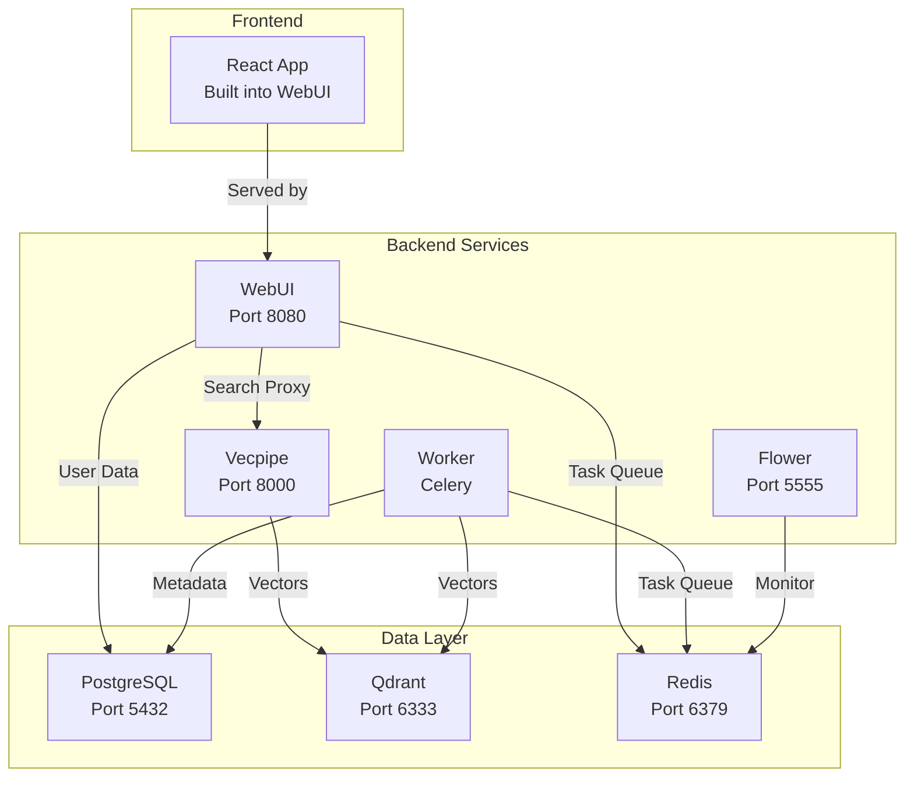

# Infrastructure

## System Architecture

```
┌─────────────────────────────────────────────────────────────────┐
│                         Document Sources                          │
│                    (/mnt/docs, ${DOCUMENT_PATH})                  │
└─────────────────────────────────────────────────────────────────┘
                                   │
                                   ▼
┌─────────────────────────────────────────────────────────────────┐
│                      Semantik Services                            │
│  ┌─────────────┐  ┌─────────────┐  ┌──────────────────────┐     │
│  │   WebUI     │  │  Vecpipe    │  │   Celery Worker      │     │
│  │  Port 8080  │  │  Port 8000  │  │   Background Tasks   │     │
│  └─────────────┘  └─────────────┘  └──────────────────────┘     │
└─────────────────────────────────────────────────────────────────┘
                                   │
                                   ▼
┌─────────────────────────────────────────────────────────────────┐
│                        Data Layer                                 │
│  ┌────────────┐  ┌──────────────┐  ┌──────────────────────┐     │
│  │ PostgreSQL │  │    Qdrant    │  │      Redis         │     │
│  │ Port 5432  │  │  Port 6333   │  │    Port 6379       │     │
│  └────────────┘  └──────────────┘  └──────────────────────┘     │
└─────────────────────────────────────────────────────────────────┘
```

### Requirements

- Docker 20.10+ with Compose 2.0+
- Python 3.11+ (local dev)
- Node.js 20.0+ (frontend dev)
- 16GB+ RAM (32GB recommended)
- SSD with 100GB+ free
- GPU optional but recommended

---

## Service Architecture

### Core Services

**WebUI** (Port 8080) - Web interface, auth, collection management
**Vecpipe** (Port 8000) - Embedding generation and semantic search
**Worker** - Celery background tasks (indexing, reindexing)
**Flower** (Port 5555) - Task monitoring (profile: backend)

### Data Layer

**PostgreSQL** (5432) - Users, collections, operations, metadata
**Qdrant** (6333, 6334) - Vector embeddings
**Redis** (6379) - Celery queue, WebSocket pub/sub
**PostgreSQL Test** (55432) - Test database (profile: testing)

### Service Dependencies



React frontend is built statically and served by WebUI.

## Development Environment

### Package Structure

```
semantik/
├── packages/
│   ├── shared/              # Shared library
│   │   ├── database/        # Database models and connections
│   │   ├── config/          # Configuration management
│   │   └── utils/           # Shared utilities
│   ├── vecpipe/             # Search and embedding service
│   │   ├── search_api.py    # FastAPI search service
│   │   ├── embedding/       # Embedding generation
│   │   └── models/          # Model management
│   └── webui/               # Web interface backend
│       ├── main.py          # FastAPI application
│       ├── api/             # API routers
│       ├── services/        # Business logic
│       ├── repositories/    # Data access layer
│       └── tasks.py         # Celery tasks
├── apps/
│   └── webui-react/         # React frontend
│       ├── src/
│       │   ├── components/  # React components
│       │   ├── stores/      # Zustand state management
│       │   ├── services/    # API clients
│       │   └── pages/       # Page components
│       └── package.json
├── docker-compose.yml       # Main Docker configuration
├── Dockerfile              # Multi-stage Dockerfile
├── pyproject.toml          # Python dependencies
└── Makefile                # Development commands
```

Python dependencies managed via `pyproject.toml` with uv. Dev tools: Ruff, Mypy, Pytest.

## Docker Infrastructure

### Docker Compose Services

```yaml
services:
  # Vector Database
  qdrant:
    image: qdrant/qdrant:latest
    ports: ["6333:6333", "6334:6334"]
    volumes: ["qdrant_storage:/qdrant/storage"]
    
  # Relational Database
  postgres:
    image: postgres:16-alpine
    ports: ["5432:5432"]
    volumes: ["postgres_data:/var/lib/postgresql/data"]
    
  # Message Broker
  redis:
    image: redis:7-alpine
    ports: ["6379:6379"]
    volumes: ["redis_data:/data"]
    
  # Search API
  vecpipe:
    build: .
    ports: ["8000:8000"]
    depends_on: [postgres, qdrant, redis]
    
  # Web Interface
  webui:
    build: .
    ports: ["8080:8080"]
    depends_on: [postgres, vecpipe, redis]
    
  # Background Worker (runs by default - no profile)
  worker:
    build: .
    depends_on: [postgres, redis, qdrant]

  # Task Monitor
  flower:
    build: .
    ports: ["5555:5555"]
    profiles: ["backend"]
    depends_on: [redis]
```

### Volumes

Named: `qdrant_storage`, `postgres_data`, `redis_data`, `postgres_test_data`
Bind mounts: `./data`, `./models`, `./logs`, `${DOCUMENT_PATH}` (read-only)

### Profiles

- **Default**: Core services
- **backend**: Adds Flower
- **testing**: Adds test PostgreSQL
- **dev**: Live reload, debug logging (`docker-compose.dev.yml`)

## Testing

Tests in `tests/` organized by category (unit, integration, e2e, api, services, etc).

```bash
make test              # All tests
make test-coverage     # With coverage
uv run pytest tests/unit -v
make frontend-test
```

## Build System

Multi-stage Dockerfile: dependencies → builder → runtime.

Frontend: `npm run build` → `packages/webui/static/`

Setup wizard: `make wizard` (auto-config, generates secrets)

Key Make commands: `docker-up`, `docker-down`, `docker-logs`, `test`, `lint`

## Service Management

All services have health checks. Start order: data layer → vecpipe → webui → workers.

Resource limits configurable in docker-compose (CPU, memory, GPU).

## Networking

All services on `semantik-network` bridge. Internal DNS: `postgres:5432`, `qdrant:6333`, `redis:6379`, etc.

WebSocket endpoints: `/ws/operations`, `/ws/operations/{id}`, `/ws/directory-scan/{id}` (JWT auth)

## Monitoring

Metrics on internal port 9091 (not exposed by default). Access via `docker exec` or configure Prometheus in network.

Logs: Structured JSON logging with rotation (10MB, 5 backups). Use fluentd driver for production aggregation.

## Security

Containers run with `no-new-privileges`, dropped capabilities, non-root user (UID/GID configurable via `.env`).

## Configuration

Key environment variables: `JWT_SECRET_KEY`, `POSTGRES_PASSWORD`, `CONNECTOR_SECRETS_KEY`, `DEFAULT_EMBEDDING_MODEL`, `CELERY_MAX_CONCURRENCY`

See `.env.docker.example` for full list.

Production: Create your own `nginx.conf` for reverse proxy (SSL, WebSocket, rate limiting).

## CI/CD

GitHub Actions pipeline: lint (Ruff, ESLint) → type check (Mypy, TypeScript) → security scan (Trivy, Safety) → tests (4-way matrix) → coverage (Codecov)

## Troubleshooting

**Service won't start:** Check `docker compose logs <service>`, verify ports with `lsof`
**DB connection failed:** Test with `docker compose exec postgres psql -U semantik -c "SELECT 1"`
**GPU not available:** Install `nvidia-container-toolkit`, restart Docker
**Memory issues:** Reduce batch size, use int8 quantization

Debug mode: `LOG_LEVEL=DEBUG`, `SQLALCHEMY_ECHO=true`

## Maintenance

Daily: Monitor logs, check disk
Weekly: Review metrics, clean operation files
Monthly: Security updates, performance review

Update: backup → pull → rebuild → migrate → restart → verify
