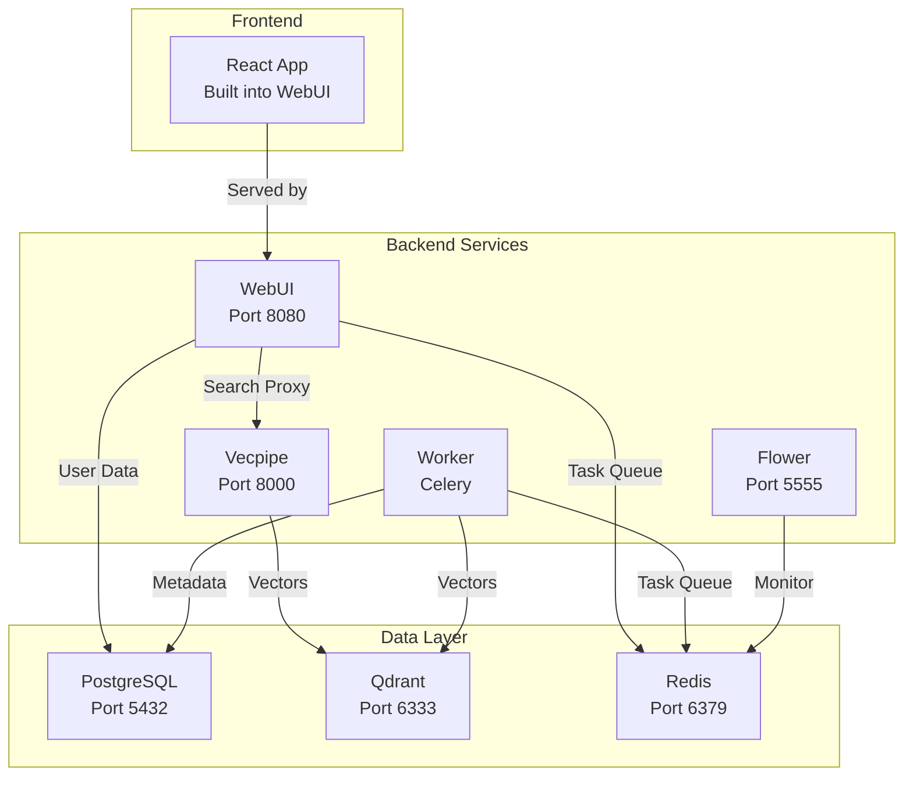

# Infrastructure Documentation

## Table of Contents

1. [Infrastructure Overview](#infrastructure-overview)
2. [Service Architecture](#service-architecture)
3. [Development Environment](#development-environment)
4. [Docker Infrastructure](#docker-infrastructure)
5. [Testing Framework](#testing-framework)
6. [Build System](#build-system)
7. [Service Management](#service-management)
8. [Networking](#networking)
9. [Monitoring and Logging](#monitoring-and-logging)
10. [Security & Operations](#security--operations)
11. [CI/CD Pipeline](#cicd-pipeline)
12. [Troubleshooting Guide](#troubleshooting-guide)

---

## Infrastructure Overview

### System Architecture

```
┌─────────────────────────────────────────────────────────────────┐
│                         Document Sources                          │
│                    (/mnt/docs, ${DOCUMENT_PATH})                  │
└─────────────────────────────────────────────────────────────────┘
                                   │
                                   ▼
┌─────────────────────────────────────────────────────────────────┐
│                      Semantik Services                            │
│  ┌─────────────┐  ┌─────────────┐  ┌──────────────────────┐     │
│  │   WebUI     │  │  Vecpipe    │  │   Celery Worker      │     │
│  │  Port 8080  │  │  Port 8000  │  │   Background Tasks   │     │
│  └─────────────┘  └─────────────┘  └──────────────────────┘     │
└─────────────────────────────────────────────────────────────────┘
                                   │
                                   ▼
┌─────────────────────────────────────────────────────────────────┐
│                        Data Layer                                 │
│  ┌────────────┐  ┌──────────────┐  ┌──────────────────────┐     │
│  │ PostgreSQL │  │    Qdrant    │  │      Redis         │     │
│  │ Port 5432  │  │  Port 6333   │  │    Port 6379       │     │
│  └────────────┘  └──────────────┘  └──────────────────────┘     │
└─────────────────────────────────────────────────────────────────┘
```

### System Requirements

- **Operating System**: Linux (Ubuntu 20.04+ recommended), macOS, Windows (WSL2)
- **Docker**: 20.10+ with Docker Compose 2.0+
- **Python**: 3.12+ (for local development)
- **Node.js**: 20.0+ (for frontend development)
- **GPU**: NVIDIA GPU with CUDA support (optional but recommended)
- **RAM**: Minimum 16GB, 32GB+ recommended
- **Storage**: SSD with at least 100GB free space

---

## Service Architecture

### Core Services

#### 1. **WebUI** (Port 8080)
- **Purpose**: Web interface and REST API
- **Technology**: FastAPI, React
- **Responsibilities**:
  - User authentication and authorization
  - Collection management
  - Operation orchestration
  - WebSocket connections for real-time updates
  - Search API proxy

#### 2. **Vecpipe** (Port 8000)
- **Purpose**: Search and embedding service
- **Technology**: FastAPI, PyTorch
- **Responsibilities**:
  - Document embedding generation
  - Semantic search operations
  - Model management
  - Vector operations with Qdrant

#### 3. **Worker** (No exposed port)
- **Purpose**: Background task processing
- **Technology**: Celery
- **Responsibilities**:
  - Document indexing
  - Collection reindexing
  - Asynchronous operations
  - File processing

#### 4. **Flower** (Port 5555)
- **Purpose**: Task monitoring dashboard
- **Technology**: Flower (Celery monitoring)
- **Profile**: backend
- **Access**: http://localhost:5555 (authenticate with `FLOWER_USERNAME`/`FLOWER_PASSWORD` from `.env`; rotate via `make wizard`)

### Data Layer Services

#### 1. **PostgreSQL** (Port 5432)
- **Purpose**: Relational database
- **Version**: 16-alpine
- **Data**: Users, collections, operations, metadata

#### 2. **Qdrant** (Port 6333, 6334)
- **Purpose**: Vector database
- **Ports**: 6333 (HTTP), 6334 (gRPC)
- **Data**: Document embeddings, vector indices

#### 3. **Redis** (Port 6379)
- **Purpose**: Message broker and cache
- **Version**: 7-alpine
- **Usage**: Celery task queue, WebSocket pub/sub

#### 4. **PostgreSQL Test** (Port 55432)
- **Purpose**: Dedicated test database instance
- **Version**: 16-alpine
- **Profile**: testing
- **Usage**: Integration and API tests
- **Note**: Uses separate volume (`postgres_test_data`) for isolation

### Service Dependencies



> **Note**: The React frontend is built statically during the Docker build process and served by the WebUI service. There is no standalone frontend container or development server exposed on port 5173 in the Docker environment.

---

## Development Environment

### Package Structure

```
semantik/
├── packages/
│   ├── shared/              # Shared library
│   │   ├── database/        # Database models and connections
│   │   ├── config/          # Configuration management
│   │   └── utils/           # Shared utilities
│   ├── vecpipe/             # Search and embedding service
│   │   ├── search_api.py    # FastAPI search service
│   │   ├── embedding/       # Embedding generation
│   │   └── models/          # Model management
│   └── webui/               # Web interface backend
│       ├── main.py          # FastAPI application
│       ├── api/             # API routers
│       ├── services/        # Business logic
│       ├── repositories/    # Data access layer
│       └── tasks.py         # Celery tasks
├── apps/
│   └── webui-react/         # React frontend
│       ├── src/
│       │   ├── components/  # React components
│       │   ├── stores/      # Zustand state management
│       │   ├── services/    # API clients
│       │   └── pages/       # Page components
│       └── package.json
├── docker-compose.yml       # Main Docker configuration
├── Dockerfile              # Multi-stage Dockerfile
├── pyproject.toml          # Python dependencies
└── Makefile                # Development commands
```

### Python Configuration

```toml
[project]
name = "semantik"
version = "2.0.0"
requires-python = ">=3.11,<3.13"
dependencies = [
    "fastapi>=0.116.0,<0.117",
    "uvicorn>=0.27.1,<0.28",
    "sqlalchemy>=2.0.23,<3",
    "asyncpg>=0.30.0,<0.31",
    "qdrant-client>=1.9.0,<2",
    "celery[redis]>=5.3.0,<6",
    "redis>=5.0.0,<6",
    "transformers>=4.51.0,<5",
    "torch",
    # ..."
]

[dependency-groups]
dev = ["pytest>=8.0.0,<9", "ruff>=0.2.0,<0.3", "mypy>=1.8.0,<2"]
e2e = ["pytest-playwright>=0.6.2,<0.7"]

[tool.uv]
default-groups = ["dev", "e2e"]
```

### Development Dependencies

- **Black**: Code formatting
- **Ruff**: Fast Python linter
- **Mypy**: Static type checking
- **Pytest**: Testing framework
- **Coverage**: Test coverage reporting

---

## Docker Infrastructure

### Docker Compose Services

```yaml
services:
  # Vector Database
  qdrant:
    image: qdrant/qdrant:latest
    ports: ["6333:6333", "6334:6334"]
    volumes: ["qdrant_storage:/qdrant/storage"]
    
  # Relational Database
  postgres:
    image: postgres:16-alpine
    ports: ["5432:5432"]
    volumes: ["postgres_data:/var/lib/postgresql/data"]
    
  # Message Broker
  redis:
    image: redis:7-alpine
    ports: ["6379:6379"]
    volumes: ["redis_data:/data"]
    
  # Search API
  vecpipe:
    build: .
    ports: ["8000:8000"]
    depends_on: [postgres, qdrant, redis]
    
  # Web Interface
  webui:
    build: .
    ports: ["8080:8080"]
    depends_on: [postgres, vecpipe, redis]
    
  # Background Worker (runs by default - no profile)
  worker:
    build: .
    depends_on: [postgres, redis, qdrant]

  # Task Monitor
  flower:
    build: .
    ports: ["5555:5555"]
    profiles: ["backend"]
    depends_on: [redis]
```

### Volume Management

#### Named Volumes
- `qdrant_storage`: Vector database persistence
- `postgres_data`: PostgreSQL database files
- `postgres_test_data`: PostgreSQL test database files (testing profile)
- `redis_data`: Redis persistence (AOF enabled)

#### Bind Mounts
- `./data`: Application data and operations
- `./models`: HuggingFace model cache
- `./logs`: Service logs
- `${DOCUMENT_PATH}`: User documents (read-only)

### Docker Profiles

1. **Default Profile**: Core services (qdrant, postgres, redis, vecpipe, webui, worker)
   ```bash
   docker compose up -d
   ```

2. **Backend Profile**: Adds Flower monitoring dashboard
   ```bash
   docker compose --profile backend up -d
   ```

3. **Testing Profile**: Adds dedicated test PostgreSQL instance
   ```bash
   docker compose --profile testing up -d
   ```

### Development Override File

For local development with live code reloading, use the `docker-compose.dev.yml` override:

```bash
docker compose -f docker-compose.yml -f docker-compose.dev.yml up
```

This enables:
- Source code mounting (read-only) for live updates
- `WEBUI_RELOAD=true` for automatic restart on code changes
- `DB_ECHO=true` for SQL query logging
- `ENVIRONMENT=development` for debug settings

---

## Testing Framework

### Test Structure

```
tests/
├── api/                     # API endpoint tests
├── application/             # Application layer tests
├── chunking/                # Chunking strategy tests
├── database/                # Database migration and query tests
├── domain/                  # Domain model tests
├── e2e/                     # End-to-end tests
├── fixtures/                # Shared test fixtures
├── integration/             # Integration tests
├── performance/             # Performance benchmarks
├── security/                # Security tests
├── services/                # Service layer tests
├── shared/                  # Shared utility tests
├── streaming/               # Streaming pipeline tests
├── unit/                    # Unit tests
├── webui/                   # WebUI-specific tests
│   ├── api/v2/              # V2 API tests
│   └── services/            # WebUI service tests
├── websocket/               # WebSocket tests
└── conftest.py              # Shared fixtures and configuration
```

### Key Test Fixtures

```python
@pytest.fixture
async def test_db():
    """Test database session"""
    
@pytest.fixture
def test_client():
    """FastAPI test client with auth"""
    
@pytest.fixture
def mock_qdrant():
    """Mock Qdrant client"""
    
@pytest.fixture
def celery_worker():
    """Test Celery worker"""
```

### Running Tests

```bash
# Run all tests
make test

# Run with coverage
make test-coverage

# Run specific test category
uv run pytest tests/unit -v
uv run pytest tests/integration -v
uv run pytest tests/e2e -v

# Run frontend tests
make frontend-test
```

---

## Build System

### Docker Build Process

The `Dockerfile` uses a multi-stage build:

```dockerfile
# Stage 1: Dependencies
FROM python:3.12-slim as dependencies
WORKDIR /app
RUN curl -LsSf https://astral.sh/uv/install.sh | sh
ENV PATH=/root/.local/bin:$PATH
COPY pyproject.toml uv.lock ./
RUN uv sync --frozen --no-install-project --no-default-groups

# Stage 2: Builder
FROM python:3.12-slim as builder
COPY --from=dependencies /app/.venv /app/.venv

# Stage 3: Runtime
FROM python:3.12-slim as runtime
COPY --from=builder /app/.venv /app/.venv
COPY packages/ /app/packages/
ENV PATH=/app/.venv/bin:$PATH
```

### Frontend Build

```bash
# Development build
cd apps/webui-react
npm install
npm run dev

# Production build
npm run build
# Output: packages/webui/static/
```

### Make Commands

```bash
# Docker commands
make wizard              # Interactive setup wizard
make docker-up          # Start all services
make docker-down        # Stop services
make docker-logs        # View logs
make docker-build-fresh # Rebuild without cache

# Development commands
make dev-install        # Install dependencies
make format            # Format code
make lint              # Run linters
make test              # Run tests
make check             # Run all checks

# Frontend commands
make frontend-install   # Install frontend deps
make frontend-build    # Build frontend
make frontend-dev      # Start dev server
make frontend-test     # Run frontend tests
```

### Setup Wizard

Semantik includes an interactive setup wizard for initial configuration:

```bash
# Run the setup wizard
make wizard

# Or directly via Python
python wizard_launcher.py
```

The wizard (`wizard_launcher.py`) provides:
- Python version verification (requires 3.11+)
- Automatic `uv` installation if not present
- Dependency installation via `uv sync`
- Interactive configuration via `docker_setup_tui.py`

### Docker Entrypoint Behavior

The `docker-entrypoint.sh` script handles service startup with the following behaviors:

#### Environment Validation
All services run strict environment validation via `scripts/validate_env.py --strict` before starting. This ensures required configuration is present.

#### Service-Specific Startup

| Service | Pre-startup Actions |
|---------|---------------------|
| **webui** | Waits for Search API, runs Alembic migrations |
| **vecpipe** | Waits for Qdrant, validates HF cache, cleans lock files |
| **worker** | Auto-calculates Celery concurrency based on CPU cores |
| **flower** | Requires `FLOWER_USERNAME` and `FLOWER_PASSWORD` |

#### Celery Worker Concurrency

The worker automatically determines concurrency:
1. Uses `CELERY_CONCURRENCY` if explicitly set
2. Otherwise: `(CPU cores - 1)`, minimum 1
3. Capped by `CELERY_MAX_CONCURRENCY` if set

---

## Service Management

### Health Checks

All services include health checks:

```yaml
healthcheck:
  test: ["CMD", "curl", "-f", "http://localhost:8080/api/health/readyz"]
  interval: 30s
  timeout: 10s
  retries: 3
  start_period: 60s
```

#### Health Endpoints
- WebUI: `http://localhost:8080/api/health/readyz`
- Vecpipe: `http://localhost:8000/health`
- Qdrant: `http://localhost:6333/health`
- PostgreSQL: `pg_isready` command
- Redis: `redis-cli ping`

### Service Orchestration

Services start in dependency order:
1. Data layer (PostgreSQL, Qdrant, Redis)
2. Search API (Vecpipe)
3. Web interface (WebUI)
4. Background services (Worker, Flower)

### Resource Limits

```yaml
deploy:
  resources:
    limits:
      cpus: '2'
      memory: 4G
    reservations:
      cpus: '1'
      memory: 2G
      devices:
        - driver: nvidia
          count: 1
          capabilities: [gpu]
```

---

## Networking

### Docker Network

All services communicate through `semantik-network`:

```yaml
networks:
  default:
    name: semantik-network
    driver: bridge
```

### Service Discovery

Internal service communication:
- `postgres:5432` - PostgreSQL
- `qdrant:6333` - Qdrant HTTP
- `redis:6379` - Redis
- `vecpipe:8000` - Search API
- `webui:8080` - Web interface

### Port Mappings

| Service | Internal | External | Purpose |
|---------|----------|----------|---------|
| WebUI | 8080 | 8080 | Web interface |
| Vecpipe | 8000 | 8000 | Search API |
| Qdrant | 6333 | 6333 | Vector DB HTTP |
| Qdrant | 6334 | 6334 | Vector DB gRPC |
| PostgreSQL | 5432 | 5432 | Database |
| Redis | 6379 | 6379 | Message broker |
| Flower | 5555 | 5555 | Task monitor |

### WebSocket Configuration

WebUI supports WebSocket connections for real-time updates:
- Global operations: `ws://localhost:8080/ws/operations?token=<jwt_token>`
- Operation progress: `ws://localhost:8080/ws/operations/{operation_id}?token=<jwt_token>`
- Directory scan progress: `ws://localhost:8080/ws/directory-scan/{scan_id}?token=<jwt_token>`
- Protocol: JSON messages
- Authentication: JWT token in query string (or disabled in dev)

---

## Monitoring and Logging

### Prometheus Metrics

Services expose metrics on internal port 9091. Note that this port is **not exposed externally** in the default docker-compose configuration - it is only accessible within the container network for internal monitoring or by attaching to the container.

```python
# Metrics endpoints (internal only)
- WebUI: http://webui:9091/metrics
- Vecpipe: http://vecpipe:9091/metrics
```

To access metrics externally, you can:
1. Add port mapping in docker-compose (e.g., `- "9091:9091"`)
2. Use `docker exec` to query from within the container
3. Configure a Prometheus instance within the Docker network

Key metrics:
- Request latency
- Active operations
- Model loading time
- GPU memory usage
- Queue lengths

### Logging Configuration

Services use structured logging:

```python
LOGGING_CONFIG = {
    "version": 1,
    "formatters": {
        "default": {
            "format": "%(asctime)s - %(name)s - %(levelname)s - %(message)s"
        },
        "json": {
            "class": "pythonjsonlogger.jsonlogger.JsonFormatter"
        }
    },
    "handlers": {
        "console": {
            "class": "logging.StreamHandler",
            "formatter": "default"
        },
        "file": {
            "class": "logging.handlers.RotatingFileHandler",
            "filename": "/app/logs/service.log",
            "maxBytes": 10485760,  # 10MB
            "backupCount": 5,
            "formatter": "json"
        }
    }
}
```

### Log Aggregation

For production, use centralized logging:

```yaml
logging:
  driver: "fluentd"
  options:
    fluentd-address: "localhost:24224"
    tag: "semantik.{{.Name}}"
```

---

## Security & Operations

### Container Security

```yaml
security_opt:
  - no-new-privileges:true
cap_drop:
  - ALL
cap_add:
  - NET_BIND_SERVICE
```

### User Permissions

Containers run as non-root user. The UID/GID can be configured via environment variables:

```yaml
# In docker-compose.yml
user: "${UID:-1000}:${GID:-1000}"
```

To match your host user (recommended for volume permissions):
```bash
# Add to .env file
UID=1000
GID=1000

# Or use your actual UID/GID
UID=$(id -u)
GID=$(id -g)
```

This ensures files created in mounted volumes have the correct ownership.

### Environment Variables Reference

#### Core Configuration
| Variable | Default | Description |
|----------|---------|-------------|
| `ENVIRONMENT` | `development` | Environment mode (`development`, `production`) |
| `JWT_SECRET_KEY` | (required) | Secret key for JWT token signing |
| `ACCESS_TOKEN_EXPIRE_MINUTES` | `1440` | JWT token expiration time |

#### Worker Configuration
| Variable | Default | Description |
|----------|---------|-------------|
| `EMBEDDING_CONCURRENCY_PER_WORKER` | `1` | Max concurrent /embed calls per worker (protects VRAM) |
| `CELERY_MAX_CONCURRENCY` | `4` | Cap for auto-scaled Celery worker pool |
| `CELERY_CONCURRENCY` | (auto) | Explicit worker concurrency (overrides auto-calculation) |

#### Database Connection Pool
| Variable | Default | Description |
|----------|---------|-------------|
| `DB_POOL_SIZE` | `20` (webui), `10` (worker) | Connection pool size |
| `DB_MAX_OVERFLOW` | `40` (webui), `20` (worker) | Max overflow connections |
| `DB_POOL_TIMEOUT` | `30` | Pool checkout timeout (seconds) |
| `DB_POOL_RECYCLE` | `3600` | Connection recycle time (seconds) |
| `DB_POOL_PRE_PING` | `true` | Enable connection health checks |

#### Model Configuration
| Variable | Default | Description |
|----------|---------|-------------|
| `DEFAULT_EMBEDDING_MODEL` | `Qwen/Qwen3-Embedding-0.6B` | Default embedding model |
| `DEFAULT_QUANTIZATION` | `float16` | Model quantization setting |
| `USE_MOCK_EMBEDDINGS` | `false` | Use mock embeddings (for testing) |
| `HF_HOME` | `/app/.cache/huggingface` | HuggingFace cache directory |
| `HF_HUB_OFFLINE` | `false` | Run HuggingFace in offline mode |

#### Service URLs
| Variable | Default | Description |
|----------|---------|-------------|
| `SEARCH_API_URL` | `http://vecpipe:8000` | Internal Search API URL |
| `REDIS_URL` | `redis://redis:6379/0` | Redis connection URL |
| `DATABASE_URL` | (composed) | PostgreSQL connection URL |

### Production Notes

#### Nginx Configuration

For production deployments with a reverse proxy, you must create your own `nginx.conf` file. Semantik does not include a pre-configured nginx setup - users are expected to configure this based on their deployment requirements.

Example considerations for nginx:
- SSL/TLS termination
- WebSocket proxying for `/ws/` endpoints
- Static file serving optimization
- Rate limiting at the proxy level

### Secret Management

```bash
# Create Docker secrets
echo "$JWT_SECRET" | docker secret create jwt_secret -
echo "$DB_PASSWORD" | docker secret create db_password -

# Use in compose
services:
  webui:
    secrets:
      - jwt_secret
      - db_password
```

### Backup Procedures

```bash
#!/bin/bash
# Daily backup script

# Backup PostgreSQL
docker compose exec -T postgres pg_dump -U semantik semantik > backup.sql

# Backup Qdrant
curl -X POST "http://localhost:6333/snapshots"

# Backup volumes
docker run --rm \
  -v semantik_postgres_data:/data \
  -v ./backups:/backup \
  alpine tar czf /backup/postgres.tar.gz /data
```

---

## CI/CD Pipeline

### GitHub Actions Workflow

The CI pipeline runs on push to `main`/`develop` branches and on pull requests. It uses a matrix strategy for parallel test execution.

#### Pipeline Jobs

1. **Python Format** (`python-format`): Black formatting check
2. **Python Lint** (`python-lint`): Ruff linting and Mypy type checking
3. **Frontend Lint** (`frontend-lint`): ESLint for React code
4. **Security Scan** (`security-scan`): Trivy vulnerability scanner and Safety for Python dependencies
5. **Backend Tests** (`backend-tests`): Matrix-based test execution with 4 groups
6. **Frontend Tests** (`frontend-tests`): Vitest with coverage reporting
7. **Build Validation** (`build-validation`): Frontend production build verification

#### Backend Test Matrix

Tests are split into 4 parallel groups for faster CI:

```yaml
strategy:
  matrix:
    group: [unit, webui, integration, other]
```

- **unit**: `tests/unit/` - Core unit tests
- **webui**: `tests/webui/` - WebUI-specific tests
- **integration**: `tests/integration/` - Integration tests
- **other**: `tests/domain/`, `tests/application/`, `tests/streaming/`, `tests/websocket/`, `tests/database/`, `tests/security/`, `tests/api/`, `tests/shared/`

#### Security Scanning

- **Trivy**: Filesystem vulnerability scanning for CRITICAL and HIGH severity issues
- **Safety**: Python dependency vulnerability checking (via pyupio/safety-action)

#### Coverage Reporting

Both backend and frontend tests generate coverage reports uploaded to Codecov with separate flags:
- `backend-unit`, `backend-webui`, `backend-integration`, `backend-other`
- `frontend`

### Build Pipeline Summary

1. **Lint & Format**: Black, Ruff, ESLint
2. **Type Check**: Mypy (packages/), TypeScript
3. **Security Scan**: Trivy (filesystem), Safety (Python deps)
4. **Backend Tests**: Pytest with matrix parallelization
5. **Frontend Tests**: Vitest with coverage
6. **Build Validation**: Production frontend build

---

## Troubleshooting Guide

### Common Issues

#### Service Won't Start
```bash
# Check logs
docker compose logs webui

# Verify ports
sudo lsof -i :8080

# Check environment
docker compose config
```

#### Database Connection Failed
```bash
# Test PostgreSQL
docker compose exec postgres psql -U semantik -c "SELECT 1"

# Check Redis
docker compose exec redis redis-cli ping

# Verify Qdrant
curl http://localhost:6333/health
```

#### GPU Not Available
```bash
# Check NVIDIA runtime
nvidia-smi
docker run --rm --gpus all nvidia/cuda:11.8.0-base nvidia-smi

# Install nvidia-container-toolkit
sudo apt-get install nvidia-container-toolkit
sudo systemctl restart docker
```

#### Memory Issues
```bash
# Check container stats
docker stats

# Adjust batch size
export BATCH_SIZE=16
export DEFAULT_QUANTIZATION=int8
```

### Debug Mode

Enable debug logging:
```bash
LOG_LEVEL=DEBUG
DEBUG=true
SQLALCHEMY_ECHO=true
```

### Performance Tuning

1. **Database Optimization**
   ```sql
   ALTER SYSTEM SET shared_buffers = '256MB';
   ALTER SYSTEM SET work_mem = '16MB';
   ```

2. **Redis Optimization**
   ```
   maxmemory 2gb
   maxmemory-policy allkeys-lru
   ```

3. **GPU Optimization**
   ```bash
   PYTORCH_CUDA_ALLOC_CONF=max_split_size_mb:512
   USE_AMP=true
   ```

---

## Maintenance

### Regular Tasks

#### Daily
- Monitor service logs
- Check disk usage
- Verify backups

#### Weekly
- Review metrics
- Clean operation files
- Update images

#### Monthly
- Security updates
- Performance review
- Capacity planning

### Update Procedure

```bash
# 1. Backup
./backup.sh

# 2. Pull updates
git pull origin main

# 3. Update dependencies
uv lock --upgrade
cd apps/webui-react && npm update

# 4. Rebuild
docker compose build

# 5. Apply migrations
docker compose run --rm webui alembic upgrade head

# 6. Restart
docker compose down
docker compose up -d

# 7. Verify
./health-check.sh
```

---

## Support

For infrastructure issues:
1. Check logs: `docker compose logs -f [service]`
2. Review metrics: `docker exec semantik-webui curl http://localhost:9091/metrics` (internal port)
3. Monitor tasks: http://localhost:5555 (requires `--profile backend`)
4. Check documentation
5. Submit GitHub issue
