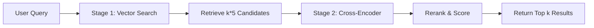

# Cross-Encoder Reranking Guide

## Overview

Semantik implements a sophisticated two-stage retrieval system that combines fast vector search with accurate cross-encoder reranking. This approach delivers significantly improved search relevance (20%+ improvement in metrics) while maintaining reasonable latency.

## How Reranking Works

### Two-Stage Retrieval Process



#### Stage 1: Fast Vector Retrieval
- Uses the same embedding model that indexed the documents
- Retrieves more candidates than requested (default: 5x multiplier)
- Leverages Qdrant's efficient HNSW index
- Typical latency: 10-50ms

#### Stage 2: Accurate Reranking
- Analyzes full query-document pairs with cross-encoder
- Computes more nuanced relevance scores
- Returns only the top-k most relevant results
- Typical latency: 100-800ms (model dependent)

### Why Two Stages?

**Traditional Embedding Search Limitations**:
- Embeddings compress text into fixed vectors
- Lose nuanced relationships between query and document
- Can miss subtle relevance signals

**Cross-Encoder Advantages**:
- Processes query and document together
- Captures fine-grained interactions
- Much more accurate relevance scoring
- Too slow for searching millions of documents directly

**Best of Both Worlds**:
- Stage 1 quickly narrows search space
- Stage 2 accurately ranks the most promising candidates

## Model Selection

### Automatic Model Mapping

Semantik automatically selects the appropriate reranker based on your embedding model:

```python
# Qwen3 Model Mapping
Qwen/Qwen3-Embedding-0.6B → Qwen/Qwen3-Reranker-0.6B
Qwen/Qwen3-Embedding-4B  → Qwen/Qwen3-Reranker-4B
Qwen/Qwen3-Embedding-8B  → Qwen/Qwen3-Reranker-8B
```

### Model Characteristics

| Model | Parameters | Memory (float16) | Memory (int8) | Batch Size | Speed |
|-------|------------|------------------|---------------|------------|-------|
| Qwen3-Reranker-0.6B | 0.6B | ~1.2GB | ~600MB | 64-256 | Fast |
| Qwen3-Reranker-4B | 4B | ~8GB | ~4GB | 16-64 | Medium |
| Qwen3-Reranker-8B | 8B | ~16GB | ~8GB | 8-32 | Slow |

### Selection Logic

1. **Exact Match**: Tries to match embedding model to corresponding reranker
2. **Size-Based Fallback**: Matches model size if exact match not found
3. **Default**: Uses 0.6B model if no match exists

## Configuration

### Enabling Reranking

#### Via API Request
```python
# Python example
response = requests.get("http://localhost:8000/search", params={
    "q": "machine learning algorithms",
    "k": 10,
    "use_reranker": True,  # Enable reranking
    "rerank_model": "Qwen/Qwen3-Reranker-4B",  # Optional: override model
    "rerank_quantization": "int8"  # Optional: override quantization
})
```

#### Via Configuration
```python
# config/rerank_config.py
RERANK_CONFIG = {
    "enabled": True,
    "candidate_multiplier": 5,    # Retrieve k * 5 candidates
    "min_candidates": 20,         # Minimum candidates to retrieve
    "max_candidates": 200,        # Maximum candidates cap
    "default_model": "Qwen/Qwen3-Reranker-0.6B",
    "default_quantization": "float16"
}
```

### Configuration Parameters

| Parameter | Default | Description |
|-----------|---------|-------------|
| `enabled` | `True` | Global reranking enable/disable |
| `candidate_multiplier` | `5` | How many candidates to retrieve (k * multiplier) |
| `min_candidates` | `20` | Minimum candidates regardless of k |
| `max_candidates` | `200` | Maximum candidates to prevent memory issues |
| `default_model` | `Qwen3-0.6B` | Fallback reranker model |
| `default_quantization` | `float16` | Default quantization level |

### Batch Size Configuration

Batch sizes are automatically configured based on model and quantization:

```python
"batch_sizes": {
    "Qwen/Qwen3-Reranker-0.6B": {
        "float32": 64,
        "float16": 128,
        "int8": 256
    },
    "Qwen/Qwen3-Reranker-4B": {
        "float32": 16,
        "float16": 32,
        "int8": 64
    },
    "Qwen/Qwen3-Reranker-8B": {
        "float32": 8,
        "float16": 16,
        "int8": 32
    }
}
```

## Performance Considerations

### Memory Requirements

#### GPU Memory Usage
- **Embedding Model**: Loaded for query encoding
- **Reranker Model**: Loaded for scoring
- **Peak Usage**: Both models in memory simultaneously

#### Memory Management
- **Lazy Loading**: Models loaded only when needed
- **Auto-Unloading**: Models freed after 5 minutes inactivity
- **Memory Checks**: Pre-flight checks prevent OOM errors

### Latency Impact

| Operation | Latency | Notes |
|-----------|---------|-------|
| Vector Search | 10-50ms | Fast HNSW lookup |
| Model Loading | 2-10s | First request only |
| Reranking (0.6B) | 100-300ms | For 50 documents |
| Reranking (4B) | 300-600ms | For 50 documents |
| Reranking (8B) | 600-1200ms | For 50 documents |

### Optimization Tips

1. **Right-size Your Model**
   - Start with 0.6B for testing
   - Upgrade to 4B/8B only if needed
   - Consider int8 quantization

2. **Tune Candidate Multiplier**
   ```python
   # For high-precision needs
   "candidate_multiplier": 10  # More candidates, better accuracy
   
   # For speed-sensitive applications
   "candidate_multiplier": 3   # Fewer candidates, faster
   ```

3. **Monitor GPU Memory**
   ```bash
   # Check available memory before deployment
   nvidia-smi
   ```

## Implementation Details

### Query-Document Formatting

The reranker uses a specific format for optimal performance:

```
<Instruct>: Given the query and document, determine if the document is relevant to the query.
<Query>: {user_query}
<Document>: {document_content}
```

### Instruction Templates

Different templates for different search types:

```python
INSTRUCTION_TEMPLATES = {
    "general": "Given the query and document, determine if the document is relevant to the query.",
    "technical": "Assess if this technical document provides useful information for the technical query.",
    "code": "Determine if this code snippet is relevant to the programming query.",
    "qa": "Check if this document contains information that answers the question."
}
```

### Score Computation

The reranker outputs probabilities for "yes" and "no" tokens:
- **Score** = P(yes|query,document)
- **Range**: 0.0 to 1.0
- **Higher is better**: More relevant documents score higher

### Error Handling

Graceful degradation on errors:
```python
try:
    reranked_results = rerank_results(results, query)
except InsufficientMemoryError:
    # Return vector-only results with warning
    logger.warning("Insufficient GPU memory for reranking")
    return vector_results
```

## Usage Examples

### Basic Reranking
```python
# Enable reranking for better accuracy
results = search_api.search(
    query="How does transformer architecture work?",
    k=10,
    use_reranker=True
)
```

### Custom Model Selection
```python
# Use larger model for complex queries
results = search_api.search(
    query="Explain the mathematical foundations of attention mechanisms",
    k=5,
    use_reranker=True,
    rerank_model="Qwen/Qwen3-Reranker-4B",
    rerank_quantization="float16"
)
```

### Batch Search with Reranking
```python
# Rerank multiple queries efficiently
queries = [
    "machine learning algorithms",
    "deep learning frameworks",
    "neural network architectures"
]

results = search_api.batch_search(
    queries=queries,
    k=10,
    use_reranker=True
)
```

## Best Practices

### 1. When to Use Reranking

**Enable Reranking For**:
- Complex, nuanced queries
- Question-answering tasks
- Technical documentation search
- When precision matters more than speed

**Skip Reranking For**:
- Simple keyword lookups
- Real-time autocomplete
- High-volume, low-latency requirements
- When GPU memory is limited

### 2. Model Selection Guidelines

```python
# Decision tree for model selection
if gpu_memory < 2GB:
    use_model = "Qwen/Qwen3-Reranker-0.6B"
    quantization = "int8"
elif query_complexity == "high" and gpu_memory > 10GB:
    use_model = "Qwen/Qwen3-Reranker-4B"
    quantization = "float16"
else:
    use_model = None  # Use automatic selection
```

### 3. Production Deployment

**Pre-deployment Checklist**:
- [ ] Test with expected query volume
- [ ] Monitor GPU memory usage
- [ ] Set appropriate timeout values
- [ ] Configure model unload timing
- [ ] Test fallback behavior

**Monitoring Metrics**:
- Reranking latency percentiles
- GPU memory utilization
- Model load/unload frequency
- Fallback rate (when reranking fails)

## Troubleshooting

### Common Issues

#### 1. Out of Memory Errors
```
InsufficientMemoryError: Not enough GPU memory for Qwen3-Reranker-4B
```
**Solutions**:
- Use smaller model (0.6B)
- Enable int8 quantization
- Reduce batch size
- Increase model unload frequency

#### 2. Slow Performance
**Diagnosis**:
```python
# Check reranking time in response
{
    "search_time_ms": 45.2,
    "reranking_time_ms": 823.1,  # Too high
    "reranking_used": true
}
```
**Solutions**:
- Reduce candidate_multiplier
- Use smaller model
- Enable quantization
- Increase batch size if memory allows

#### 3. Model Loading Delays
**Symptoms**: First search after idle period is slow
**Solutions**:
- Pre-load models on startup
- Increase unload timeout
- Use model warming in production

### Debug Mode

Enable detailed logging:
```python
import logging
logging.getLogger("semantik.reranker").setLevel(logging.DEBUG)
```

## Advanced Topics

### Custom Reranker Integration

To add a custom reranker model:

1. **Define Model Mapping**:
```python
CUSTOM_RERANKER_MAPPING = {
    "my-embedding-model": "my-reranker-model"
}
```

2. **Configure Batch Sizes**:
```python
"batch_sizes": {
    "my-reranker-model": {
        "float32": 32,
        "float16": 64,
        "int8": 128
    }
}
```

3. **Implement Scoring Logic**:
```python
def custom_rerank_score(model, query, document):
    # Custom scoring implementation
    return score
```

### A/B Testing Reranking

Compare reranking effectiveness:
```python
# Group A: Vector search only
results_a = search(query, use_reranker=False)

# Group B: With reranking
results_b = search(query, use_reranker=True)

# Compare relevance metrics
```

## Conclusion

Cross-encoder reranking significantly improves search relevance in Semantik by combining the speed of vector search with the accuracy of cross-encoder models. With proper configuration and model selection, you can achieve excellent search quality while maintaining acceptable performance for your use case.

Key takeaways:
- Reranking improves relevance by 20%+ in most scenarios
- Automatic model selection simplifies configuration
- Memory management prevents system instability
- Graceful fallbacks ensure reliability

For implementation details, see the source code in:
- `packages/vecpipe/search_api.py`
- `packages/webui/qwen3_search_config.py`
- `packages/webui/embedding_service.py`