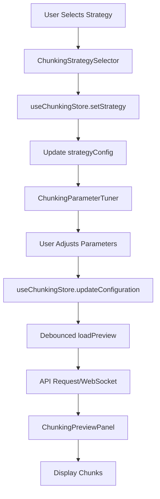
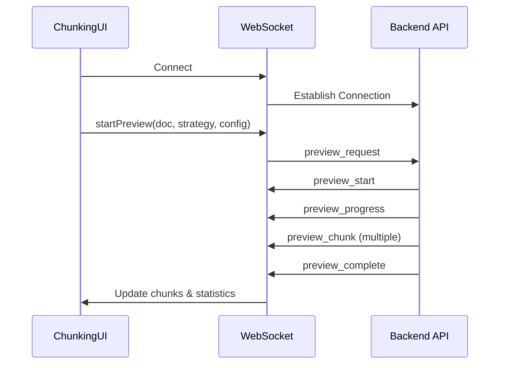

# CHUNKING_UI Component Documentation

## 1. Component Overview

The CHUNKING_UI is a sophisticated frontend subsystem within the Semantik application that provides a comprehensive interface for document chunking operations. This system enables users to split documents into semantically meaningful segments for optimal vector embedding and search performance.

### Core Purpose
- **Document Segmentation**: Split large documents into smaller, searchable chunks
- **Strategy Selection**: Choose from 6 different chunking algorithms based on content type
- **Real-time Preview**: Visualize chunking results before applying to collections
- **Performance Optimization**: Compare strategies to find the best balance between quality and speed
- **Analytics & Insights**: Monitor chunking performance across the system

### Key Features
1. **Six Chunking Strategies**:
   - Character-based: Simple fixed-size splitting
   - Recursive: Intelligent boundary detection
   - Markdown-aware: Structure-preserving for documentation
   - Semantic: AI-powered topic-based segmentation
   - Hierarchical: Parent-child chunk relationships
   - Hybrid Auto-Select: Automatic strategy selection

2. **Interactive Parameter Tuning**: Real-time adjustment of strategy parameters
3. **Live Preview Panel**: Split-view visualization of original and chunked content
4. **Strategy Comparison**: Side-by-side evaluation of multiple strategies
5. **Analytics Dashboard**: Historical performance metrics and recommendations
6. **WebSocket Integration**: Real-time updates for long-running operations

## 2. Architecture & Design Patterns

### Component Hierarchy

```
chunking/
├── ChunkingStrategySelector.tsx         # Main strategy selection UI
├── SimplifiedChunkingStrategySelector.tsx # Streamlined selector variant
├── ChunkingParameterTuner.tsx          # Parameter configuration interface
├── ChunkingPreviewPanel.tsx            # Real-time chunk visualization
├── ChunkingComparisonView.tsx          # Multi-strategy comparison
├── ChunkingAnalyticsDashboard.tsx      # Performance metrics & insights
└── ChunkingStrategyGuide.tsx           # Interactive documentation modal
```

### State Management Pattern

The chunking UI implements a centralized Zustand store pattern:

```typescript
// Store Location: apps/webui-react/src/stores/chunkingStore.ts
interface ChunkingStore {
  // Core State
  selectedStrategy: ChunkingStrategyType;
  strategyConfig: ChunkingConfiguration;
  
  // Preview State
  previewDocument: Document | null;
  previewChunks: ChunkPreview[];
  previewStatistics: ChunkingStatistics | null;
  
  // Comparison State
  comparisonStrategies: ChunkingStrategyType[];
  comparisonResults: Record<ChunkingStrategyType, ChunkingComparisonResult>;
  
  // Analytics State
  analyticsData: ChunkingAnalytics | null;
  
  // Actions
  setStrategy: (strategy: ChunkingStrategyType) => void;
  updateConfiguration: (updates: Partial<Parameters>) => void;
  loadPreview: (forceRefresh?: boolean) => Promise<void>;
  compareStrategies: () => Promise<void>;
  loadAnalytics: () => Promise<void>;
}
```

### Real-time Communication Architecture

```typescript
// WebSocket Hook: apps/webui-react/src/hooks/useChunkingWebSocket.ts
useChunkingWebSocket({
  autoConnect: true,
  onChunkReceived: (chunk, index, total) => {},
  onProgressUpdate: (progress) => {},
  onComplete: (statistics, performance) => {},
  onError: (error) => {}
});
```

## 3. Key Interfaces & Contracts

### Core Type Definitions

```typescript
// Location: apps/webui-react/src/types/chunking.ts

export type ChunkingStrategyType = 
  | 'character'
  | 'recursive'
  | 'markdown'
  | 'semantic'
  | 'hierarchical'
  | 'hybrid';

export interface ChunkingStrategy {
  type: ChunkingStrategyType;
  name: string;
  description: string;
  icon: string; // lucide-react icon name
  performance: {
    speed: 'fast' | 'medium' | 'slow';
    quality: 'basic' | 'good' | 'excellent';
    memoryUsage: 'low' | 'medium' | 'high';
  };
  supportedFileTypes: string[];
  parameters: ChunkingParameter[];
  isRecommended?: boolean;
  recommendedFor?: string[];
}

export interface ChunkingParameter {
  name: string;
  key: string;
  type: 'number' | 'boolean' | 'select';
  min?: number;
  max?: number;
  step?: number;
  options?: { value: string | number; label: string }[];
  defaultValue: number | boolean | string;
  description: string;
  unit?: string;
  advanced?: boolean;
}

export interface ChunkPreview {
  id: string;
  content: string;
  startIndex: number;
  endIndex: number;
  metadata?: Record<string, unknown>;
  tokens?: number;
  overlapWithPrevious?: number;
  overlapWithNext?: number;
}

export interface ChunkingStatistics {
  totalChunks: number;
  avgChunkSize: number;
  minChunkSize: number;
  maxChunkSize: number;
  totalTokens?: number;
  avgTokensPerChunk?: number;
  overlapPercentage?: number;
  sizeDistribution: {
    range: string;
    count: number;
    percentage: number;
  }[];
}
```

### Component Props Contracts

```typescript
// ChunkingStrategySelector Props
interface ChunkingStrategySelectorProps {
  onStrategyChange?: (strategy: ChunkingStrategyType) => void;
  disabled?: boolean;
  fileType?: string;
}

// ChunkingParameterTuner Props
interface ChunkingParameterTunerProps {
  showPreview?: boolean;
  onParameterChange?: () => void;
  disabled?: boolean;
}

// ChunkingPreviewPanel Props
interface ChunkingPreviewPanelProps {
  document?: { id?: string; content?: string; name?: string };
  onDocumentSelect?: () => void;
  height?: string;
}

// ChunkingComparisonView Props
interface ChunkingComparisonViewProps {
  document?: { id?: string; content?: string; name?: string };
  maxStrategies?: number; // Default: 3
}
```

## 4. Data Flow & Dependencies

### User Interaction Flow



### WebSocket Communication Flow



### Component Dependencies

- **External Libraries**:
  - `zustand`: State management
  - `lucide-react`: Icon components
  - `axios`: HTTP client for REST fallback
  
- **Internal Services**:
  - `/services/api/v2/chunking`: REST API client
  - `/services/websocket`: WebSocket client
  - `/utils/formStyles`: UI styling utilities

## 5. Critical Implementation Details

### Strategy Configuration Defaults

```typescript
// Default configurations per strategy
const STRATEGY_DEFAULTS = {
  character: {
    chunk_size: 600,
    chunk_overlap: 100
  },
  recursive: {
    chunk_size: 600,
    chunk_overlap: 100,
    preserve_sentences: true
  },
  markdown: {
    max_header_level: 3,
    include_headers: true,
    min_chunk_size: 300
  },
  semantic: {
    breakpoint_percentile_threshold: 90,
    max_chunk_size: 1000,
    buffer_size: 2
  },
  hierarchical: {
    chunk_sizes: '1024,2048,4096',
    overlap_ratio: 0.2
  },
  hybrid: {
    quality_preference: 'balanced',
    auto_detect_code: true
  }
};
```

### Preview Generation Logic

```typescript
// ChunkingPreviewPanel.tsx - Key preview logic
const loadPreview = async (forceRefresh = false) => {
  const { previewDocument, strategyConfig, previewChunks } = get();
  
  if (!previewDocument || (!forceRefresh && previewChunks.length > 0)) {
    return;
  }

  set({ previewLoading: true, previewError: null });

  try {
    const response = await chunkingApi.preview(
      {
        documentId: previewDocument.id,
        content: previewDocument.content,
        strategy: strategyConfig.strategy,
        configuration: strategyConfig.parameters,
      },
      {
        requestId: `preview-${previewDocument.id || 'content'}-${Date.now()}`,
        onProgress: (progress) => {
          console.debug(`Preview progress: ${progress.percentage}%`);
        },
      }
    );

    set({
      previewChunks: response.chunks,
      previewStatistics: response.statistics,
      previewLoading: false
    });
  } catch (error) {
    set({
      previewError: handleChunkingError(error),
      previewLoading: false
    });
  }
};
```

### Debounced Parameter Updates

```typescript
// ChunkingParameterTuner.tsx - Debouncing implementation
const debouncedLoadPreview = useCallback(() => {
  let timeoutId: NodeJS.Timeout;
  return () => {
    clearTimeout(timeoutId);
    timeoutId = setTimeout(() => {
      if (showPreview && previewDocument) {
        loadPreview(true);
      }
      onParameterChange?.();
    }, 500); // 500ms debounce delay
  };
}, [showPreview, previewDocument, loadPreview, onParameterChange]);
```

### Chunk Boundary Visualization

```typescript
// ChunkingPreviewPanel.tsx - Boundary highlighting
const renderOriginalWithBoundaries = (): React.ReactNode => {
  const content = activeDocument.content;
  const elements: React.ReactElement[] = [];
  let lastIndex = 0;

  chunkBoundaries.forEach((boundary, index) => {
    // Add text before this chunk
    if (boundary.start > lastIndex) {
      elements.push(
        <span key={`text-${lastIndex}`} className="text-gray-400">
          {content.substring(lastIndex, boundary.start)}
        </span>
      );
    }

    // Add the chunk text with highlighting
    const isHighlighted = highlightedChunkId === boundary.id;
    const isSelected = selectedChunkIndex === index;
    
    elements.push(
      <span
        key={`chunk-${boundary.id}`}
        className={`
          relative cursor-pointer transition-all duration-200
          ${isHighlighted ? 'bg-yellow-200' : ''}
          ${isSelected ? 'bg-blue-100 border-b-2 border-blue-500' : 'hover:bg-gray-100'}
        `}
        onClick={() => setSelectedChunkIndex(index)}
      >
        {content.substring(boundary.start, boundary.end)}
      </span>
    );
    lastIndex = boundary.end;
  });

  return <>{elements}</>;
};
```

## 6. Security Considerations

### Input Validation

```typescript
// Parameter validation in updateConfiguration
const updateConfiguration = (updates) => {
  const { strategyConfig } = get();
  
  // Filter out undefined values and validate types
  const filteredUpdates = Object.entries(updates).reduce((acc, [key, value]) => {
    if (value !== undefined) {
      // Validate against parameter definitions
      const paramDef = CHUNKING_STRATEGIES[strategyConfig.strategy]
        .parameters.find(p => p.key === key);
      
      if (paramDef) {
        // Type validation
        if (paramDef.type === 'number' && typeof value === 'number') {
          // Range validation
          if (paramDef.min !== undefined && value < paramDef.min) return acc;
          if (paramDef.max !== undefined && value > paramDef.max) return acc;
        }
        acc[key] = value;
      }
    }
    return acc;
  }, {} as Record<string, number | boolean | string>);
  
  set({
    strategyConfig: {
      ...strategyConfig,
      parameters: { ...strategyConfig.parameters, ...filteredUpdates }
    }
  });
};
```

### Content Sanitization

```typescript
// Document content handling
const setPreviewDocument = (doc) => {
  // Sanitize document content before storage
  const sanitizedDoc = doc ? {
    id: doc.id?.replace(/[^a-zA-Z0-9-_]/g, ''),
    content: doc.content, // Content is text-only, rendered in <pre> tags
    name: doc.name?.replace(/[<>]/g, '') // Remove potential HTML tags
  } : null;
  
  set({ 
    previewDocument: sanitizedDoc,
    previewChunks: [],
    previewStatistics: null,
    previewError: null
  });
};
```

### API Request Security

```typescript
// Request validation and cancellation
class RequestManager {
  private activeRequests = new Map<string, CancelTokenSource>();

  register(id: string, source: CancelTokenSource): void {
    // Prevent duplicate request IDs
    if (this.activeRequests.has(id)) {
      this.cancel(id);
    }
    this.activeRequests.set(id, source);
  }

  cancel(id: string, reason?: string): boolean {
    const source = this.activeRequests.get(id);
    if (source) {
      source.cancel(reason || 'Request cancelled by user');
      this.unregister(id);
      return true;
    }
    return false;
  }
}
```

## 7. Testing Requirements

### Component Tests

```typescript
// ChunkingStrategySelector.test.tsx
describe('ChunkingStrategySelector', () => {
  it('should render all 6 strategies', () => {
    render(<ChunkingStrategySelector />);
    expect(screen.getAllByRole('button')).toHaveLength(6);
  });

  it('should highlight recommended strategy for file type', () => {
    render(<ChunkingStrategySelector fileType="md" />);
    const markdownStrategy = screen.getByText('Markdown-aware');
    expect(markdownStrategy.closest('[role="button"]'))
      .toHaveTextContent('Recommended');
  });

  it('should update store on strategy selection', () => {
    const { result } = renderHook(() => useChunkingStore());
    render(<ChunkingStrategySelector />);
    
    fireEvent.click(screen.getByText('Semantic'));
    expect(result.current.selectedStrategy).toBe('semantic');
  });
});
```

### Integration Tests

```typescript
// ChunkingPreviewPanel.test.tsx
describe('ChunkingPreviewPanel Integration', () => {
  it('should load preview when document is set', async () => {
    const mockDocument = {
      id: 'doc-1',
      content: 'Test content for chunking',
      name: 'test.txt'
    };

    render(<ChunkingPreviewPanel document={mockDocument} />);
    
    await waitFor(() => {
      expect(screen.getByText(/Chunks \(\d+\)/)).toBeInTheDocument();
    });
  });

  it('should sync scroll between panels in split view', () => {
    render(<ChunkingPreviewPanel document={mockDocument} />);
    
    const leftPanel = screen.getByTestId('original-panel');
    const rightPanel = screen.getByTestId('chunks-panel');
    
    fireEvent.scroll(leftPanel, { target: { scrollTop: 100 } });
    expect(rightPanel.scrollTop).toBe(100);
  });
});
```

### WebSocket Tests

```typescript
// useChunkingWebSocket.test.ts
describe('useChunkingWebSocket', () => {
  it('should handle connection lifecycle', async () => {
    const { result } = renderHook(() => useChunkingWebSocket({
      autoConnect: true
    }));

    expect(result.current.connectionStatus).toBe('connecting');
    
    await waitFor(() => {
      expect(result.current.connectionStatus).toBe('connected');
    });

    act(() => result.current.disconnect());
    expect(result.current.connectionStatus).toBe('disconnected');
  });

  it('should accumulate chunks in correct order', async () => {
    const { result } = renderHook(() => useChunkingWebSocket());
    
    // Simulate receiving chunks out of order
    mockWebSocket.emit('preview_chunk', {
      chunk: { id: 'chunk-2', content: 'Second' },
      index: 1,
      total: 3
    });
    
    mockWebSocket.emit('preview_chunk', {
      chunk: { id: 'chunk-1', content: 'First' },
      index: 0,
      total: 3
    });

    expect(result.current.chunks[0].content).toBe('First');
    expect(result.current.chunks[1].content).toBe('Second');
  });
});
```

## 8. Common Pitfalls & Best Practices

### Pitfall: Excessive Re-renders

**Problem**: Parameter changes trigger immediate preview updates, causing performance issues.

**Solution**: Implement debouncing with 500ms delay:
```typescript
const debouncedUpdate = useMemo(
  () => debounce(loadPreview, 500),
  [loadPreview]
);
```

### Pitfall: WebSocket Connection Loss

**Problem**: Long-running operations fail when WebSocket disconnects.

**Solution**: Implement automatic fallback to REST API:
```typescript
if (useWebSocket && isConnected && document.id) {
  startWebSocketPreview(document.id, strategy, config);
} else {
  // Fallback to REST API
  loadPreview();
}
```

### Pitfall: Memory Leaks with Large Documents

**Problem**: Storing full document content in multiple components.

**Solution**: Use references and lazy loading:
```typescript
const previewDocument = useRef<Document | null>(null);
// Only load content when needed for preview
```

### Best Practice: Strategy Selection Guidance

Always provide contextual recommendations:
```typescript
const getRecommendedStrategy = (fileType?: string) => {
  if (!fileType) return 'recursive';
  
  const fileTypeMap = {
    'md': 'markdown',
    'pdf': 'semantic',
    'py': 'recursive',
    'html': 'markdown'
  };
  
  return fileTypeMap[fileType] || 'recursive';
};
```

### Best Practice: Error Recovery

Implement graceful error handling with retry options:
```typescript
if (displayError) {
  return (
    <div className="error-state">
      <p>{displayError}</p>
      <button onClick={() => loadPreview(true)}>Retry</button>
      {useWebSocket && !isConnected && (
        <button onClick={() => setUseWebSocket(false)}>
          Use REST API
        </button>
      )}
    </div>
  );
}
```

## 9. Configuration & Environment

### Default Strategy Configurations

```typescript
// Location: apps/webui-react/src/types/chunking.ts
export const CHUNKING_PRESETS: ChunkingPreset[] = [
  {
    id: 'default-documents',
    name: 'General Documents',
    strategy: 'recursive',
    configuration: {
      strategy: 'recursive',
      parameters: {
        chunk_size: 600,
        chunk_overlap: 100,
        preserve_sentences: true
      }
    },
    fileTypes: ['pdf', 'doc', 'docx', 'txt']
  },
  {
    id: 'technical-docs',
    name: 'Technical Documentation',
    strategy: 'markdown',
    configuration: {
      strategy: 'markdown',
      parameters: {
        max_header_level: 3,
        include_headers: true,
        min_chunk_size: 300
      }
    },
    fileTypes: ['md', 'mdx', 'rst']
  },
  {
    id: 'code-files',
    name: 'Source Code',
    strategy: 'recursive',
    configuration: {
      strategy: 'recursive',
      parameters: {
        chunk_size: 400,
        chunk_overlap: 50,
        preserve_sentences: false
      }
    },
    fileTypes: ['py', 'js', 'ts', 'java', 'cpp', 'go', 'rust']
  }
];
```

### Performance Limits

```typescript
// System constraints
const CHUNKING_LIMITS = {
  MAX_DOCUMENT_SIZE: 10 * 1024 * 1024, // 10MB
  MAX_PREVIEW_CHUNKS: 100,
  MAX_COMPARISON_STRATEGIES: 3,
  DEBOUNCE_DELAY: 500, // ms
  WEBSOCKET_TIMEOUT: 30000, // 30 seconds
  MAX_CHUNK_SIZE: 8192, // characters
  MIN_CHUNK_SIZE: 100 // characters
};
```

### WebSocket Configuration

```typescript
// WebSocket connection settings
const WS_CONFIG = {
  url: process.env.REACT_APP_WS_URL || 'ws://localhost:8000/ws/chunking',
  reconnect: {
    maxAttempts: 5,
    delay: 1000,
    maxDelay: 30000,
    backoff: 2
  },
  heartbeat: {
    interval: 30000,
    timeout: 60000
  }
};
```

## 10. Integration Points

### Collection Creation Integration

```typescript
// Integration with collection creation workflow
const CollectionCreationForm = () => {
  const { selectedStrategy, strategyConfig } = useChunkingStore();
  
  const handleSubmit = async (formData) => {
    const collection = await createCollection({
      ...formData,
      chunkingStrategy: selectedStrategy,
      chunkingConfiguration: strategyConfig.parameters
    });
    
    // Trigger document processing with selected chunking
    await processDocuments(collection.id, {
      strategy: selectedStrategy,
      configuration: strategyConfig.parameters
    });
  };
};
```

### API Endpoints

```typescript
// Chunking API endpoints
const CHUNKING_ENDPOINTS = {
  preview: '/api/v2/chunking/preview',
  compare: '/api/v2/chunking/compare',
  analytics: '/api/v2/chunking/analytics',
  presets: {
    list: '/api/v2/chunking/presets',
    save: '/api/v2/chunking/presets',
    delete: '/api/v2/chunking/presets/:id'
  },
  validate: '/api/v2/chunking/validate'
};
```

### WebSocket Message Protocol

```typescript
// WebSocket message types
enum ChunkingMessageType {
  // Preview operations
  PREVIEW_START = 'chunking.preview.start',
  PREVIEW_PROGRESS = 'chunking.preview.progress',
  PREVIEW_CHUNK = 'chunking.preview.chunk',
  PREVIEW_COMPLETE = 'chunking.preview.complete',
  PREVIEW_ERROR = 'chunking.preview.error',
  
  // Comparison operations
  COMPARISON_START = 'chunking.comparison.start',
  COMPARISON_PROGRESS = 'chunking.comparison.progress',
  COMPARISON_COMPLETE = 'chunking.comparison.complete',
  COMPARISON_ERROR = 'chunking.comparison.error'
}

// Message structure
interface WebSocketMessage {
  type: string;
  data: unknown;
  timestamp: number;
  requestId: string;
}
```

### Store Integration Points

```typescript
// Integration with other stores
const useCollectionStore = create((set, get) => ({
  createCollection: async (data) => {
    const { selectedStrategy, strategyConfig } = useChunkingStore.getState();
    
    const collection = await api.createCollection({
      ...data,
      chunking: {
        strategy: selectedStrategy,
        configuration: strategyConfig
      }
    });
    
    return collection;
  }
}));
```

## Component File References

### Core Components
- `/home/john/semantik/apps/webui-react/src/components/chunking/ChunkingStrategySelector.tsx`
- `/home/john/semantik/apps/webui-react/src/components/chunking/SimplifiedChunkingStrategySelector.tsx`
- `/home/john/semantik/apps/webui-react/src/components/chunking/ChunkingParameterTuner.tsx`
- `/home/john/semantik/apps/webui-react/src/components/chunking/ChunkingPreviewPanel.tsx`
- `/home/john/semantik/apps/webui-react/src/components/chunking/ChunkingComparisonView.tsx`
- `/home/john/semantik/apps/webui-react/src/components/chunking/ChunkingAnalyticsDashboard.tsx`
- `/home/john/semantik/apps/webui-react/src/components/chunking/ChunkingStrategyGuide.tsx`

### State Management
- `/home/john/semantik/apps/webui-react/src/stores/chunkingStore.ts`

### Type Definitions
- `/home/john/semantik/apps/webui-react/src/types/chunking.ts`

### Hooks & Services
- `/home/john/semantik/apps/webui-react/src/hooks/useChunkingWebSocket.ts`
- `/home/john/semantik/apps/webui-react/src/services/api/v2/chunking.ts`

### Test Files
- `/home/john/semantik/apps/webui-react/src/components/chunking/__tests__/ChunkingStrategySelector.test.tsx`
- `/home/john/semantik/apps/webui-react/src/components/chunking/__tests__/ChunkingComparisonView.test.tsx`
- `/home/john/semantik/apps/webui-react/src/components/chunking/__tests__/ChunkingAnalyticsDashboard.test.tsx`
- `/home/john/semantik/apps/webui-react/src/components/chunking/__tests__/ChunkingPreviewPanel.test.tsx`

---

*This documentation provides a comprehensive technical reference for the CHUNKING_UI component system. It should be used as the authoritative source for understanding the chunking interface implementation, integration patterns, and best practices within the Semantik application.*