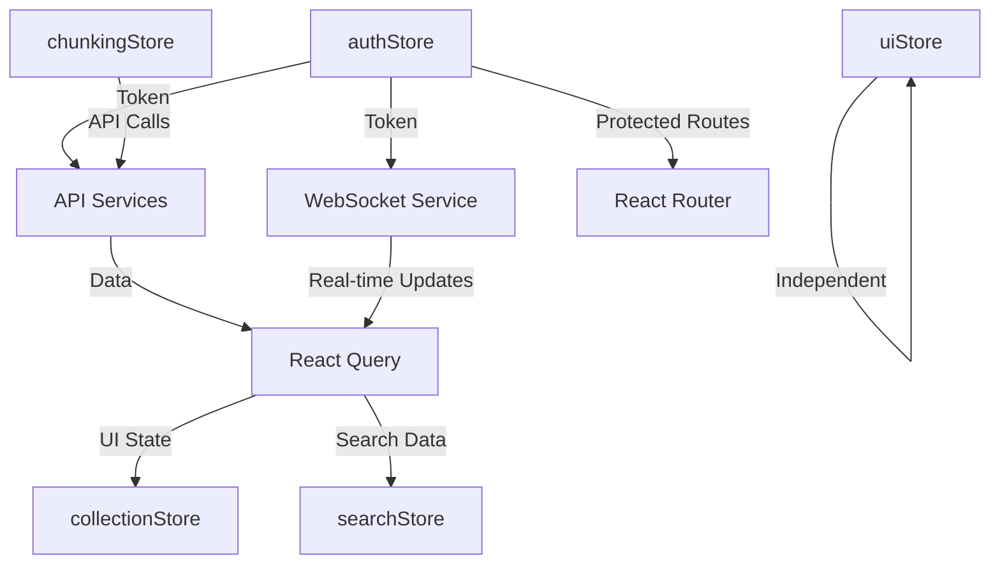

# STATE_MANAGEMENT Component - Cleanroom Documentation

## 1. Component Overview

The STATE_MANAGEMENT component implements a hybrid state management architecture for the Semantik frontend application using Zustand for client-side state and React Query for server state. This architecture provides a clear separation between UI state, authentication state, and server-synchronized data, enabling optimistic updates, real-time synchronization, and offline resilience.

### Core Technology Stack
- **Zustand v4**: Lightweight state management for client-side state
- **Zustand Middleware**: Persistence (localStorage) and DevTools integration
- **React Query v5**: Server state management and caching
- **WebSocket**: Real-time state synchronization for operations
- **TypeScript**: Full type safety across all stores

### Store Architecture
```
apps/webui-react/src/stores/
├── authStore.ts          # Authentication and user session state
├── collectionStore.ts    # UI state for collection selection
├── searchStore.ts        # Search parameters and results state
├── uiStore.ts           # Global UI state (toasts, modals, tabs)
├── chunkingStore.ts     # Document chunking configuration state
└── __tests__/           # Store-specific test suites
```

## 2. Architecture & Design Patterns

### 2.1 Store Patterns

#### Persistent Store Pattern (authStore)
```typescript
// Pattern: Zustand + persist middleware for cross-session state
export const useAuthStore = create<AuthState>()(
  persist(
    (set, get) => ({
      // State
      token: null,
      refreshToken: null,
      user: null,
      
      // Actions
      setAuth: (token, user, refreshToken) => 
        set({ token, user, refreshToken }),
      
      logout: async () => {
        // API call + state cleanup
        await fetch('/api/auth/logout', {...});
        set({ token: null, refreshToken: null, user: null });
        localStorage.removeItem('auth-storage');
      }
    }),
    {
      name: 'auth-storage', // localStorage key
    }
  )
);
```

#### DevTools-Enhanced Store Pattern (chunkingStore)
```typescript
// Pattern: Complex state with DevTools for debugging
export const useChunkingStore = create<ChunkingStore>()(
  devtools(
    (set, get) => ({
      // Hierarchical state structure
      selectedStrategy: 'recursive',
      strategyConfig: getDefaultConfiguration('recursive'),
      previewChunks: [],
      
      // Composite actions with side effects
      loadPreview: async (forceRefresh = false) => {
        const { previewDocument, strategyConfig } = get();
        if (!previewDocument) return;
        
        set({ previewLoading: true, previewError: null });
        
        try {
          const response = await chunkingApi.preview({...});
          set({
            previewChunks: response.chunks,
            previewStatistics: response.statistics,
            previewLoading: false
          });
        } catch (error) {
          set({
            previewError: handleChunkingError(error),
            previewLoading: false
          });
        }
      }
    }),
    {
      name: 'chunking-store' // DevTools instance name
    }
  )
);
```

#### UI-Only Store Pattern (collectionStore)
```typescript
// Pattern: Simplified UI state, server state managed by React Query
export const useCollectionStore = create<CollectionUIStore>()(
  devtools(
    (set) => ({
      selectedCollectionId: null,
      
      setSelectedCollection: (id: string | null) => 
        set({ selectedCollectionId: id }),
      
      clearStore: () => set({
        selectedCollectionId: null,
      }),
    }),
    {
      name: 'collection-ui-store',
    }
  )
);
```

### 2.2 Action Patterns

#### Optimistic Update Pattern
```typescript
// searchStore: Immediate UI feedback with validation
validateAndUpdateSearchParams: (params) => {
  const currentParams = get().searchParams;
  const updatedParams = { ...currentParams };
  
  // Sanitize and clamp values immediately
  if (params.query !== undefined) {
    updatedParams.query = sanitizeQuery(params.query);
  }
  if (params.topK !== undefined) {
    updatedParams.topK = clampValue(params.topK, MIN, MAX);
  }
  
  // Validate all params
  const errors = validateSearchParams(updatedParams);
  
  // Update state with validation results
  set({
    searchParams: updatedParams,
    validationErrors: errors,
  });
}
```

#### Async Action with Error Handling Pattern
```typescript
// authStore: Graceful degradation on API failure
logout: async () => {
  try {
    // Attempt API logout
    const token = get().token;
    if (token) {
      await fetch('/api/auth/logout', {
        method: 'POST',
        headers: { 'Authorization': `Bearer ${token}` },
        body: JSON.stringify({ refresh_token: get().refreshToken }),
      });
    }
  } catch (error) {
    console.error('Logout API call failed:', error);
  } finally {
    // Always clear state regardless of API result
    set({ token: null, refreshToken: null, user: null });
    localStorage.removeItem('auth-storage');
  }
}
```

#### Queue Management Pattern
```typescript
// chunkingStore: Request cancellation and queueing
cancelActiveRequests: () => {
  chunkingApi.cancelAllRequests('User cancelled operation');
},

loadPreview: async (forceRefresh = false) => {
  const { previewChunks } = get();
  
  // Skip if data already loaded
  if (!forceRefresh && previewChunks.length > 0) {
    return;
  }
  
  // Cancel any pending requests
  get().cancelActiveRequests();
  
  // Start new request
  // ...
}
```

### 2.3 Selector Patterns

#### Direct Property Access
```typescript
// Most common pattern for simple state access
const token = useAuthStore((state) => state.token);
const user = useAuthStore((state) => state.user);
```

#### Computed Selectors
```typescript
// searchStore: Derived state from store
hasValidationErrors: () => get().validationErrors.length > 0,

getValidationError: (field) => {
  const errors = get().validationErrors;
  const error = errors.find(e => e.field === field);
  return error?.message;
}
```

## 3. Key Interfaces & Contracts

### 3.1 Store State Interfaces

```typescript
// authStore.ts
interface AuthState {
  token: string | null;
  refreshToken: string | null;
  user: User | null;
  setAuth: (token: string, user: User, refreshToken?: string) => void;
  logout: () => Promise<void>;
}

interface User {
  id: number;
  username: string;
  email: string;
  full_name?: string;
  is_active: boolean;
  created_at: string;
  last_login?: string;
}

// searchStore.ts
interface SearchState {
  results: SearchResult[];
  loading: boolean;
  error: string | null;
  searchParams: SearchParams;
  collections: string[];
  failedCollections: FailedCollection[];
  partialFailure: boolean;
  rerankingMetrics: RerankingMetrics | null;
  validationErrors: ValidationError[];
  rerankingAvailable: boolean;
  rerankingModelsLoading: boolean;
  // Actions
  setResults: (results: SearchResult[]) => void;
  setLoading: (loading: boolean) => void;
  setError: (error: string | null) => void;
  updateSearchParams: (params: Partial<SearchParams>) => void;
  validateAndUpdateSearchParams: (params: Partial<SearchParams>) => void;
  clearResults: () => void;
  // ... additional actions
}

interface SearchParams {
  query: string;
  selectedCollections: string[];
  topK: number;
  scoreThreshold: number;
  searchType: 'semantic' | 'question' | 'code' | 'hybrid';
  rerankModel?: string;
  rerankQuantization?: string;
  useReranker: boolean;
  hybridAlpha?: number;
  hybridMode?: 'reciprocal_rank' | 'relative_score';
  keywordMode?: 'bm25';
}

// uiStore.ts
interface UIState {
  toasts: Toast[];
  activeTab: 'search' | 'collections' | 'operations';
  showDocumentViewer: { collectionId: string; docId: string; chunkId?: string } | null;
  showCollectionDetailsModal: string | null;
  addToast: (toast: Omit<Toast, 'id'>) => void;
  removeToast: (id: string) => void;
  setActiveTab: (tab: 'search' | 'collections' | 'operations') => void;
  setShowDocumentViewer: (viewer: {...} | null) => void;
  setShowCollectionDetailsModal: (collectionId: string | null) => void;
}

interface Toast {
  id: string;
  message: string;
  type: 'success' | 'error' | 'info' | 'warning';
  duration?: number;
}

// chunkingStore.ts
interface ChunkingStore {
  // Strategy Selection
  selectedStrategy: ChunkingStrategyType;
  strategyConfig: ChunkingConfiguration;
  
  // Preview State
  previewDocument: { id?: string; content?: string; name?: string } | null;
  previewChunks: ChunkPreview[];
  previewStatistics: ChunkingStatistics | null;
  previewLoading: boolean;
  previewError: string | null;
  
  // Comparison State
  comparisonStrategies: ChunkingStrategyType[];
  comparisonResults: Partial<Record<ChunkingStrategyType, ChunkingComparisonResult>>;
  comparisonLoading: boolean;
  comparisonError: string | null;
  
  // Analytics State
  analyticsData: ChunkingAnalytics | null;
  analyticsLoading: boolean;
  
  // Preset Management
  selectedPreset: string | null;
  customPresets: ChunkingPreset[];
  presetsLoading: boolean;
  
  // Actions (30+ methods)
  setStrategy: (strategy: ChunkingStrategyType) => void;
  updateConfiguration: (updates: Partial<ChunkingConfiguration['parameters']>) => void;
  loadPreview: (forceRefresh?: boolean) => Promise<void>;
  compareStrategies: () => Promise<void>;
  // ... additional actions
}
```

## 4. Data Flow & Dependencies

### 4.1 Store Dependencies



### 4.2 Data Flow Patterns

#### Authentication Flow
1. User credentials → Login API → authStore.setAuth()
2. authStore persists token to localStorage
3. Token used for all subsequent API calls
4. WebSocket reads token from localStorage for authentication
5. Logout clears both store and localStorage

#### Search Flow
1. User input → searchStore.validateAndUpdateSearchParams()
2. Validation and sanitization applied
3. Search API called with validated params
4. Results stored in searchStore.results
5. Failed collections tracked separately
6. Reranking metrics stored if applicable

#### Collection Management Flow
1. Collections fetched via React Query hooks
2. UI selection state in collectionStore
3. Server state managed by React Query
4. WebSocket updates trigger React Query invalidation
5. Optimistic updates with rollback on failure

## 5. Critical Implementation Details

### 5.1 State Persistence

#### localStorage Schema
```javascript
// auth-storage (authStore)
{
  "state": {
    "token": "jwt-token-string",
    "refreshToken": "refresh-token-string",
    "user": {
      "id": 1,
      "username": "user",
      "email": "user@example.com",
      "is_active": true,
      "created_at": "2025-01-01T00:00:00Z"
    }
  },
  "version": 0
}

// semantik_storage_version (migration tracking)
"2.0.0"
```

#### Persistence Security Considerations
- Tokens stored in localStorage (XSS vulnerable)
- No sensitive data beyond auth tokens
- Automatic cleanup on logout
- Version-based migration for breaking changes

### 5.2 Store Subscriptions

#### Toast Auto-Removal Pattern
```typescript
// uiStore: Self-cleaning notifications
addToast: (toast) => {
  const id = Date.now().toString();
  set((state) => ({ toasts: [...state.toasts, { ...toast, id }] }));
  
  // Auto-remove after duration (default 5000ms)
  if (toast.duration !== 0) {
    setTimeout(() => {
      set((state) => ({
        toasts: state.toasts.filter((t) => t.id !== id),
      }));
    }, toast.duration || 5000);
  }
}
```

#### WebSocket Token Synchronization
```typescript
// websocket.ts: Reads auth token from localStorage
private createConnection(): void {
  const authStorage = localStorage.getItem('auth-storage');
  let token = '';
  
  if (authStorage) {
    const authState = JSON.parse(authStorage);
    token = authState.state?.token || '';
  }
  
  if (!token) {
    this.emit('error', { message: 'Not authenticated', code: 'NO_AUTH' });
    return;
  }
  
  // Store token for post-connection authentication
  this.authenticationToken = token;
  // Connect WITHOUT token in URL (security best practice)
  this.ws = new WebSocket(this.config.url);
}
```

### 5.3 Middleware Configuration

#### Persist Middleware (authStore)
```typescript
persist(storeCreator, {
  name: 'auth-storage',           // localStorage key
  // Default settings:
  // storage: localStorage         // Storage backend
  // partialize: (state) => state  // Entire state persisted
  // version: 0                    // Schema version
  // migrate: undefined            // No migration function
})
```

#### DevTools Middleware (chunkingStore, collectionStore)
```typescript
devtools(storeCreator, {
  name: 'chunking-store',          // DevTools instance name
  // Enables Redux DevTools Extension features:
  // - Time-travel debugging
  // - Action history
  // - State diff inspection
  // - State export/import
})
```

## 6. Security Considerations

### 6.1 Token Storage

**Current Implementation**
- JWT tokens stored in localStorage via Zustand persist
- Refresh tokens also stored in localStorage
- Vulnerable to XSS attacks

**Security Measures**
- Tokens never included in URL parameters
- WebSocket authentication via message, not URL
- Automatic token cleanup on logout
- Token validation on every protected route

**Recommended Improvements**
```typescript
// Consider httpOnly cookie storage for tokens
// Or use sessionStorage for increased security
// Implement token rotation on refresh
```

### 6.2 Sensitive Data Handling

**Data Classification**
- **Sensitive**: Auth tokens, user email
- **Non-sensitive**: UI preferences, search params
- **Public**: Collection names, search results

**Protection Measures**
```typescript
// Clear all sensitive data on logout
logout: async () => {
  // Clear tokens from memory
  set({ token: null, refreshToken: null, user: null });
  // Clear from persistence
  localStorage.removeItem('auth-storage');
  // API logout attempt (best effort)
  await fetch('/api/auth/logout', {...});
}
```

### 6.3 Input Validation

**Search Parameter Sanitization**
```typescript
// searchValidation.ts utilities used by searchStore
export function sanitizeQuery(query: string): string {
  return query
    .trim()
    .replace(/[<>]/g, '') // Remove potential XSS vectors
    .slice(0, MAX_QUERY_LENGTH);
}

export function clampValue(value: number, min: number, max: number): number {
  return Math.max(min, Math.min(max, value));
}
```

## 7. Testing Requirements

### 7.1 Store Testing Patterns

#### Basic Store Test Structure
```typescript
// authStore.test.ts
describe('authStore', () => {
  beforeEach(() => {
    // Reset store to initial state
    useAuthStore.setState({
      token: null,
      user: null,
      refreshToken: null,
    });
    // Clear localStorage
    localStorage.clear();
    // Reset mocks
    vi.clearAllMocks();
  });

  it('sets auth data correctly', () => {
    const mockUser = { id: 1, username: 'test' };
    const { setAuth } = useAuthStore.getState();
    
    setAuth('token', mockUser, 'refresh');
    
    const state = useAuthStore.getState();
    expect(state.token).toBe('token');
    expect(state.user).toEqual(mockUser);
  });
});
```

#### Async Action Testing
```typescript
it('clears state even if logout API fails', async () => {
  const { setAuth, logout } = useAuthStore.getState();
  setAuth('token', mockUser);
  
  // Mock failed API response
  server.use(
    http.post('/api/auth/logout', () => {
      return HttpResponse.error();
    })
  );
  
  await logout();
  
  // State should be cleared despite API failure
  const state = useAuthStore.getState();
  expect(state.token).toBeNull();
  expect(localStorage.getItem('auth-storage')).toBeNull();
});
```

#### Validation Testing
```typescript
// searchStore.test.ts
it('validates and clamps search parameters', () => {
  const { validateAndUpdateSearchParams } = useSearchStore.getState();
  
  validateAndUpdateSearchParams({
    topK: 1000,        // Over max
    scoreThreshold: -1, // Under min
    query: '  test  '  // Needs trimming
  });
  
  const state = useSearchStore.getState();
  expect(state.searchParams.topK).toBe(100); // Clamped to max
  expect(state.searchParams.scoreThreshold).toBe(0); // Clamped to min
  expect(state.searchParams.query).toBe('test'); // Trimmed
});
```

### 7.2 Mock Store Creation

```typescript
// For component testing
const mockAuthStore = {
  token: 'mock-token',
  user: { id: 1, username: 'test' },
  setAuth: vi.fn(),
  logout: vi.fn(),
};

// Override store in tests
useAuthStore.setState(mockAuthStore);
```

## 8. Common Pitfalls & Best Practices

### 8.1 Performance Optimization

**DO: Use Selectors for Specific State**
```typescript
// Good: Only re-renders when token changes
const token = useAuthStore((state) => state.token);

// Bad: Re-renders on any store change
const store = useAuthStore();
const token = store.token;
```

**DO: Batch State Updates**
```typescript
// Good: Single state update
set({
  loading: false,
  results: data,
  error: null
});

// Bad: Multiple updates cause multiple re-renders
set({ loading: false });
set({ results: data });
set({ error: null });
```

### 8.2 Async Operations

**DO: Handle Loading States**
```typescript
loadPreview: async () => {
  set({ previewLoading: true, previewError: null });
  
  try {
    const data = await api.fetch();
    set({ previewData: data, previewLoading: false });
  } catch (error) {
    set({ previewError: error.message, previewLoading: false });
  }
}
```

**DON'T: Forget Cleanup**
```typescript
// Bad: No cleanup on component unmount
useEffect(() => {
  store.loadData();
}, []);

// Good: Cancel requests on unmount
useEffect(() => {
  store.loadData();
  return () => store.cancelActiveRequests();
}, []);
```

### 8.3 State Structure

**DO: Keep State Flat When Possible**
```typescript
// Good: Flat structure
{
  selectedCollectionId: '123',
  selectedDocumentId: '456'
}

// Avoid: Deeply nested state
{
  ui: {
    collections: {
      selected: {
        id: '123',
        document: { id: '456' }
      }
    }
  }
}
```

**DO: Normalize Complex Data**
```typescript
// Good: Normalized with lookup
{
  comparisonResults: {
    'recursive': { ... },
    'semantic': { ... }
  }
}

// Bad: Array requiring search
{
  comparisonResults: [
    { strategy: 'recursive', ... },
    { strategy: 'semantic', ... }
  ]
}
```

## 9. Configuration & Environment

### 9.1 Storage Configuration

```typescript
// Storage Keys
const STORAGE_KEYS = {
  AUTH: 'auth-storage',
  VERSION: 'semantik_storage_version',
};

// Current Schema Version
const CURRENT_VERSION = '2.0.0';

// Patterns for migration cleanup
const CLEAR_KEY_PATTERNS = [
  'semantik_',
  'auth-storage',
  'jobs',      // Legacy
  'search',
  'collections',
  'settings',
  'ui-',
];
```

### 9.2 Default Configurations

```typescript
// Search Defaults
const DEFAULT_SEARCH_PARAMS = {
  query: '',
  selectedCollections: [],
  topK: 10,
  scoreThreshold: 0.0,
  searchType: 'semantic',
  useReranker: false,
  hybridAlpha: 0.7,
  hybridMode: 'reciprocal_rank',
  keywordMode: 'bm25',
};

// UI Defaults
const DEFAULT_UI_STATE = {
  toasts: [],
  activeTab: 'collections',
  showDocumentViewer: null,
  showCollectionDetailsModal: null,
};

// Toast Defaults
const DEFAULT_TOAST_DURATION = 5000; // 5 seconds
```

### 9.3 WebSocket Configuration

```typescript
// WebSocket connection settings
const WS_CONFIG = {
  reconnect: true,
  reconnectInterval: 3000,
  reconnectMaxAttempts: 5,
  heartbeatInterval: 30000,
  connectionTimeout: 5000,
};

// WebSocket URL construction
const baseUrl = window.location.origin.replace(/^http/, 'ws');
const wsUrl = `${baseUrl}/ws/chunking`;
```

## 10. Integration Points

### 10.1 React Query Integration

**Store + React Query Pattern**
```typescript
// useCollections.ts hook
export function useCreateCollection() {
  const queryClient = useQueryClient();
  const { addToast } = useUIStore(); // Store integration
  
  return useMutation({
    mutationFn: async (data) => {
      const response = await collectionsV2Api.create(data);
      return response.data;
    },
    onSuccess: () => {
      // Invalidate queries
      queryClient.invalidateQueries({ queryKey: ['collections'] });
      // Update UI via store
      addToast({
        message: 'Collection created successfully',
        type: 'success'
      });
    },
    onError: (error) => {
      // Error notification via store
      addToast({
        message: error.message,
        type: 'error'
      });
    }
  });
}
```

### 10.2 WebSocket Integration

**Real-time Updates Flow**
```typescript
// WebSocket → Store Updates
websocket.on('preview_chunk', (data) => {
  const store = useChunkingStore.getState();
  store.addPreviewChunk(data.chunk);
});

websocket.on('preview_complete', (data) => {
  const store = useChunkingStore.getState();
  store.setPreviewStatistics(data.statistics);
  store.setPreviewLoading(false);
});
```

### 10.3 Router Integration

**Protected Routes Using Auth Store**
```typescript
// App.tsx
function ProtectedRoute({ children }) {
  const token = useAuthStore((state) => state.token);
  
  if (!token) {
    return <Navigate to="/login" replace />;
  }
  
  return <>{children}</>;
}
```

### 10.4 Component Integration Patterns

**Direct Store Usage**
```typescript
// SearchBar.tsx
function SearchBar() {
  const { searchParams, updateSearchParams } = useSearchStore();
  
  return (
    <input
      value={searchParams.query}
      onChange={(e) => updateSearchParams({ query: e.target.value })}
    />
  );
}
```

**Store + React Query Combination**
```typescript
// CollectionList.tsx
function CollectionList() {
  const { selectedCollectionId, setSelectedCollection } = useCollectionStore();
  const { data: collections, isLoading } = useCollections();
  
  return (
    <div>
      {collections?.map(c => (
        <CollectionCard
          key={c.id}
          collection={c}
          isSelected={c.id === selectedCollectionId}
          onSelect={() => setSelectedCollection(c.id)}
        />
      ))}
    </div>
  );
}
```

## Migration Strategies

### Schema Migration Pattern
```typescript
// localStorageMigration.ts
function performMigration(oldVersion: string | null): void {
  if (!oldVersion || oldVersion < '2.0.0') {
    // Complete clear for pre-2.0 versions
    clearLocalStorage();
  }
  
  // Future migrations
  if (oldVersion === '2.0.0' && CURRENT_VERSION === '2.1.0') {
    migrateFrom2_0To2_1();
  }
}

function migrateFrom2_0To2_1() {
  // Example: Migrate auth schema
  const authData = localStorage.getItem('auth-storage');
  if (authData) {
    const parsed = JSON.parse(authData);
    // Transform data structure
    parsed.state.newField = 'default';
    localStorage.setItem('auth-storage', JSON.stringify(parsed));
  }
}
```

### Breaking Change Handling
1. Update CURRENT_VERSION constant
2. Implement migration logic in performMigration()
3. Test migration with production-like data
4. Deploy with automatic migration on app load
5. Monitor for migration errors in production

## Performance Considerations

### Store Update Optimization
- Use shallow equality checks for selectors
- Batch multiple state updates into single set() calls
- Avoid storing derived state (compute on-demand)
- Use React.memo() for components with store subscriptions

### Memory Management
- Clear large data sets when not needed (clearResults(), reset())
- Cancel pending API requests on unmount
- Limit array sizes (max comparison strategies, toast queue)
- Use pagination for large result sets

### Re-render Optimization
```typescript
// Selective subscriptions prevent unnecessary re-renders
const token = useAuthStore((state) => state.token);
// vs
const { token, user, refreshToken } = useAuthStore(); // Re-renders on any change
```

## Debugging & Monitoring

### Redux DevTools Integration
- Install Redux DevTools Extension
- Stores with devtools() middleware appear automatically
- Time-travel debugging available
- State diff inspection
- Action replay capability

### Console Debugging
```typescript
// Get current state
const state = useAuthStore.getState();
console.log('Auth state:', state);

// Trigger actions
useAuthStore.getState().setAuth('token', user);

// Subscribe to changes
const unsubscribe = useAuthStore.subscribe(
  (state) => console.log('State changed:', state)
);
```

### Error Tracking
- All API errors logged to console
- Failed operations tracked in store state
- WebSocket errors emitted as events
- Validation errors stored for UI display

## Future Considerations

### Potential Enhancements
1. **Token Security**: Move to httpOnly cookies or secure token storage
2. **State Persistence**: Implement selective persistence (exclude sensitive data)
3. **Optimistic Updates**: Expand to more operations beyond collections
4. **State Synchronization**: Add cross-tab synchronization for auth state
5. **Performance Monitoring**: Add metrics for store update frequency
6. **Type Safety**: Implement stricter TypeScript types with branded types
7. **Testing**: Add integration tests for store interactions
8. **Migration Tooling**: Build automated migration testing framework

### Scalability Considerations
- Consider splitting large stores (chunkingStore has 30+ actions)
- Implement lazy store initialization for rarely-used features
- Add store composition patterns for feature modules
- Consider state machines for complex workflows (Zustand + XState)