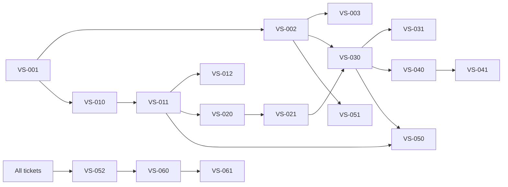

# Vector Search MVP - Ticket Breakdown

**Epic ID:** VS-QDRANT-MVP  
**Objective:** Deploy private document search using Qdrant 1.8 vector database  
**Target Environment:** Unraid server (Epyc 7402, 768GB RAM) + RTX 3090 workstation

## 1. Infrastructure Setup

| Ticket | Title | Description | Acceptance Criteria | Dependencies | Estimate |
|--------|-------|-------------|-------------------|--------------|----------|
| VS-001 | Configure NFS export for document repository | Export `/mnt/zfs/docs` (dirA/B/C) as read-only NFS share | • NFS export configured with `ro,noatime,no_root_squash` • Workstation can mount share • `/etc/exports` updated and committed | None | 2h |
| VS-002 | Deploy Qdrant 1.8 Docker container | Install and configure Qdrant vector database on server | • Docker container running Qdrant 1.8.0 • Data persisted to `/var/qdrant/data` on ZFS • Port 6333 exposed on internal VLAN only • Container auto-restarts on failure • Health endpoint returns 200 OK | VS-001 | 3h |
| VS-003 | Setup Qdrant monitoring | Configure Prometheus scraping and Grafana dashboard | • Prometheus scraping `/metrics` endpoint • Grafana dashboard showing: QPS, memory usage, WAL size, disk usage • Alerts configured for >85% RAM or >2h WAL lag • Dashboard JSON exported to repo | VS-002 | 4h |

## 2. Document Processing Pipeline

| Ticket | Title | Description | Acceptance Criteria | Dependencies | Estimate |
|--------|-------|-------------|-------------------|--------------|----------|
| VS-010 | Create manifest generation script | Build file discovery script for document corpus | • Script finds all PDF/DOCX/TXT files in source dirs • Outputs null-delimited list to `/var/embeddings/filelist.null` • Systemd service + hourly timer configured • Runtime < 10 seconds for full scan | VS-001 | 2h |
| VS-011 | Implement document extraction module | Parse documents and chunk into embeddable segments | • Python script using `unstructured` 0.13 • Outputs parquet files with columns: `doc_id`, `chunk_id`, `path`, `text` • 600 token chunks with 200 token overlap • Multiprocessing support • Error handling with graceful degradation | VS-010 | 6h |
| VS-012 | Create extraction systemd service | Automate document extraction pipeline | • `extract.service` processes new manifest entries • Hourly timer trigger • Concurrent processing (nproc) • Failed files logged to `/tmp/error_extract.log` | VS-011 | 2h |

## 3. Embedding Generation

| Ticket | Title | Description | Acceptance Criteria | Dependencies | Estimate |
|--------|-------|-------------|-------------------|--------------|----------|
| VS-020 | Build embedding generation module | Convert text chunks to vectors using BGE model | • Loads parquet files from extract stage • Uses BAAI/bge-large-en-v1.5 on GPU • Batch size 96 with OOM retry at batch/2 • Outputs parquet with: `id`, `vector`, `payload` • Vectors normalized to unit length | VS-011 | 8h |
| VS-021 | Create embedding systemd service | Automate embedding generation | • Monitors `/opt/vecpipe/extract/` for new files • Hourly execution • GPU utilization > 90% during processing • Moves completed files to `/var/embeddings/ingest/` | VS-020 | 2h |

## 4. Vector Database Integration

| Ticket | Title | Description | Acceptance Criteria | Dependencies | Estimate |
|--------|-------|-------------|-------------------|--------------|----------|
| VS-030 | Implement Qdrant ingestion script | Bulk load vectors into Qdrant collection | • Uses qdrant-client 1.9 • Creates `work_docs` collection on first run • HNSW index: m=32, ef_construct=200 • Batch upload: 4000 vectors, 4 parallel streams • Moves successful files to `/ingest/loaded/` | VS-002, VS-021 | 4h |
| VS-031 | Setup ingestion automation | Schedule regular vector uploads | • Systemd timer running every 15 minutes • Retry logic for failed uploads • Failed files moved to `/ingest/rejects/` | VS-030 | 2h |

## 5. Query API

| Ticket | Title | Description | Acceptance Criteria | Dependencies | Estimate |
|--------|-------|-------------|-------------------|--------------|----------|
| VS-040 | Build FastAPI search service | REST API for vector similarity search | • `/search` endpoint with query and k parameters • Query embedding using same BGE model • Returns path, chunk_id, and similarity score • Dockerized with port 8000 exposed • CPU fallback for embedding | VS-030 | 6h |
| VS-041 | Configure API gateway | Secure API access with authentication | • Nginx reverse proxy to FastAPI • OIDC/JWT authentication • HTTPS with Let's Encrypt certificates • Rate limiting configured | VS-040 | 3h |

## 6. Operations & Maintenance

| Ticket | Title | Description | Acceptance Criteria | Dependencies | Estimate |
|--------|-------|-------------|-------------------|--------------|----------|
| VS-050 | Implement incremental updates | Track processed files and support updates | • SQLite DB tracking processed files by SHA256 • Skip unchanged files • Upsert logic for modified documents • Watermark timestamp tracking | VS-011, VS-030 | 4h |
| VS-051 | Setup backup automation | Nightly Qdrant snapshots to S3 | • Script creates collection snapshots • S3 sync with date-based folders • Logging to Grafana Loki • Retention policy: 30 days | VS-002 | 3h |
| VS-052 | Create operations runbook | Document troubleshooting procedures | • Log file locations documented • Manual retry commands • Reject file handling procedures • Common error resolutions • Saved as `/docs/runbook.md` | All | 3h |

## 7. Documentation & Delivery

| Ticket | Title | Description | Acceptance Criteria | Dependencies | Estimate |
|--------|-------|-------------|-------------------|--------------|----------|
| VS-060 | Setup project repository | Initialize codebase with CI/CD | • Git repo structure: `vecpipe/`, `deploy/`, `docs/` • Requirements files (poetry.lock or requirements.txt) • GitHub Actions for linting and tests • Pre-commit hooks configured | All code tickets | 2h |
| VS-061 | Write deployment documentation | Complete setup and operations guide | • Step-by-step deployment instructions • Configuration file examples • Backup/restore procedures • Grafana dashboard export • Handoff checklist | VS-060 | 4h |

## Execution Plan

## Resource Allocation

**Suggested Team Structure:**
- **Infrastructure Engineer**: VS-001, VS-002, VS-003, VS-051
- **Backend Developer 1**: VS-010, VS-011, VS-012, VS-050
- **ML Engineer**: VS-020, VS-021
- **Backend Developer 2**: VS-030, VS-031, VS-040
- **DevOps Engineer**: VS-041, VS-052, VS-060, VS-061

**Total Estimate**: ~65 hours (8-10 person-days with parallel execution)

## Risk Mitigation

1. **GPU Memory Issues**: VS-020 includes batch size reduction on OOM
2. **Network Failures**: All ingestion scripts include retry logic
3. **Data Loss**: VS-051 provides automated backups
4. **Performance**: VS-003 monitoring alerts before issues become critical